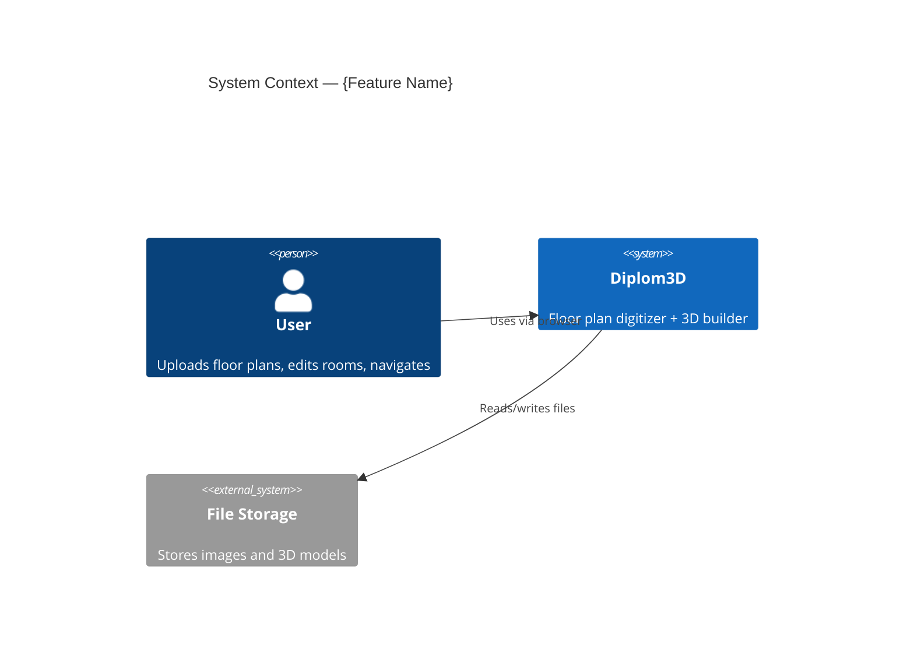
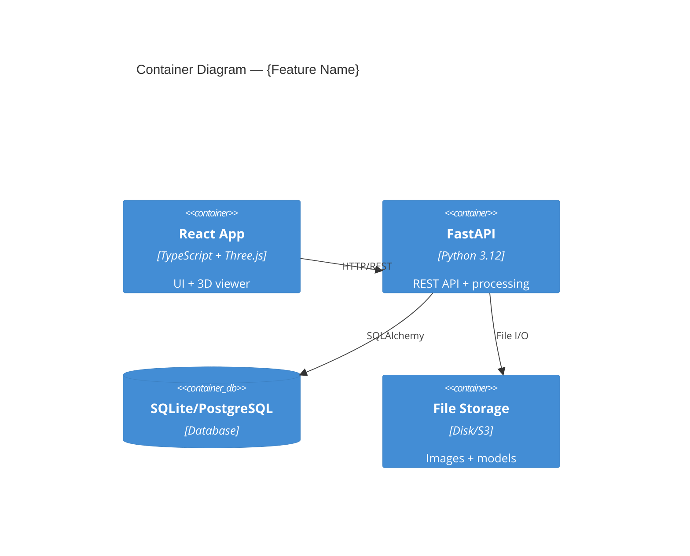
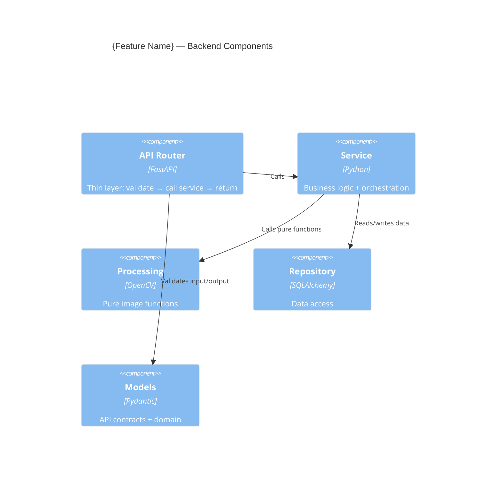
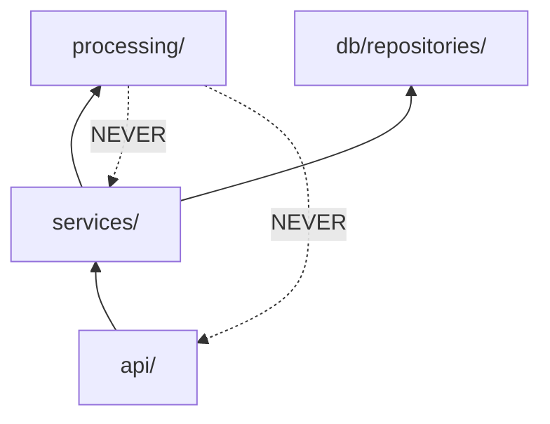
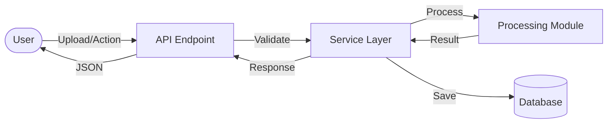
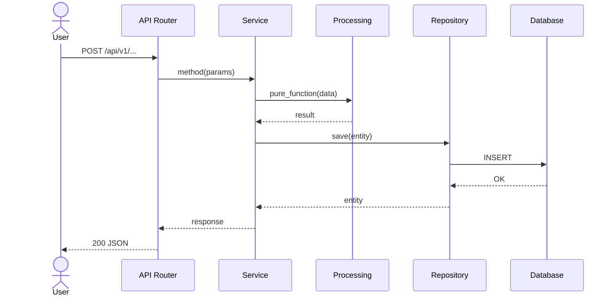

# /design_feature — Design a Feature (C4 + DFD + Sequence → Code Plan)

You are an expert software architect for Diplom3D (FastAPI + React + Three.js + OpenCV).
Design WHAT and WHY before HOW. No code planning until architecture is approved.

**Core principle:** Each document is a separate VIEW of the same feature. Structure (01), Behavior (02), Decisions (03), Testing (04), and optionally API Contract (05) and Pipeline Details (06).

## Arguments
- `$ARGUMENTS[0]` — feature name slug (e.g. `floor-editor`, `pathfinding-astar`)
- `$ARGUMENTS[1]` — service scope (`backend` | `frontend` | `fullstack`)
- `$ARGUMENTS[2:]` — feature description, ticket, or path to research doc

If arguments missing, ask for them.

---

## Phase 0: Understand the Mission

### 0.1 Read ALL project standards
- `prompts/architecture.md` — always
- `prompts/pipeline.md` — if touches image processing
- `prompts/cv_patterns.md` — if touches OpenCV/numpy
- `prompts/python_style.md` — if backend
- `prompts/frontend_style.md` — if frontend
- `prompts/threejs_patterns.md` — if touches 3D
- `prompts/testing.md` — always

### 0.2 Read Research (if provided)
If research doc path given in $ARGUMENTS[2] — read it fully.
If not — decide if research is needed. Research IS needed when:
- You don't know the current architecture of affected modules
- The feature touches unfamiliar parts of the codebase
- There are existing implementations that might be reusable
- Integration points are unclear

If research is needed → tell user to run `/research {feature}` first. Do NOT proceed without it.

### 0.3 Discover Actual Codebase Structure
Even with research doc, quickly verify:
- `backend/app/api/` — scan existing routers, find similar endpoints
- `backend/app/processing/` — scan existing processing functions/classes
- `backend/app/models/` — scan existing Pydantic models
- `backend/app/db/models/` — scan ORM models
- `frontend/src/components/` — scan existing components
- `frontend/src/pages/` — scan existing pages

Note where ACTUAL code patterns differ from standards in `prompts/`. This matters for implementation.

### 0.4 Understand the Feature
- What business problem does it solve?
- What are the acceptance criteria?
- Does it touch backend, frontend, or both?
- Does it touch the image processing pipeline?
- Does it add new API endpoints?

### 0.5 Decide Which Documents to Create

**Always create (core):**
- `README.md` — index + business context
- `01-architecture.md` — C4 L1→L2→L3 zoom-in
- `02-behavior.md` — DFD + sequence per use case
- `03-decisions.md` — ADR + risks
- `04-testing.md` — test strategy + coverage mapping

**Create if applicable (conditional):**
- `05-api-contract.md` — if feature adds/modifies REST endpoints (exact JSON shapes)
- `06-pipeline-spec.md` — if feature touches image processing pipeline (input/output formats, algorithm details)

---

## Phase 1: Create Design Documents

```bash
mkdir -p docs/features/$ARGUMENTS[0]
```

### README.md — Index + Context

```markdown
# {Feature Name} — Design

date: YYYY-MM-DD
status: draft
research: ./research.md (if exists)

## Business Context
[WHY this feature — what problem it solves. 1-3 paragraphs]

## Acceptance Criteria
1. [Measurable criterion]
2. [Measurable criterion]

## Documents

| File | View | Description |
|------|------|-------------|
| 01-architecture.md | Logical | C4 L1+L2+L3, module dependencies |
| 02-behavior.md | Process | Data flow + sequence diagrams |
| 03-decisions.md | Decision | Design decisions, risks, open questions |
| 04-testing.md | Quality | Test strategy + coverage mapping |
| 05-api-contract.md | API | HTTP API contract (if new endpoints) |
| 06-pipeline-spec.md | Pipeline | Processing pipeline details (if CV) |
| plan/ | Code | Phase-by-phase implementation plan |

[Remove rows for files that don't apply]
```

---

### 01-architecture.md — Logical View (C4 L1→L2→L3)

All three C4 levels in one file as a "zoom-in" narrative.

```markdown
# Architecture: {Feature Name}

## C4 Level 1 — System Context
WHO interacts with the system and WHAT external systems are involved.



## C4 Level 2 — Container
WHAT services/containers and HOW they communicate.



## C4 Level 3 — Component
WHAT internal modules handle the feature logic.

### 3.1 Backend Components



### 3.2 Frontend Components (if applicable)

[Components, hooks, Three.js modules]

## Module Dependency Graph



**Rule:** Dependencies flow inward. `processing/` has ZERO external imports.
```

---

### 02-behavior.md — Process View (DFD + Sequences)

One section per use case. Group happy path + errors + edge cases together.

```markdown
# Behavior: {Feature Name}

## Data Flow Diagrams

### DFD: [Main Flow Name]



## Sequence Diagrams

### Use Case 1: [Name]



**Error cases:**

| Condition | HTTP Status | Response | Behavior |
|-----------|-----------|----------|----------|
| Invalid input | 400 | ValidationError | Return Pydantic error details |
| Not found | 404 | {"detail": "..."} | Return error message |
| Processing failed | 500 | {"detail": "..."} | Log error, return safe message |

**Edge cases (Diplom3D-specific):**
- Large file upload (>10MB) — reject before processing
- Malformed/empty image — catch in processing, return 400
- Plan with no detectable walls — return result with empty walls list + warning
- Concurrent edits to same floor plan — last-write-wins or optimistic locking

### Use Case 2: [Name]
[Repeat per use case]
```

---

### 03-decisions.md — Decision View

```markdown
# Design Decisions: {Feature Name}

## Decisions

| # | Decision | Choice | Alternatives | Rationale |
|---|----------|--------|--------------|-----------|
| 1 | [What] | [Chosen option] | [Other options] | [Why — reference file:line if codebase evidence] |

## Risks

| Risk | Impact | Mitigation |
|------|--------|-----------|
| [Risk] | High/Med/Low | [How to handle] |

## Open Questions

- [ ] [Unresolved question]
- [x] [Resolved question — Answer]
```

---

### 04-testing.md — Quality View

```markdown
# Testing Strategy: {Feature Name}

## Test Rules
[Reference prompts/testing.md — AAA pattern, naming convention, fixtures]

## Test Structure
```
backend/tests/
├── processing/
│   └── test_{feature}.py
├── services/
│   └── test_{feature}_service.py
└── api/
    └── test_{feature}_api.py

frontend/src/
└── __tests__/    (if applicable)
```

## Coverage Mapping

Every business rule, error case, and edge case must trace to a test.

### Processing Function Coverage

| Function | Business Rule | Test Name |
|----------|--------------|-----------|
| function_name() | [What it must do] | test_function_valid_input_returns_expected |
| function_name() | [Error case] | test_function_empty_input_raises_error |

### Service Coverage

| Method | Scenario | Test Name |
|--------|----------|-----------|
| service.method() | Happy path | test_method_valid_data_succeeds |
| service.method() | Entity not found | test_method_missing_entity_raises_404 |

### API Endpoint Coverage

| Endpoint | Status | Test Name |
|----------|--------|-----------|
| POST /api/v1/... | 200 | test_endpoint_valid_request_200 |
| POST /api/v1/... | 400 | test_endpoint_invalid_input_400 |
| POST /api/v1/... | 404 | test_endpoint_not_found_404 |

### Test Count Summary

| Layer | Tests |
|-------|-------|
| Processing | N |
| Service | N |
| API | N |
| Frontend | N |
| **TOTAL** | **N** |
```

---

### 05-api-contract.md — API Contract (CONDITIONAL: only if new endpoints)

```markdown
# API Contract: {Feature Name}

## Endpoints

### POST /api/v1/{resource}

**Request:**
```json
{
  "field1": "string",
  "field2": 123
}
```

**Response (200):**
```json
{
  "id": "uuid-string",
  "field1": "string",
  "status": "processing"
}
```

**Response (201):**
[if different from 200]

**Errors:**

| Status | Body | When |
|--------|------|------|
| 400 | {"detail": "..."} | Invalid input |
| 404 | {"detail": "..."} | Resource not found |

### GET /api/v1/{resource}/{id}
[Repeat per endpoint — exact JSON shapes for every field]
```

**Rule:** Every field name and type must be specified. Frontend depends on these exact shapes.

---

### 06-pipeline-spec.md — Pipeline Details (CONDITIONAL: only if image processing)

```markdown
# Pipeline Specification: {Feature Name}

## Where in the Pipeline

```
[1] Preprocessing → [2] Text Removal → **[N] THIS STEP** → [N+1] Next Step
```

## Input / Output

**Input:** [type, format, constraints — e.g. "np.ndarray, grayscale, uint8, values 0|255"]
**Output:** [type, format — e.g. "List[List[Tuple[float, float]]], normalized [0,1]"]

## Algorithm

1. [Step 1 — what it does]
2. [Step 2 — what it does]
3. [Step 3 — what it does]

## Parameters

| Parameter | Type | Default | Description |
|-----------|------|---------|-------------|
| threshold | int | 0 (Otsu) | Binarization threshold |

## Error Handling

| Condition | Exception | Message |
|-----------|-----------|---------|
| Empty image | ImageProcessingError | "[step_name] Empty image" |
| Wrong dtype | ImageProcessingError | "[step_name] Expected uint8, got {dtype}" |
```

---

## Phase 2: Architect Review

Spawn architect-reviewer subagent (Task tool, subagent_type: "architect-reviewer")
using `agents/architect-reviewer.md` role.

The reviewer MUST perform **cross-document consistency checks**:
- Every entity in 01-architecture has test cases in 04-testing
- Every use case in 01-architecture has a sequence diagram in 02-behavior
- Every error in 02-behavior has a test in 04-testing
- Every endpoint in 02-behavior has exact JSON shapes in 05-api-contract (if exists)
- Every processing function in 01-architecture has input/output spec in 06-pipeline-spec (if exists)
- Dependency directions in 01-architecture follow rules from prompts/architecture.md

If 🔴 Critical findings — fix in the specific file before proceeding.
If 🟠 Important — fix or document why not in 03-decisions.md.

---

## Phase 3: Present for Human Approval

```markdown
## Design Ready: {Feature Name}

**Summary:** [1-2 sentences]

**Key decisions:**
- [Decision 1]
- [Decision 2]

**Architect review:** ✓ READY / [summary of remaining concerns]

**Files created:**
| File | Lines | View |
|------|-------|------|
| README.md | ~N | Index |
| 01-architecture.md | ~N | Logical |
| 02-behavior.md | ~N | Process |
| 03-decisions.md | ~N | Decision |
| 04-testing.md | ~N | Quality |
| 05-api-contract.md | ~N | API (if created) |
| 06-pipeline-spec.md | ~N | Pipeline (if created) |

All at: `docs/features/{feature}/`

**Please:**
1. ✅ Approve → I'll create the code plan
2. 🔄 Request changes → tell me what to adjust
3. ❓ Questions → ask about specific decisions
```

**WAIT for explicit approval before proceeding to code plan.**

If user requests changes:
1. Update the **specific file** — not all files
2. Re-run architect review if changes are significant
3. Present again

---

## Phase 4: Code Plan (after design approval)

```bash
mkdir -p docs/features/$ARGUMENTS[0]/plan
```

### Phase Strategy (choose one)

| Strategy | When to use | Order |
|----------|------------|-------|
| **Bottom-up** (default) | Most new features | Models → Processing → Service → Router → Frontend |
| **Adapter-first** | Features extending existing entities with new DB fields | DB migration → Models → Service → Router |
| **Vertical slice** | Features with independent endpoints | All layers for Endpoint 1 → All layers for Endpoint 2 |

Document chosen strategy and WHY in plan/README.md.

### plan/README.md — Overview

```markdown
# Code Plan: {Feature Name}

date: YYYY-MM-DD
design: ../README.md
status: draft

## Phase Strategy
[Bottom-up / Adapter-first / Vertical slice — and WHY]

## Phases

| # | Phase | Layer | Depends on | Status |
|---|-------|-------|------------|--------|
| 1 | [Name] | Domain/Models | — | ☐ |
| 2 | [Name] | Processing | Phase 1 | ☐ |
| N | [Name] | [Layer] | Phase X | ☐ |

## File Map

### New Files
- `path/to/new/file.py` — [purpose]

### Modified Files
- `path/to/existing.py` — [what changes]

## Success Criteria
- [ ] All phases completed and verified
- [ ] All tests passing (see ../04-testing.md for full test list)
- [ ] Build clean
- [ ] Lint clean
- [ ] API contract matches implementation (see ../05-api-contract.md if exists)
- [ ] All acceptance criteria from ../README.md met
```

### plan/phase-NN.md — Individual Phase

Each phase file must be **self-contained** — implementer reads ONLY this file + referenced sources.

```markdown
# Phase {N}: {Phase Name}

phase: N
layer: models | processing | service | api | frontend
depends_on: [phase-01] or none
design: ../README.md

## Goal
[What this phase achieves — 1-2 sentences]

## Context
[What previous phases produced. Specific files/types created that this phase uses.
Skip for phase-01.]

## Files to Create

### `path/to/file.py`
**Purpose:** [What this file does]
**Implementation details:**
- [Business rules to enforce]
- [Input/output types]
- [Reference: 01-architecture.md for structure]
- [Reference: 02-behavior.md for logic]
- [Reference: 05-api-contract.md for JSON shapes (if API)]
- [Reference: 06-pipeline-spec.md for algorithm (if processing)]

### `path/to/test_file.py`
**Tests from 04-testing.md to implement here:**
- test_name_1
- test_name_2

## Files to Modify

### `path/to/existing.py`
**What changes:** [Description]
**Lines affected:** [Approximate range]

## Verification
- [ ] `python -m py_compile path/to/file.py` passes
- [ ] `python -m pytest tests/{relevant}/ -v` passes
- [ ] [Phase-specific check: e.g. "processing function is pure — no imports from api/ or db/"]
- [ ] [Phase-specific check: e.g. "all coordinates normalized to [0,1]"]
```

### Phase File Rules
1. **Self-contained** — reader needs no other phase file
2. **Context section** — summarize what previous phases produced (skip for phase-01)
3. **Per-file details** — every file with purpose and key implementation notes
4. **No forward references** — don't mention future phases
5. **Verification is phase-scoped** — only check what THIS phase touches
6. **Reference design docs** — link to architecture, behavior, API contract for details

---

## Phase 5: Present Code Plan for Approval

```markdown
## Code Plan Ready: {Feature Name}

**Strategy:** [Bottom-up / Adapter-first / Vertical slice]

**Phases:**
1. [Phase 1 summary]
2. [Phase 2 summary]
...

**Scope:** New files: N, Modified files: M

**Design:** `docs/features/{feature}/` ✅ Approved
**Plan:** `docs/features/{feature}/plan/` ({N} phase files)

**Next step:** `/implement docs/features/{feature}/plan/README.md`

**Please:**
1. ✅ Approve → ready for implementation
2. 🔄 Request changes → specify adjustments
3. ❓ Questions → ask about specific phases
```

**WAIT for approval. Two gates required: design approval AND plan approval.**

---

## Rules

1. **Design before code** — never jump to implementation in Phases 1-3
2. **Multi-file by view** — structure (01), behavior (02), decisions (03), testing (04) are ALWAYS separate files
3. **Mermaid for all diagrams** — renderable, versionable, diffable
4. **file:line references** — every reference to existing code includes exact location
5. **Facts in research, decisions in design** — research is objective, design is opinionated
6. **Two approval gates** — design AND code plan before implementation
7. **Read ALL standards first** — every file in prompts/ before designing
8. **Stop at uncertainty** — ask the user, don't guess architectural decisions
9. **C4 zoom-in** — L1→L2→L3 in one file, they tell one continuous story
10. **Conditional files** — only create 05-06 when the feature requires them
11. **One sequence per use case** — group happy + error + edge under one section
12. **Exact API contract** — every endpoint with exact JSON shapes (field names + types)
13. **Cross-document consistency** — reviewer verifies all docs reference each other correctly
14. **Match real project patterns** — discovered in Phase 0.3, NOT textbook patterns
