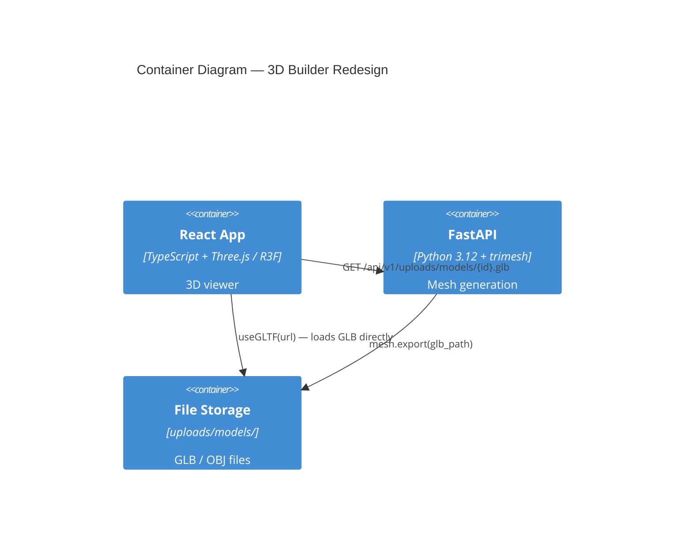
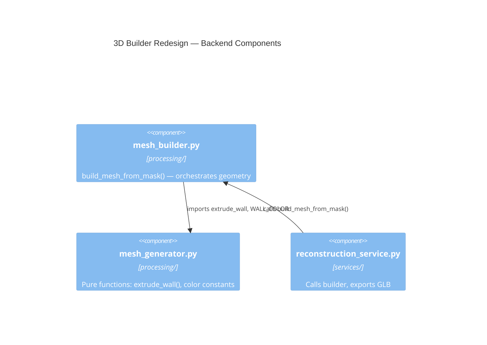
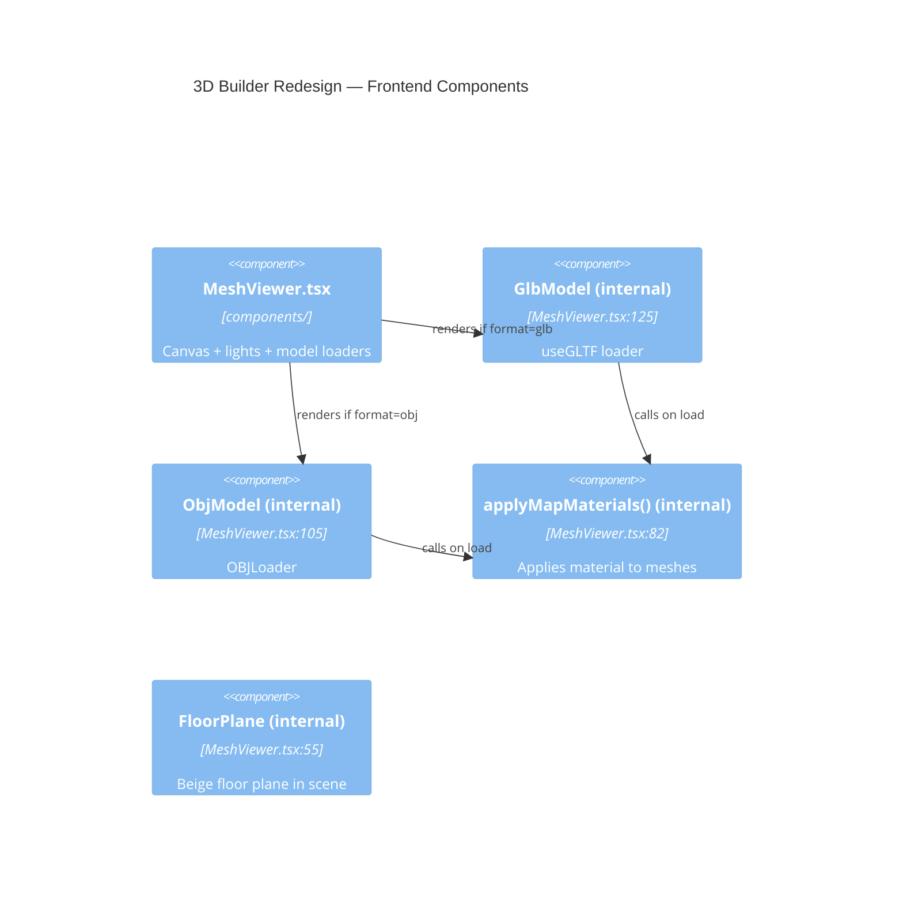
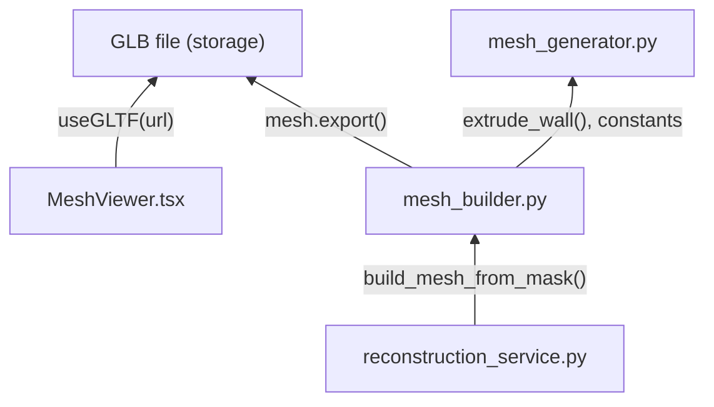

# Architecture: 3D Builder Redesign

## C4 Level 2 — Container

## C4 Level 3 — Backend Components

**Changes in this feature:**
- `mesh_generator.py` — добавить 3 новые цветовые константы: `WALL_SIDE_COLOR`, `WALL_CAP_COLOR`, `FLOOR_COLOR`
- `mesh_builder.py` — добавить `_create_floor()`, `_create_wall_cap()`, обновить цикл экструзии

## C4 Level 3 — Frontend Components

**Changes in this feature:**
- `applyMapMaterials()` — убрать `deleteAttribute('color')`, использовать `vertexColors: true`
- `COLORS` константы — обновить под новую палитру
- Lighting — снизить ambient, скорректировать directional
- `FloorPlane` — убрать (пол теперь часть GLB меша)

## Module Dependency Graph

**Правило:** `mesh_generator.py` — чистые функции, нет импортов из `api/` или `db/`.
`mesh_builder.py` — оркестрирует геометрию, импортирует только из `mesh_generator` и stdlib.
