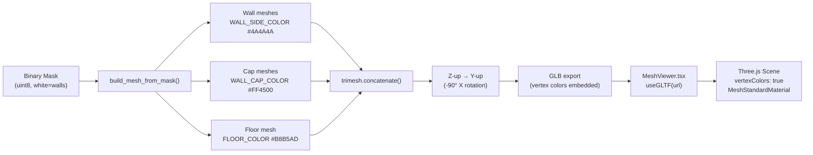
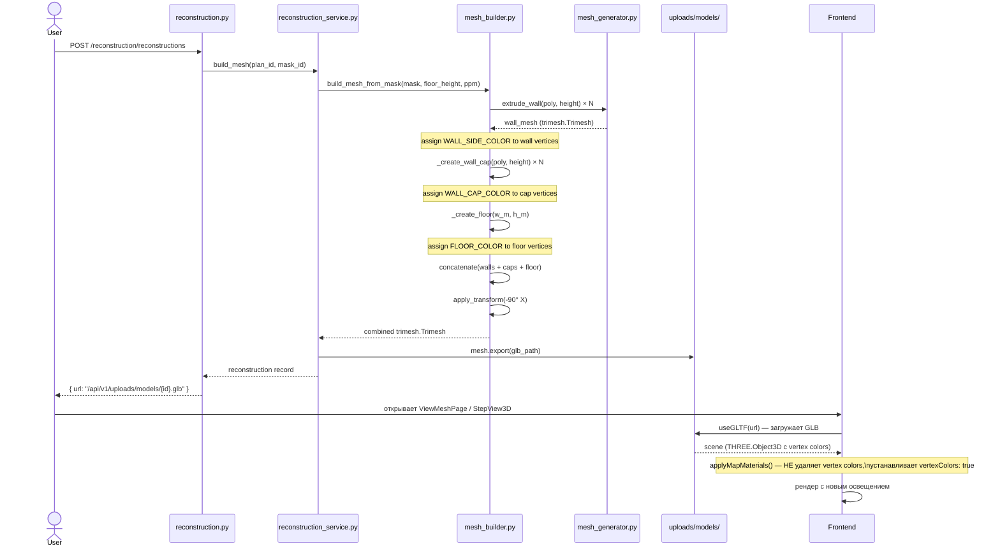

# Behavior: 3D Builder Redesign

## Data Flow

## Sequence: Mesh Build + Render

## Vertex Colors: как данные проходят через систему

| Этап | Что происходит |
|------|---------------|
| `mesh_generator.py:43` | Определены константы `WALL_SIDE_COLOR`, `WALL_CAP_COLOR`, `FLOOR_COLOR` |
| `mesh_builder.py` (новый цикл) | Каждому мешу присваиваются vertex colors через `visual.vertex_colors` |
| `trimesh.export(glb_path)` | GLB сохраняет vertex colors как атрибут `COLOR_0` в GLTF |
| `useGLTF(url)` | Three.js/GLTFLoader читает `COLOR_0`, создаёт `vertexColors: true` |
| `applyMapMaterials()` (обновлённый) | Устанавливает `vertexColors: true` на материале, НЕ удаляет атрибут |

## Изменения в FloorPlane

Текущий `FloorPlane` (MeshViewer.tsx:55) — отдельный React-компонент, создающий бежевый пол
в Three.js сцене поверх GLB модели. После редизайна пол будет частью GLB меша.

**Решение:** `FloorPlane` компонент остаётся как fallback для OBJ формата, но для GLB
он не нужен (пол уже в меше). Убирать `FloorPlane` из GLB-пути — см. 03-decisions.md.

## Error Cases

| Условие | Поведение |
|---------|-----------|
| `_create_floor()` получает w_m=0 или h_m=0 | Возвращает `None`, floor не добавляется в список |
| `_create_wall_cap()` — невалидный полигон | Возвращает `None`, cap пропускается (как `extrude_wall`) |
| GLB не содержит vertex colors (старые файлы) | `applyMapMaterials` применяет fallback цвет `COLORS.wall` |
| trimesh не установлен | `ImageProcessingError("build_mesh_from_mask", "trimesh not installed")` |
