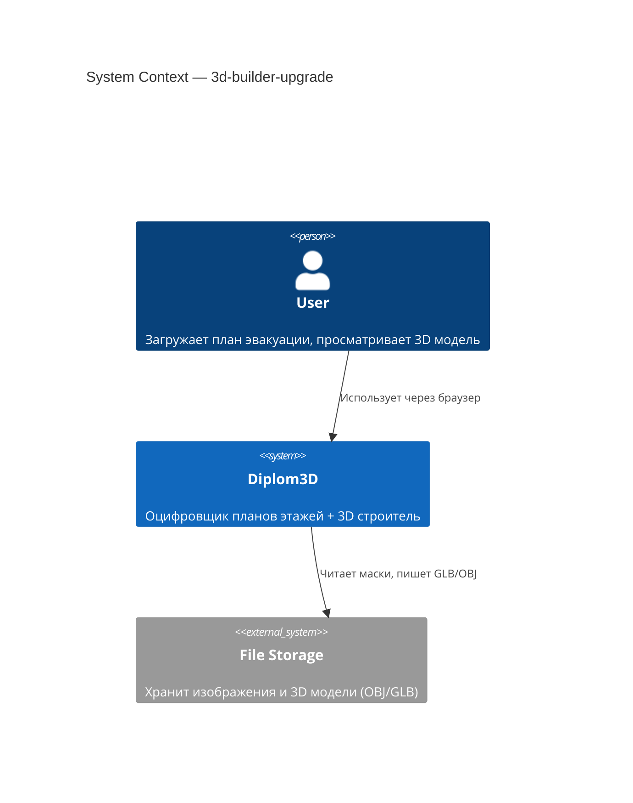
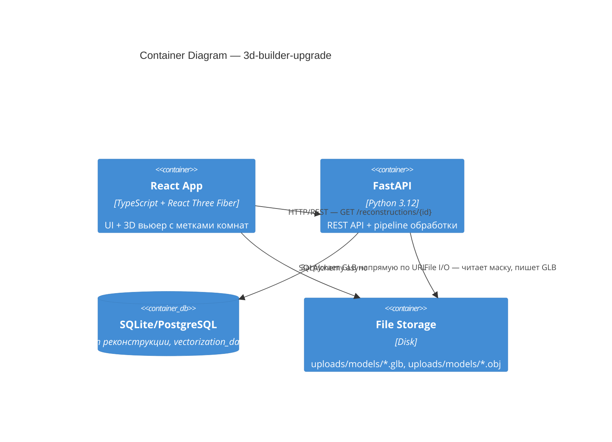
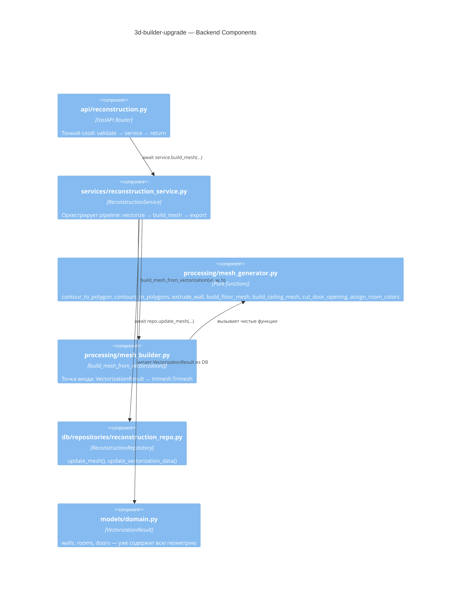
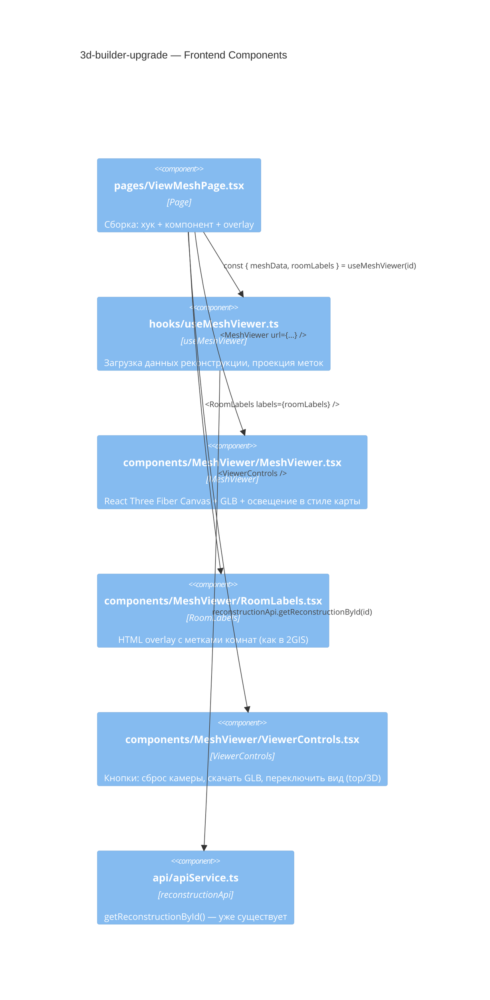
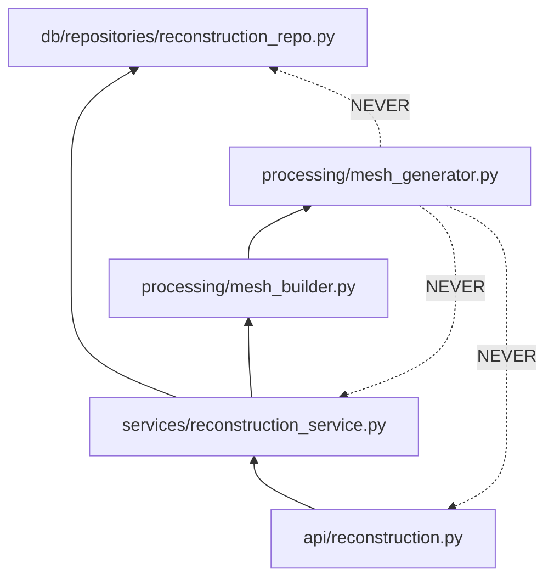

# Architecture: 3d-builder-upgrade

## C4 Level 1 — System Context

## C4 Level 2 — Container

## C4 Level 3 — Component

### 3.1 Backend Components

### 3.2 Frontend Components

### Визуальный стиль (2GIS/Яндекс Карты)

Цель — читаемая карта, а не серая масса. Ключевые решения:

- **Пол** — светло-бежевый (`#f5f0e8`), матовый материал `MeshLambertMaterial`
- **Стены** — тёмно-серые (`#4a4a4a`), чуть выше пола → визуальный контраст
- **Комнаты** — цветные полы по типу (classroom=жёлтый, corridor=синий и т.д.)
- **Освещение** — `AmbientLight` (мягкий общий) + `DirectionalLight` сверху-сбоку (тени дают глубину)
- **Фон сцены** — светло-серый (`#e8e8e8`), как подложка карты
- **Вид по умолчанию** — сверху под углом ~60° (изометрия), как в 2GIS при открытии здания
- **Переключатель** — кнопка "Сверху" (ортографическая камера) / "3D" (перспективная)

## Module Dependency Graph

**Правило:** `processing/` не импортирует из `api/`, `services/`, `db/`.
`mesh_generator.py` — только `numpy`, `shapely`, `trimesh`.

## Что меняется vs текущее состояние

| Компонент | Сейчас | После апгрейда |
|-----------|--------|----------------|
| `mesh_generator.py` | Класс `MeshGeneratorService` с состоянием (`_mesh_id`, `output_dir`) | Чистые функции: `contour_to_polygon()`, `extrude_wall()`, `build_floor_mesh()`, `build_ceiling_mesh()`, `assign_room_colors()` |
| `mesh_builder.py` | `build_mesh(contours, w, h)` — игнорирует VectorizationResult | `build_mesh_from_vectorization(vr, w, h)` — использует walls/rooms/doors |
| `reconstruction_service.py:175` | `find_contours(mask)` → `build_mesh(contours, w, h)` | `build_mesh_from_vectorization(vectorization_result, w, h)` |
| `MeshViewer.tsx` | 56 строк, только OrbitControls | + `RoomLabels` overlay, кнопка скачать GLB |
| `ViewMeshPage.tsx` | Прямой `useEffect` + `useState` | Логика вынесена в `useMeshViewer` hook |
| Высота этажа | 1.5 м (баг в `mesh_builder.py:17`) | 3.0 м из `settings.DEFAULT_FLOOR_HEIGHT` |
