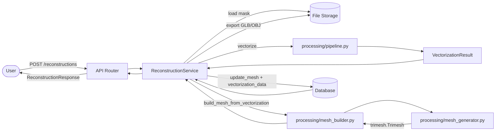
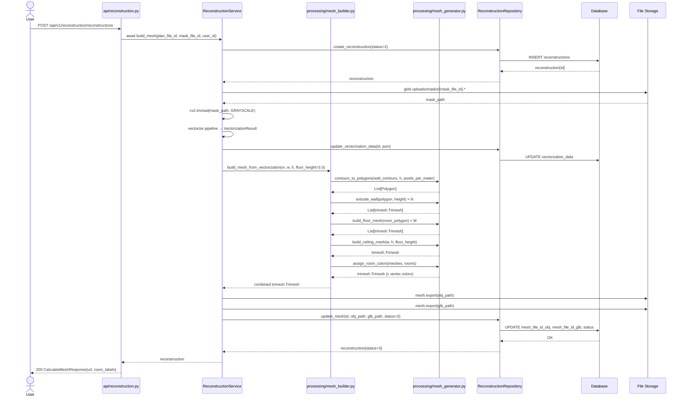
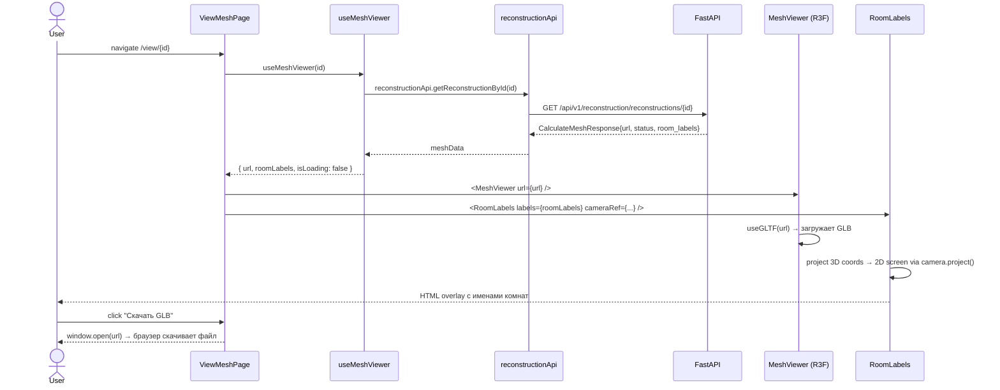

# Behavior: 3d-builder-upgrade

## Data Flow Diagrams

### DFD: Построение 3D модели (обновлённый pipeline)



### DFD: Просмотр 3D модели с метками

```mermaid
flowchart LR
    User([User]) -->|GET /view/{id}| Page[ViewMeshPage]
    Page --> Hook[useMeshViewer]
    Hook -->|getReconstructionById| API[reconstructionApi]
    API -->|HTTP GET /reconstructions/{id}| Backend[FastAPI]
    Backend -->|CalculateMeshResponse + room_labels| API
    API --> Hook
    Hook -->|url, roomLabels| Page
    Page --> Viewer[MeshViewer Canvas]
    Page --> Labels[RoomLabels overlay]
    Viewer -->|загружает GLB| Storage[(File Storage)]
```

## Sequence Diagrams

### Use Case 1: Построение 3D модели из VectorizationResult



**Error cases:**

| Condition | HTTP Status | Response | Behavior |
|-----------|-------------|----------|----------|
| Маска не найдена на диске | 200 (async) | status=4, error_message | `FileStorageError` → `update_mesh(status=4)` |
| Контуры не найдены | 200 (async) | status=4, error_message | `ImageProcessingError` → `update_mesh(status=4)` |
| trimesh/shapely не установлены | 200 (async) | status=4, error_message | `ImageProcessingError` → `update_mesh(status=4)` |
| `VectorizationResult` пуст (старая запись) | — | fallback | `build_mesh_from_vectorization` fallback на сырые контуры |

**Edge cases:**
- `rooms` список пуст → пол генерируется как один прямоугольник по размеру изображения
- `doors` список пуст → шаг вырезания проёмов пропускается
- Shapely boolean difference даёт невалидный полигон → `.buffer(0)` fix; при неудаче — стена без проёма
- Координаты комнат нормализованы [0,1] → денормализация `x * w, y * h` перед передачей в processing

### Use Case 2: Просмотр 3D модели с метками комнат



**Error cases:**

| Condition | Поведение |
|-----------|-----------|
| status=4 (ошибка построения) | Показать `error_message` вместо Canvas |
| url=null (ещё строится) | Показать спиннер / статус |
| GLB не загружается (404) | `<Suspense fallback>` показывает заглушку |
| `room_labels` пуст | `RoomLabels` не рендерится |
