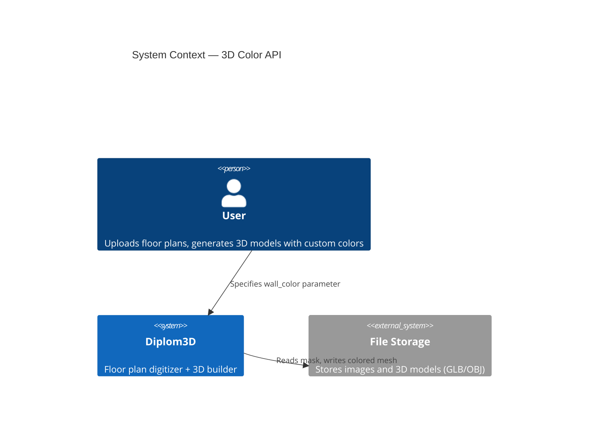
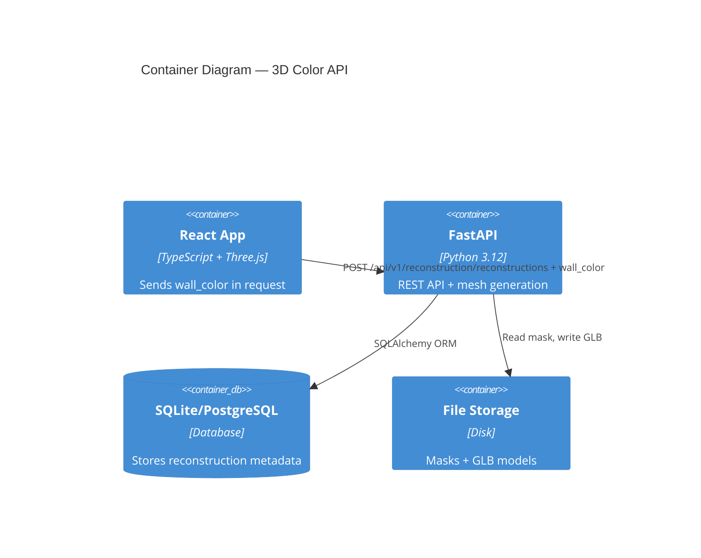
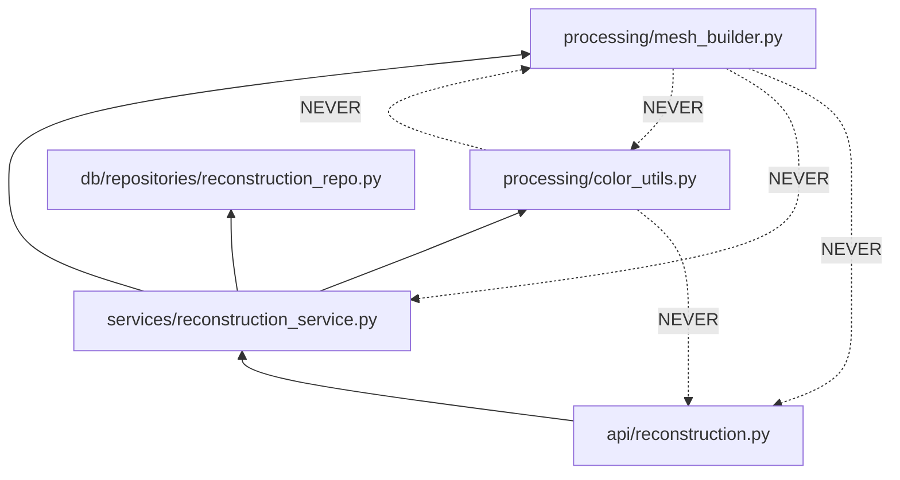

# Architecture: 3D Color API

## C4 Level 1 — System Context



## C4 Level 2 — Container



## C4 Level 3 — Component

### 3.1 Backend Components

```mermaid
C4Component
title 3D Color API — Backend Components
Component(router, "API Router", "FastAPI", "reconstruction.py — extract wall_color → call service")
Component(service, "ReconstructionService", "Python", "Validates color + orchestrates mesh building")
Component(colorutil, "Color Utilities", "Python", "Parse/validate hex/RGBA colors")
Component(meshbuilder, "Mesh Builder", "Python", "Apply pre-validated color to mesh")
Component(repo, "Repository", "SQLAlchemy", "CRUD for Reconstruction records")
Component(models, "Models", "Pydantic", "CalculateMeshRequest + CalculateMeshResponse")
Rel(router, models, "Validates input/output")
Rel(router, service, "Calls build_mesh(wall_color=...)")
Rel(service, colorutil, "Parses + validates wall_color")
Rel(service, meshbuilder, "Calls build_mesh_from_mask(wall_color=validated_rgba)")
Rel(service, repo, "Saves reconstruction record")
Rel(meshbuilder, storage, "Reads mask, writes GLB")
```

**Key principle:** Service layer validates color, processing layer applies pre-validated color only.

### 3.2 Module Dependency Graph



**Rule:** Dependencies flow inward. `processing/` has ZERO external imports (no FastAPI, no DB, no service layer).

**Validation flow:**
1. API receives `wall_color` parameter
2. Service calls `parse_color()` to validate → gets RGBA array
3. Service passes validated RGBA array to mesh builder
4. Mesh builder applies color (no validation needed)

## Key Design Points

1. **Color parameter is optional** — defaults to `WALL_SIDE_COLOR` if omitted
2. **Color validation happens ONLY in service layer** — not in router, not in processing
3. **Processing layer is pure** — accepts pre-validated RGBA array, no validation, no side effects
4. **GLB export preserves colors** — vertex colors baked into geometry
5. **No DB schema changes** — color is transient (not stored), only used during mesh generation
6. **Separation of concerns:**
   - API layer: thin routing, extract parameters
   - Service layer: validation + orchestration
   - Processing layer: pure functions, apply pre-validated data
