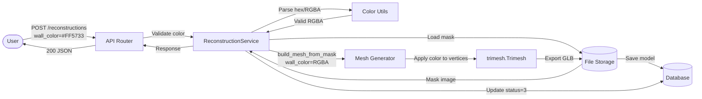
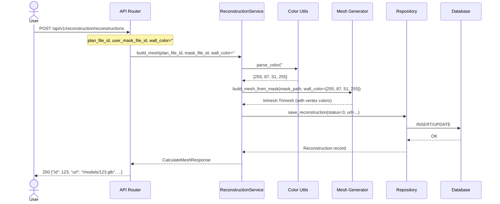
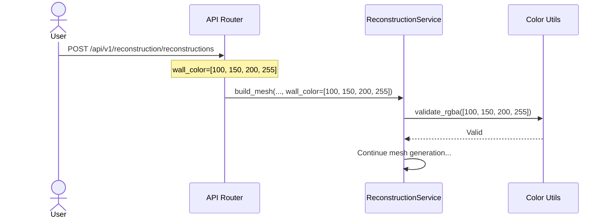
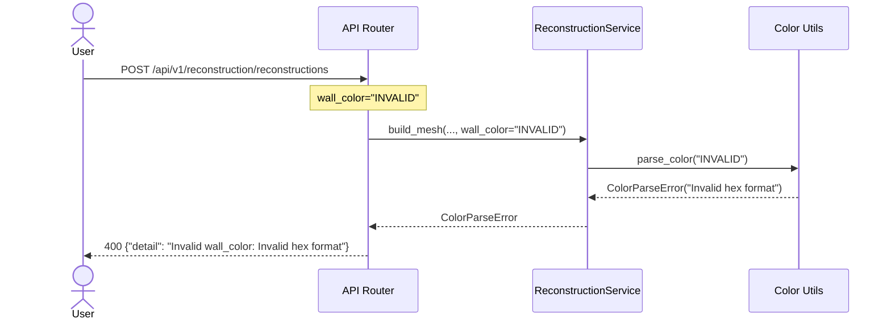
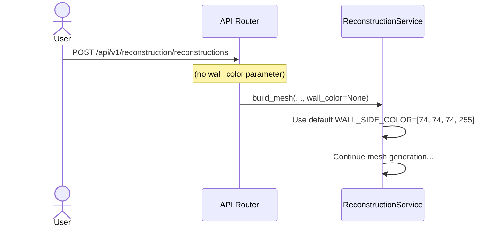

# Behavior: 3D Color API

## Data Flow Diagrams

### DFD: Generate Mesh with Custom Color

## Sequence Diagrams

### Use Case 1: Generate Mesh with Custom Hex Color

**Happy path:**
- User provides valid hex color → parsed to RGBA → applied to mesh → GLB exported with colors

### Use Case 2: Generate Mesh with RGBA Array

### Use Case 3: Invalid Color (400 Bad Request)

### Use Case 4: Omit Color (Use Default)

## Error Cases

| Condition | HTTP Status | Response | Behavior |
|-----------|-----------|----------|----------|
| Invalid hex format | 400 | `{"detail": "Invalid wall_color: expected #RRGGBB, #RRGGBBAA, or [R, G, B, A] array"}` | Reject, log error |
| Invalid RGBA array | 400 | `{"detail": "Invalid wall_color: RGBA values must be integers in range [0, 255]"}` | Reject, log error |
| Mask file not found | 404 | `{"detail": "Mask file not found"}` | Existing behavior, no change |
| Mesh generation failed | 500 | `{"detail": "Error building 3D model"}` | Existing behavior, no change |

## Edge Cases (Diplom3D-specific)

- **Transparent color** (A < 255) — allowed, trimesh preserves alpha in GLB
- **Black color** (#000000) — allowed, may be hard to see but valid
- **Very bright color** (#FFFFFF) — allowed, may wash out but valid
- **Concurrent requests with different colors** — each generates independent mesh, no conflicts
- **Color parameter with extra whitespace** — strip before parsing (e.g., `" #FF5733 "` → `"#FF5733"`)
