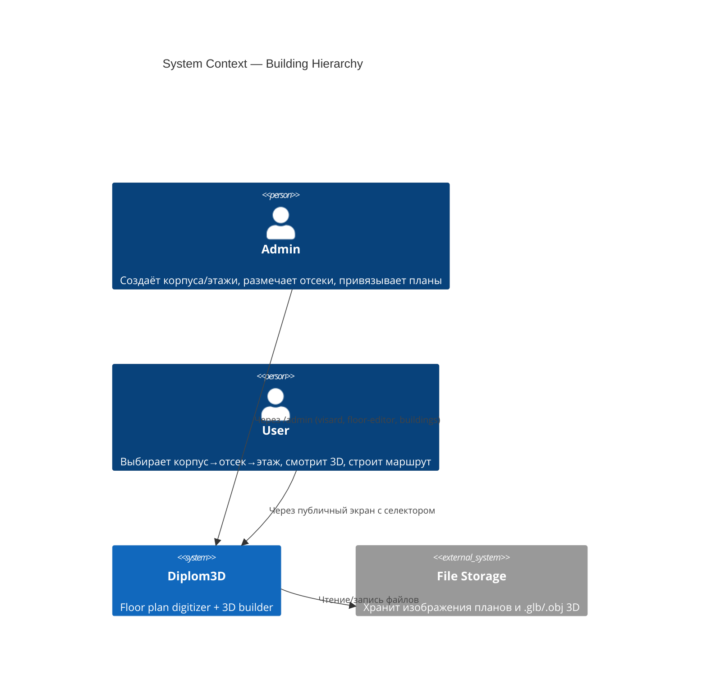
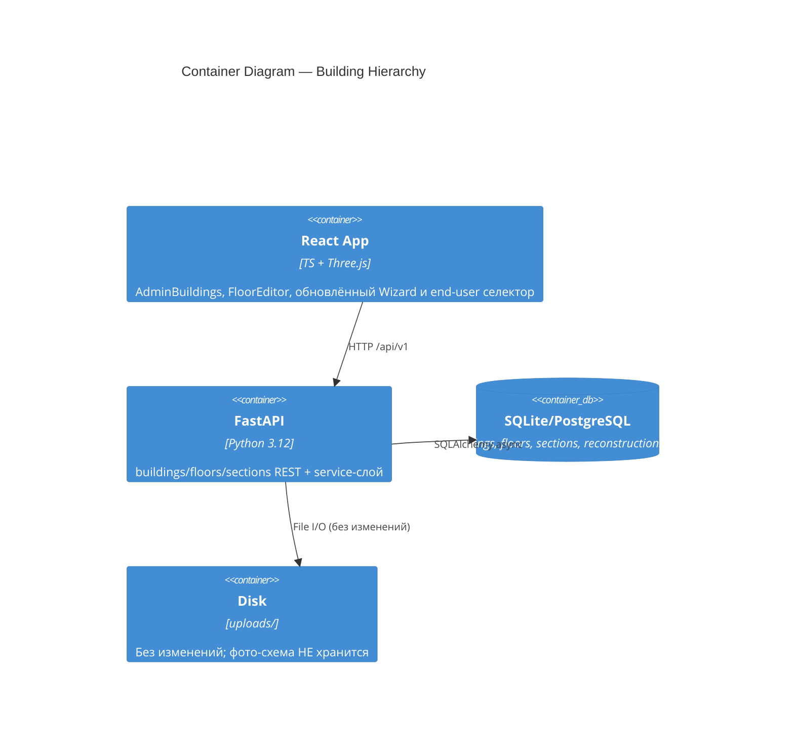
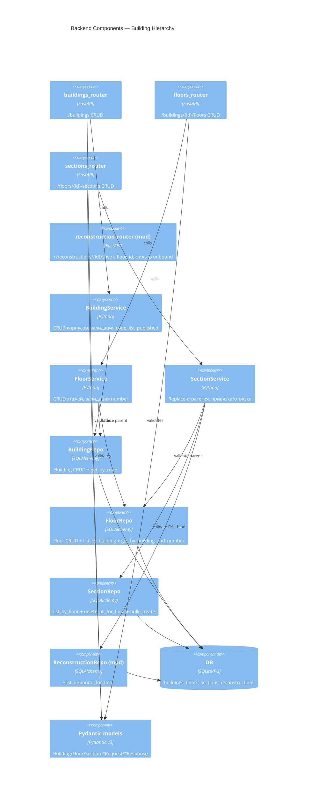
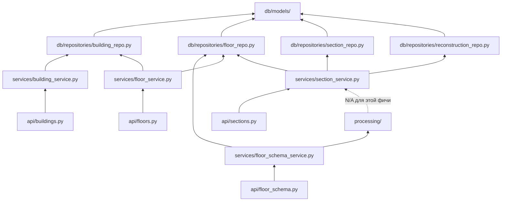

# Architecture: Building Hierarchy

## C4 Level 1 — System Context



## C4 Level 2 — Container

Архитектура контейнеров не меняется — добавляются только модули внутри существующих:



## C4 Level 3 — Component

### 3.1 Backend



**Слои уже существуют** — `services/` и `db/repositories/` есть в проекте (`backend/app/services/`, `backend/app/db/repositories/`). Шаблон следуем тому же, что в `reconstruction_service.py` + `reconstruction_repo.py`.

### 3.2 Frontend

```mermaid
C4Component
title Frontend Components — Building Hierarchy

Component(pageBuildings, "AdminBuildingsPage", "React", "/admin/buildings — CRUD корпусов и этажей")
Component(pageFloorEditor, "FloorEditorPage", "React", "/admin/floor-editor — multi-mode: Wizard(1-5) + OverviewGraphical(6) + ContextMenu(7) + OverviewTable(8)")
Component(pageWizard, "WizardPage (mod)", "React", "Поля building+floor обязательны на StepUpload")
Component(pageEdit, "EditPlanPage (mod)", "React", "Плашка 'Привязан к отсеку N'")
Component(pagePublic, "FloorViewerPage (new)", "React", "End-user: селекторы + мини-карта + 3D")

Component(hookBuildings, "useBuildings", "Hook", "list/create/update/delete buildings")
Component(hookFloors, "useFloors", "Hook", "list/create/update/delete floors by building")
Component(hookSection, "useFloorSections", "Hook", "load/save floor schema + walls + sections")
Component(hookEditor, "useFloorEditorWizard", "Hook", "Локальный state wizard (currentStep, file, crop, walls, sections в драфте)")
Component(hookViewer, "useFloorViewer", "Hook", "Управление селекторами + загрузка mesh")

Component(cmpSelector, "BuildingFloorSectionSelector", "React", "Три селектора с подсветкой активного")
Component(cmpMinimap, "FloorMinimap", "React", "SVG-канвас: фото-схема + стены + полигоны секций, оранжевая подсветка активной")

Component(cmpStep1, "Step1Upload", "React", "Шаг 1 wizard'a: DropZone + превью фото-схемы")
Component(cmpStep2, "Step2CropRotate", "React + Canvas", "Шаг 2: orange handles на изображении для кадрирования; кнопка поворота")
Component(cmpStep3, "Step3WallExtraction", "React + Canvas", "Шаг 3: автоэкстракция стен (CV) + ручная правка теми же инструментами что в WallEditorCanvas")
Component(cmpStep4, "Step4MarkSections", "React + Canvas", "Шаг 4: rect-tool, NewSectionDialog (модалка) + рендер уже размеченных отсеков")
Component(cmpStep5, "Step5BindPlans", "React", "Шаг 5: список отсеков слева + галерея планов справа + фильтры (search, building, floor)")
Component(cmpOverview, "FloorOverview", "React", "Шаг 6: graphical view с context menu (7); кнопка 'Сохранить изменения'")
Component(cmpTable, "FloorSectionsTable", "React", "Шаг 8: табличный вид + переключатель в overview")
Component(cmpContext, "SectionContextMenu", "React", "Меню: 'Изменить номер' + 'Удалить отсек'")
Component(cmpDialog, "NewSectionDialog", "React", "Модалка над canvas: ввод номера; вызывается на шагах 4 и из context menu")
Component(cmpGallery, "PlanGalleryPicker", "React", "Карточки реконструкций с поиском + dropdown'ы Здание/Этаж")
Component(cmpControls, "CanvasControls", "React", "Zoom + reset (xx) + rotate — переиспользуется на шагах 2-7")

Component(api, "buildingsApi.ts", "Axios", "REST клиент для buildings/floors/sections")
Component(typesH, "hierarchy.ts", "TS types", "Building, Floor, Section, BindRequest, ...")

Rel(pageBuildings, hookBuildings, "")
Rel(pageBuildings, hookFloors, "")
Rel(pageFloorEditor, hookSection, "")
Rel(pageFloorEditor, hookEditor, "")
Rel(pageFloorEditor, cmpStep1, "")
Rel(pageFloorEditor, cmpStep2, "")
Rel(pageFloorEditor, cmpStep3, "")
Rel(pageFloorEditor, cmpStep4, "")
Rel(pageFloorEditor, cmpStep5, "")
Rel(pageFloorEditor, cmpOverview, "")
Rel(pageFloorEditor, cmpTable, "")
Rel(cmpStep4, cmpDialog, "")
Rel(cmpOverview, cmpContext, "")
Rel(cmpStep5, cmpGallery, "")
Rel(pageWizard, hookBuildings, "list buildings")
Rel(pagePublic, hookViewer, "")
Rel(pagePublic, cmpSelector, "")
Rel(pagePublic, cmpMinimap, "")
Rel(hookBuildings, api, "")
Rel(hookFloors, api, "")
Rel(hookSection, api, "")
Rel(hookViewer, api, "")
Rel(api, typesH, "uses")
```



**Hooks-слой расширяется** — он уже создан (`useFileUpload.ts`, `useMeshViewer.ts`, ...). Новые хуки следуют тому же паттерну.

### 3.3 Domain Model

```
Building
  ├── id: int (PK)
  ├── code: str(5) UNIQUE       ← буквы корпуса (S, D, B)
  ├── name: str                 ← человекочитаемое имя ("Корпус D")
  ├── address: Optional[str]
  ├── created_at: datetime
  └── floors: List[Floor]

Floor
  ├── id: int (PK)
  ├── building_id: int (FK→buildings, CASCADE)
  ├── number: int                       ← UNIQUE с building_id
  ├── schema_image_id: Optional[str]    ← FK→uploaded_files. Фото-схема этажа (загружается на шаге 1 редактора отсеков)
  ├── schema_crop_bbox: Optional[JSON]  ← {x, y, width, height, rotation} — параметры кадрирования с шага 2
  ├── wall_polygons: Optional[JSON]     ← результат шага 3 (CV+ручная правка): [[[x,y],...], ...] нормализованные [0,1]
  ├── created_at: datetime
  ├── building: Building
  └── sections: List[Section]

Section
  ├── id: int (PK)
  ├── floor_id: int (FK→floors, CASCADE)
  ├── number: int                       ← UNIQUE с floor_id, отображается в подсветке/списке
  ├── geometry: JSON                    ← 4-точечный полигон (повёрнутый прямоугольник): [[x1,y1],[x2,y2],[x3,y3],[x4,y4]] нормализованные [0,1]
  ├── reconstruction_id: Optional[int]  ← FK→reconstructions ON DELETE SET NULL, UNIQUE
  ├── section_type: int                 ← резерв: 1=room (default), 2=stairs, 3=elevator
  ├── created_at: datetime
  ├── updated_at: datetime
  ├── floor: Floor
  └── reconstruction: Optional[Reconstruction]

Reconstruction (modified)
  ├── id, name, plan_file_id, mask_file_id, mesh_file_id_obj, mesh_file_id_glb, status, ...
  ├── floor_id: Optional[int] (FK→floors ON DELETE SET NULL)
  └── (УБИРАЮТСЯ: building_id: str, floor_number: int)
```

**Описание полей Floor (новые):**
- `schema_image_id` — uploaded_file id с PNG/JPG/PDF фото-схемы этажа. Используется как фон в редакторе отсеков и **показывается на мини-карте у end-user'a** (поверх него рендерятся стены и подсветка отсеков).
- `schema_crop_bbox` — кадр оригинального изображения, на котором находится «чистая» схема этажа без рамок/подписей. Применяется при отображении (либо клиент кропает, либо backend выдаёт уже cropped image_url).
- `wall_polygons` — линейная геометрия стен этажа в нормализованных координатах. Получена шагом 3 редактора (CV-pipeline + ручная корректировка). Используется как фон мини-карты для контекста — полигоны секций рисуются поверх.

**Семантика «висящего» плана:** `Reconstruction.floor_id IS NOT NULL` (известны корпус+этаж из визарда), но в `sections` нет ни одной строки с этим `reconstruction_id`. UI отображает такую реконструкцию в EditPlanPage с плашкой «Не привязан».

## Module Dependency Graph



**Правило соблюдено:** новые модули не импортируют из `api/`. **`processing/` задействован**: `SectionService` (точнее, новый `FloorSchemaService`) вызывает существующие функции CV (binarization → contour → vectorization) для шага 3 (wall extraction). См. `06-pipeline-spec.md` для деталей.

## Cross-cutting Considerations

- **Авторизация:** все новые endpoints под `Depends(get_current_admin_user)`, **за единственным исключением:** `GET /api/v1/buildings?published=true` требует `Depends(get_current_user)` — любого авторизованного user'а (включая non-admin). Используется end-user экраном `/viewer`. Реализация — две handler-функции (admin-ветка и user-ветка) с разными dependencies, либо условный `Depends` через factory, в зависимости от того, что чище в FastAPI.
- **Транзакционность:** batch-сохранение секций этажа — одна транзакция (`async with session.begin():`)
- **Каскады:**
  - Building → Floor: CASCADE (удаление корпуса удаляет этажи)
  - Floor → Section: CASCADE
  - Reconstruction → Section.reconstruction_id: SET NULL (удаление плана не уничтожает секцию, только обнуляет привязку)
  - Floor → Reconstruction.floor_id: SET NULL (удаление этажа делает план «висячим»)
- **Совместимость с FloorTransition:** телепорты ссылаются на `from/to_reconstruction_id`. После миграции (drop reconstructions) старые транзишены теряют валидность; миграция дропает таблицу `floor_transitions` перед dropом reconstructions. Админ пересоздаёт транзишены после миграции.
