# Behavior: Building Hierarchy

## Use Cases (карта)

| # | Кто | Что | Где |
|---|-----|-----|-----|
| UC-01 | Admin | Создаёт корпус с буквенным кодом | AdminBuildingsPage |
| UC-02 | Admin | Создаёт этаж в корпусе | AdminBuildingsPage |
| UC-03 | Admin | Загружает план в визарде с обязательным выбором корпуса+этажа | WizardPage |
| UC-04 | Admin | Multi-step wizard: загрузка фото-схемы → crop → wall extraction → разметка отсеков → привязка планов | FloorEditorPage (Wizard mode) |
| UC-05 | Admin | Видит статус привязки в редакторе плана | EditPlanPage |
| UC-06 | User | Выбирает корпус→отсек→этаж и видит 3D | FloorViewerPage |
| UC-07 | User | Строит маршрут через несколько отсеков | FloorViewerPage |
| UC-08 | Admin | Видит overview этажа со всеми отсеками + редактирует через context menu | FloorEditorPage (Overview mode) |
| UC-09 | Admin | Удаляет отсек через context menu | FloorEditorPage (Overview mode) |
| UC-10 | Admin | Переключает overview в табличный вид | FloorEditorPage (Table mode) |

---

## DFD: Полный pipeline доменной фичи

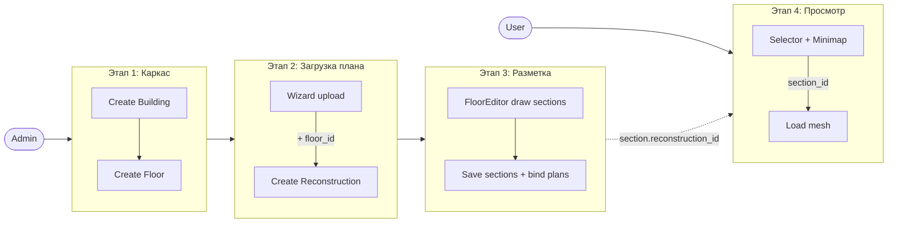

---

## UC-01: Создание корпуса

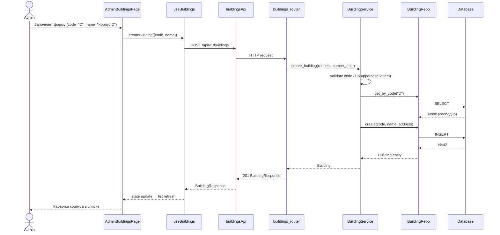

**Error cases:**

| Условие | HTTP | Тело | Поведение |
|---------|------|------|-----------|
| code занят | 409 | `{"detail": "Building with code 'D' already exists"}` | Подсветить поле code |
| code не валиден (формат) | 422 | Pydantic ValidationError | Не отправлять запрос (frontend validate) |
| Не админ | 403 | `{"detail": "Forbidden"}` | Показать toast |

**Edge cases:**
- Код регистронезависимый при поиске, но нормализуется в UPPER при сохранении (`"d"` → `"D"`)
- Удаление корпуса с этажами — каскадно удаляет этажи, секции; reconstructions становятся «висячими» (floor_id = NULL)

---

## UC-02: Создание этажа

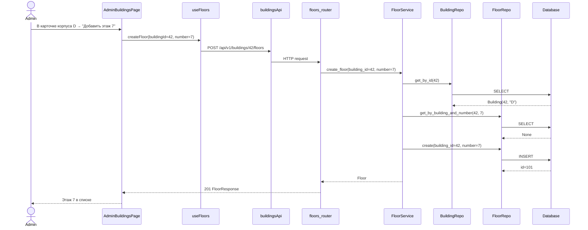

**Errors:** 404 если building не найден; 409 если этаж с таким номером уже есть в корпусе.

---

## UC-03: Wizard с обязательной привязкой к корпусу+этажу

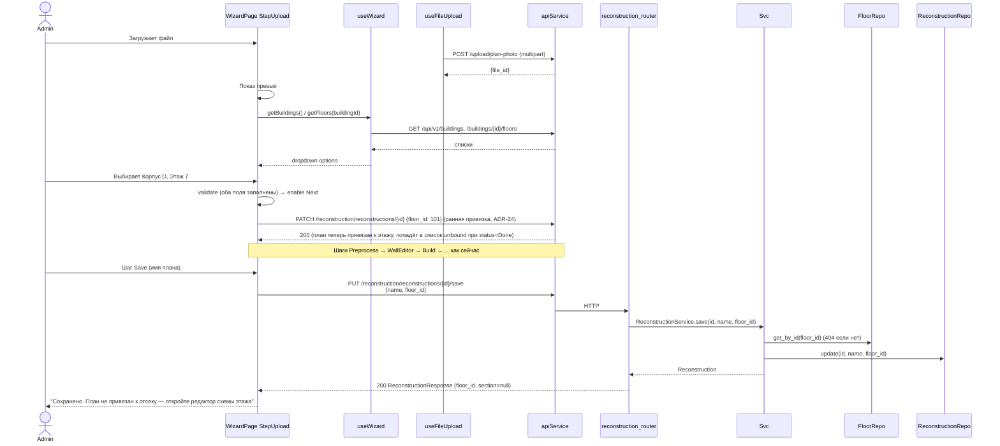

**Изменения в текущем wizard:**
- `frontend/src/components/Wizard/StepUpload.tsx` — `MetadataForm` заменяется на `BuildingFloorPicker` (два связанных dropdown'а)
- `frontend/src/components/Wizard/StepSave.tsx` — поля building/floor убраны (уже выбраны), остаётся только имя
- `frontend/src/hooks/useWizard.ts` — добавляется `floorId` в state, валидация перехода на следующий шаг
- `backend/app/api/reconstruction.py` — endpoint `/save` принимает `floor_id` вместо `building_id`+`floor_number`

**Errors:**

| Условие | HTTP | Поведение |
|---------|------|-----------|
| Нет корпусов в системе | — | StepUpload показывает кнопку «Создать корпус» (ссылка на /admin/buildings) |
| Нет этажей в выбранном корпусе | — | Аналогично |
| floor_id не найден на сохранении | 404 | Toast «Этаж был удалён, выберите другой» |

---

## UC-04: Multi-step wizard разметки этажа и привязки планов

Реализован как 5 последовательных шагов внутри `FloorEditorPage` в режиме «Wizard». Запускается:
- При открытии страницы (`/admin/floor-editor`) с пустым этажом — автоматически
- При нажатии «Сохранить изменения» в Overview — нет, это сохранение
- При нажатии «Редактировать схему» в Table view — переход на шаг 1 с предзагруженными данными

После завершения шага 5 — переход в режим Overview (UC-08).

**State wizard'a** (управляется `useFloorEditorWizard`):
```typescript
{
  currentStep: 1 | 2 | 3 | 4 | 5;
  buildingId, floorId: number;
  schemaImageId: string | null;          // загружено на шаге 1
  schemaImageUrl: string | null;
  cropBbox: { x, y, w, h, rotation } | null;  // шаг 2
  wallPolygons: Point[][] | null;         // шаг 3
  sectionDrafts: SectionDraft[];          // шаги 4-5
  isDirty: boolean;
}
```

### UC-04.1: Шаг 1 — Загрузка фото-схемы этажа

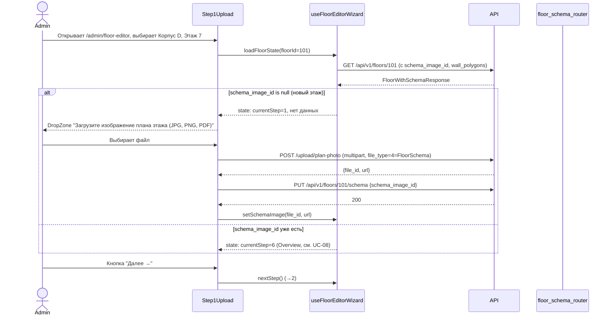

**UI:** левая панель «Источник плана» с DropZone (как на скрине шага 1). Кнопки: «← Назад» (выход из wizard'a), «Далее →» (orange, disabled пока файл не загружен).

**Errors:** invalid format (не JPG/PNG/PDF) — toast «Поддерживаются JPG, PNG, PDF». Слишком большой файл (>50MB) — toast.

---

### UC-04.2: Шаг 2 — Кадрирование и поворот

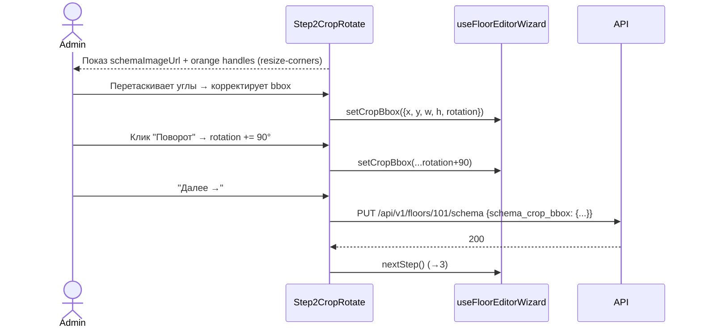

**UI:** левая панель «Инструменты»: «Кадрирование» (всегда активно), «Поворот» (кнопка, моментальное действие). Canvas с фото и оранжевыми handles. Внизу — `CanvasControls` (zoom/reset/rotate). Подсказка: «Выделите область с отсеком и нажмите Далее».

**Default:** при первом входе bbox = весь image; rotation = 0.

**Note:** название шага в макете «Кадрирование и выбор отсека» — историческое (изначально мы планировали per-section crop, отказались). Реальный смысл — **preprocessing фото-схемы целиком** (убрать рамки/подписи легенды). Подпись в UI заменяется на «Кадрирование схемы».

---

### UC-04.3: Шаг 3 — Извлечение стен (CV + ручная правка)

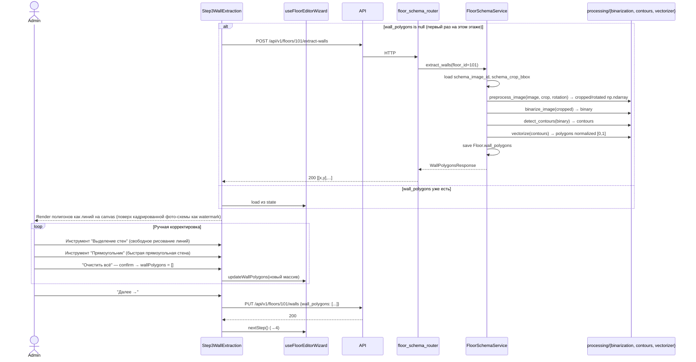

**UI:** левая панель «Инструменты»: «Выделение стен» (active по умолчанию, ручное рисование линий по точкам), «Прямоугольник» (drag для прямоугольной стены), «Очистить всё». Canvas с полигонами стен на нейтральном фоне (либо фото-схема с пониженной непрозрачностью). Внизу — Canvas controls.

**Reuse существующего CV:** `processing/binarization.py`, `processing/contours.py`, `processing/vectorizer.py` уже умеют это для wall vectorization в существующем wizard. Здесь — тот же вызов, но к фото-схеме этажа, не к плану отсека.

**Errors:**
- CV не находит стен — `wall_polygons = []`, пользователь рисует вручную
- Файл повреждён — 500 от processing → toast «Ошибка обработки изображения»

---

### UC-04.4: Шаг 4 — Разметка отсеков (rect + номер)

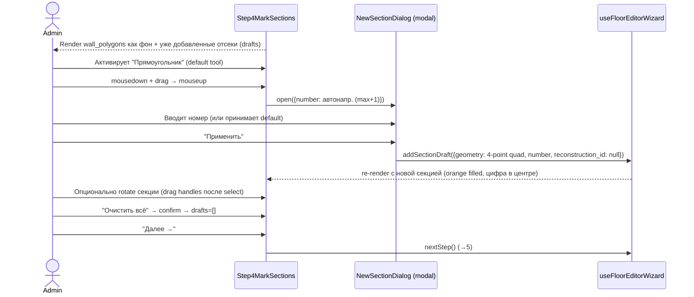

**UI:** левая панель «Инструменты»: «Выделение стен» (вернуться к редактированию стен), «Прямоугольник» (default), «Очистить всё». Canvas с wall_polygons как фон + уже размеченные секции с номерами. Подсказка: «Выделите прямоугольником отсек и задайте номер».

**Модалка `NewSectionDialog`** (твоё требование — поверх canvas, не side panel):
- Заголовок «Новый отсек»
- Поле «Номер отсека» (обязательное, число ≥ 1, default = max существующих + 1)
- Кнопки: «Отмена», «Применить» (orange)
- НЕТ полей описания/цвета — фиксированный оранжевый, без description

**Validation на клиенте:**
- Номер уникален среди drafts → иначе inline error «Отсек с номером N уже существует»

**Геометрия:** прямоугольник хранится как 4-точечный полигон (corners). При rotate — точки пересчитываются. Допускает любую ориентацию.

---

### UC-04.5: Шаг 5 — Привязка отсеков к планам (галерея)

```mermaid
sequenceDiagram
  actor Admin
  participant UI as Step5BindPlans
  participant Gallery as PlanGalleryPicker
  participant Hook as useFloorEditorWizard
  participant API

  UI->>API: GET /reconstruction/reconstructions?status=Done (все done-планы)
  API-->>UI: ReconstructionListItem[] с floor.building.code
  UI-->>Admin: Слева — список отсеков (1, 2, 3, ...); первый выбран
  UI-->>Gallery: render карточки всех Done-реконструкций

  Admin->>UI: Кликает Отсек 1 (orange highlight)
  Admin->>Gallery: Поиск "А11"
  Gallery->>Gallery: filter по name
  Admin->>Gallery: Dropdown "Здание" → выбирает "А"
  Admin->>Gallery: Dropdown "Этаж" → выбирает "11"
  Gallery-->>UI: filtered cards (А11.1, А11.2, ..., А11.5)

  Admin->>Gallery: Клик карточки "А11.4"
  Gallery->>Hook: bindReconstruction(sectionIdx=0, reconstruction_id=...)
  Hook-->>UI: secitons[0].reconstruction_id = ..., карточка с checkmark

  Admin->>UI: Переключается на Отсек 2 → bind следующего плана
  Note over Admin,Hook: ... повторяется для всех отсеков

  Admin->>UI: "Сохранить" (orange)
  UI->>Hook: saveAll()
```

**Save flow** (`saveAll()`):

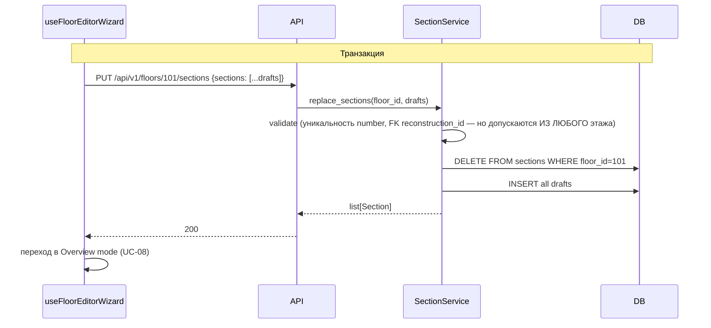

**Изменение в SectionService validation:** допускается reconstruction_id, чьё `Reconstruction.floor_id != floor_id` (галерея не ограничивает по этажу — ADR-17 reverse). Единственная проверка — reconstruction должен существовать и не быть привязан к другой секции.

**Кнопки:**
- «Сохранить и выйти» — save + редирект в Overview
- «Сохранить» (orange) — save + остаться, дать возможность ещё раз пройти wizard

**Errors:**
- Дубль номера — 422, toast
- Reconstruction уже в другой секции — 422, подсветка проблемного отсека

**Edge cases:**
- Не все отсеки привязаны — допустимо. Пустые reconstruction_id остаются null. План «не привязан» в end-user UI скрыт.
- Номер пропущен (1, 2, 4) — допустимо, нет требования последовательности.

---

## UC-05: Плашка статуса в EditPlanPage

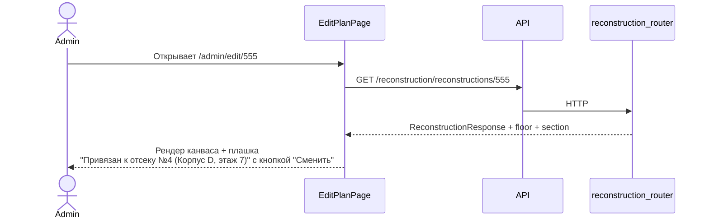

**Backend:** в `ReconstructionResponse` добавляются вычисляемые поля `floor` (вложенный {id, number, building: {id, code, name}}) и `section` (вложенный {id, number} | null), вычисляются через JOIN в `reconstruction_repo.get_by_id`.

---

## UC-06: End-user — выбор отсека и просмотр

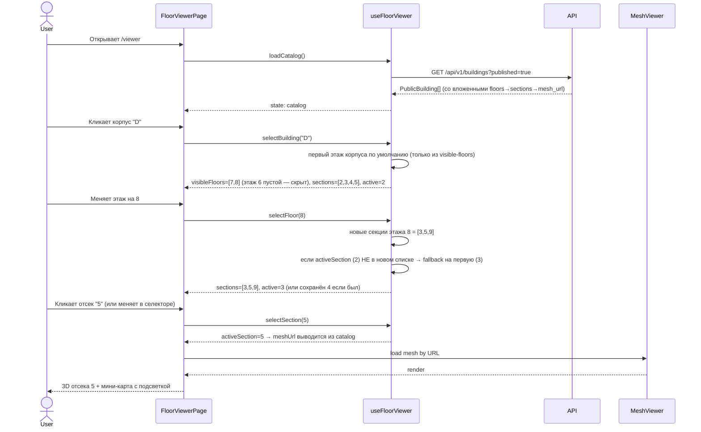

**Loading mesh:** mesh-URL берётся из ответа `/buildings?published=true` (denormalized). Снижает latency при переключении отсеков.

**Filtering "published" (иерархическое, ADR-21):** в каталоге `?published=true` рекурсивно фильтруются:
- секции — только с `reconstruction.status=Done`
- этажи — только если у них осталось ≥ 1 такая секция
- корпуса — только если у них остался ≥ 1 такой этаж

Это гарантирует, что end-user не увидит пустые этажи или корпуса без контента.

**Errors:**

| Условие | Поведение |
|---------|-----------|
| Нет ни одного "опубликованного" корпуса | Заглушка "Контент пока не загружен" |
| У выбранного отсека нет mesh (статус не Done) | Показать заглушку "План в обработке" |

---

## UC-07: Маршрут через несколько отсеков

Использует **существующий** `POST /navigation/multifloor-route`. Никаких изменений в backend-логике маршрутизации.

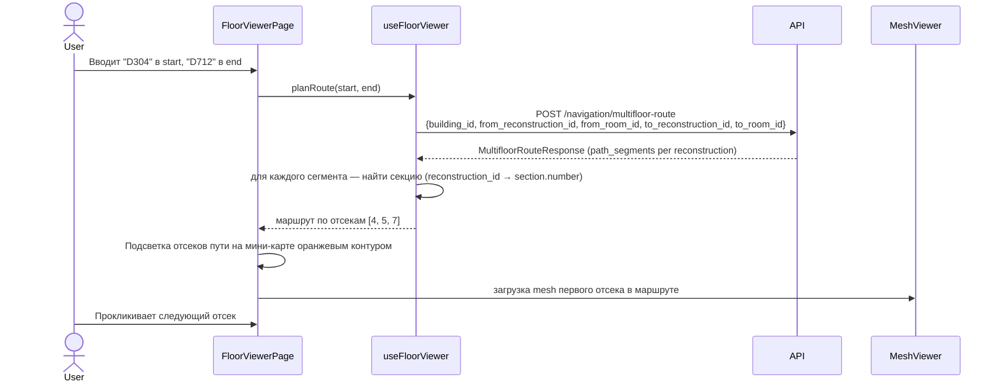

**Mapping segment → section:** `useFloorViewer` строит вспомогательный индекс `reconstructionId → sectionId` при загрузке каталога; используется для подсветки и для меток сегментов.

---

## UC-08: Overview — графический вид + Context Menu

```mermaid
sequenceDiagram
  actor Admin
  participant UI as FloorEditorPage (Overview mode)
  participant Hook as useFloorSections
  participant API

  Note over UI: Запускается после save (UC-04.5) или при открытии этажа с уже размеченными секциями
  UI->>Hook: loadFor(floorId)
  Hook->>API: GET /api/v1/floors/101/sections + GET /floors/101 (для wall_polygons + schema_image)
  API-->>UI: sections[] + Floor

  UI-->>Admin: Слева — список отсеков (номер + "Корпус N"), справа — canvas с wall_polygons фоном + sections (нейтральный цвет, активная — orange)
  UI-->>Admin: Снизу: "Всего отсеков: N", "Привязано: M", кнопка "Сохранить изменения" (orange)

  Admin->>UI: Right-click (или click) на отсек
  UI->>UI: openContextMenu(sectionId, position)
  UI-->>Admin: Меню с двумя пунктами: "Изменить номер", "Удалить отсек"

  alt "Изменить номер"
    Admin->>UI: Клик
    UI-->>Admin: NewSectionDialog (re-use модалки из UC-04.4) с current number
    Admin->>UI: Меняет номер → "Применить"
    UI->>Hook: updateSection(id, {number})
    Hook->>Hook: isDirty=true (не сохраняем сразу, ждём кнопку "Сохранить изменения")
  else "Удалить отсек" (UC-09)
    см. ниже
  end

  Admin->>UI: "Сохранить изменения"
  UI->>API: PUT /api/v1/floors/101/sections {...current state}
  API-->>UI: 200
  UI-->>Admin: Toast "Сохранено"
```

**Canvas рендер:**
- Background: cropped+rotated `schema_image_url` (применённое kropирование) с пониженной непрозрачностью
- Wall polygons: чёрные линии поверх (отрисовка как `<polyline>` или `<path>` в SVG)
- Section polygons: нейтральный outline + цифра в центре. **Активная** (если выбрана в списке слева) — оранжевая заливка с прозрачностью
- Тех же `CanvasControls` (zoom/reset)

**Note:** мокап шага 6 в моменте показывает отсеки с разными цветами outline — это **визуальное упрощение макета**. Реализация: один цвет (нейтральный), активная — orange. См. ADR-26 (отказ от Section.color).

**Кнопка-переключатель режимов:** «Графический / Табличный» — переключает Overview ↔ Table view (UC-10).

---

## UC-09: Удаление отсека

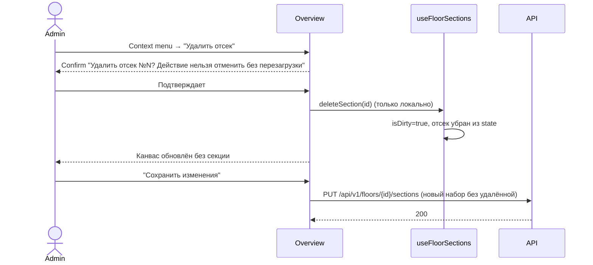

**Note:** удаление **локальное** до save. Это согласуется с replace-стратегией. После save — у удалённой секции `Reconstruction.floor_id` остаётся (план становится «висящим», доступным для перепривязки в новом проходе wizard'a).

---

## UC-10: Табличный вид

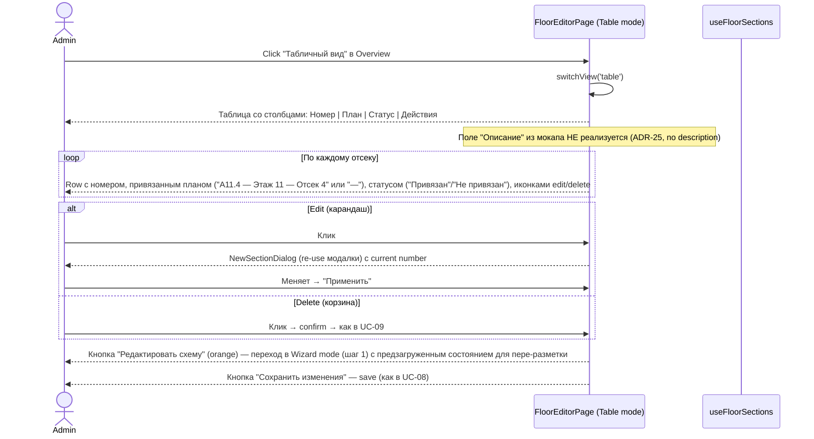

**Note:** "Экспорт схемы" (видна на мокапе шага 8) **не реализуется** в первой итерации (твой ответ: «Экспорт схемы не нужно делать»).
