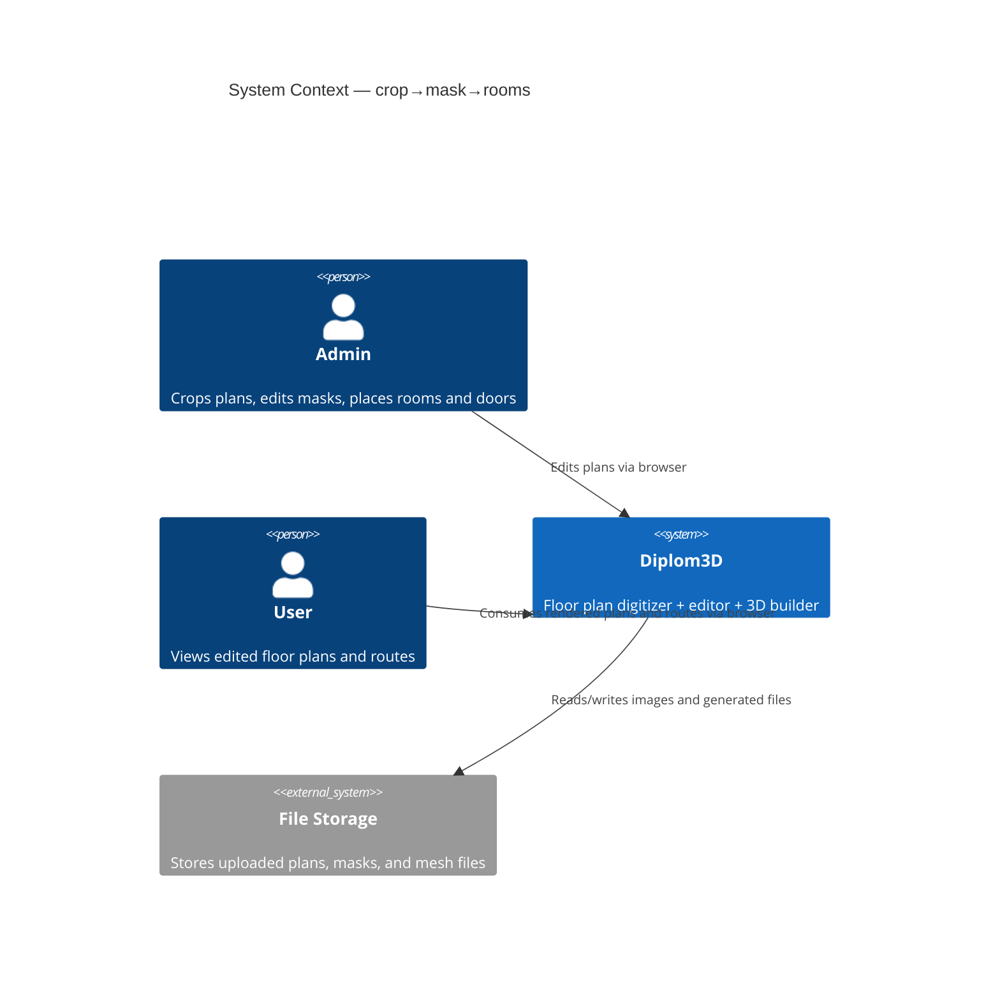
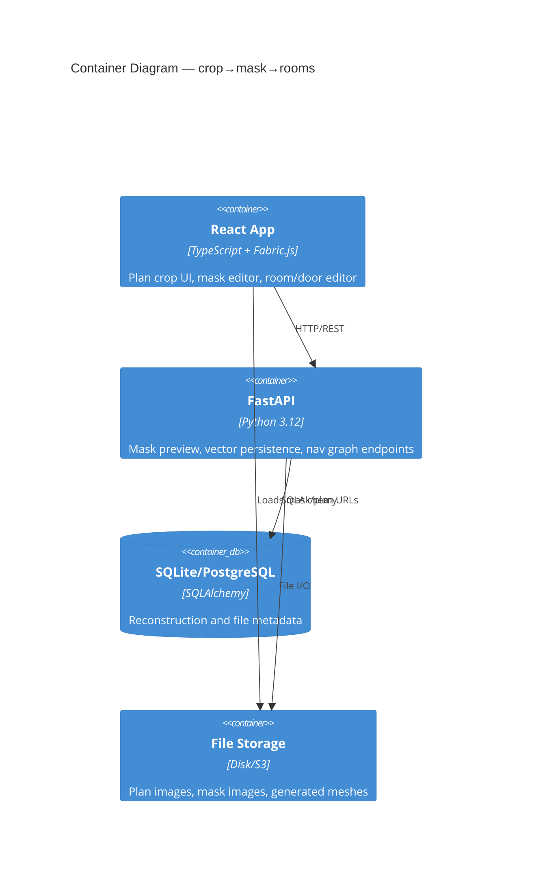
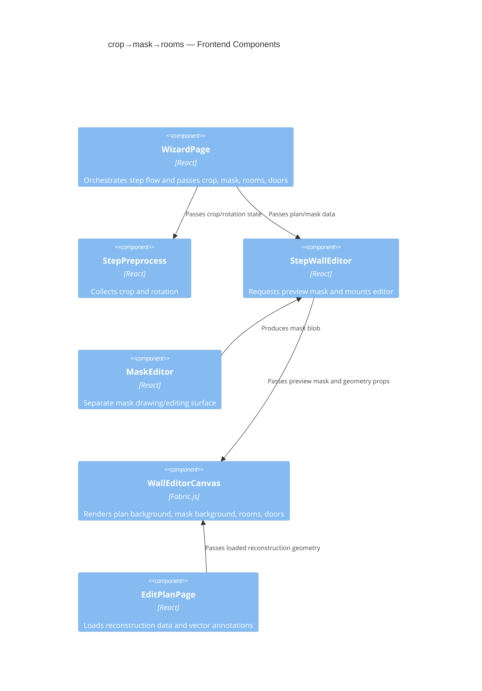
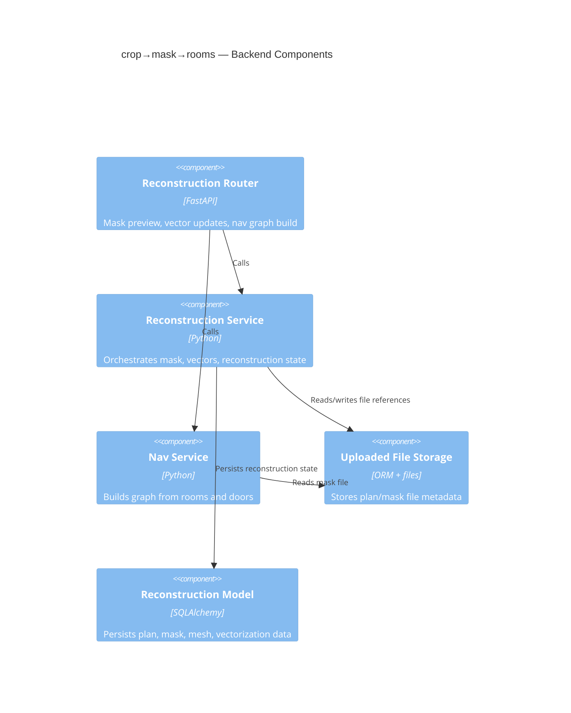
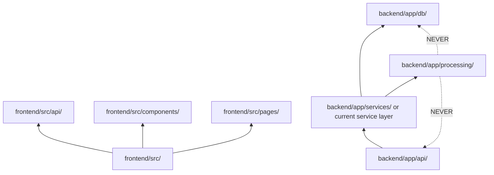

# Architecture: crop→mask→rooms

## C4 Level 1 — System Context

## C4 Level 2 — Container

## C4 Level 3 — Component

### 3.1 Frontend Components

### 3.2 Backend Components

## Module Dependency Graph

## Logical Boundaries

### Frontend
- `frontend/src/components/Editor/WallEditorCanvas.tsx:78-117` builds `displayPlanUrl` from `planUrl`, `planRotation`, and `planCropRect`.
- `frontend/src/components/Editor/WallEditorCanvas.tsx:243-268` loads `maskUrl` as Fabric background and records background dimensions.
- `frontend/src/components/Editor/WallEditorCanvas.tsx:467-493` and `623-678` normalize rooms and doors against background bounds.
- `frontend/src/components/Wizard/StepWallEditor.tsx:93-110` regenerates mask preview when crop or rotation changes.
- `frontend/src/pages/WizardPage.tsx:30-39` and `frontend/src/pages/EditPlanPage.tsx:119-153` persist annotations and call backend APIs.

### Backend
- `backend/app/api/reconstruction.py:254-347` exposes vector data and nav graph endpoints relevant to edited rooms and doors.
- `backend/app/db/models/reconstruction.py:31-57` persists the mask file id and vectorization JSON.
- `backend/app/db/models/reconstruction.py:59-71` stores room markers.

## Required Architectural Direction
The feature needs a single shared geometry basis for all three visual layers:
1. plan preview,
2. mask preview,
3. interactive annotations.

The current codebase uses separate render paths for plan and mask and then derives rooms/doors from the mask canvas bounds. The design target is to make the mask and plan consume the same transform metadata so that annotation normalization uses the same crop/rotation origin as the visible plan.
