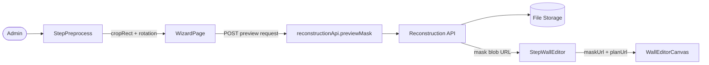
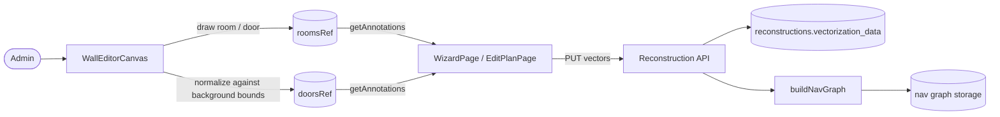
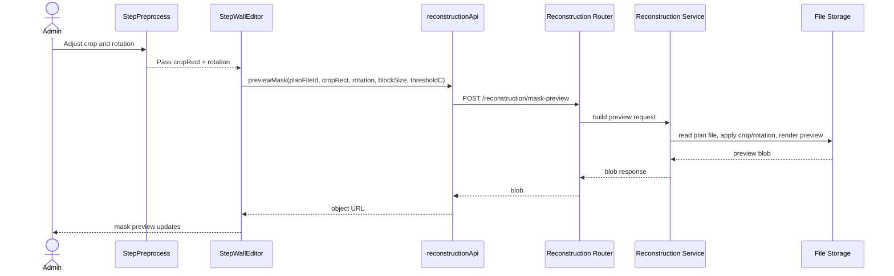
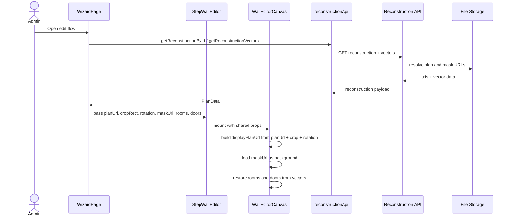
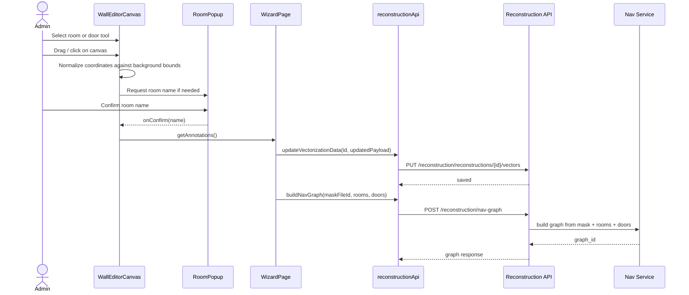
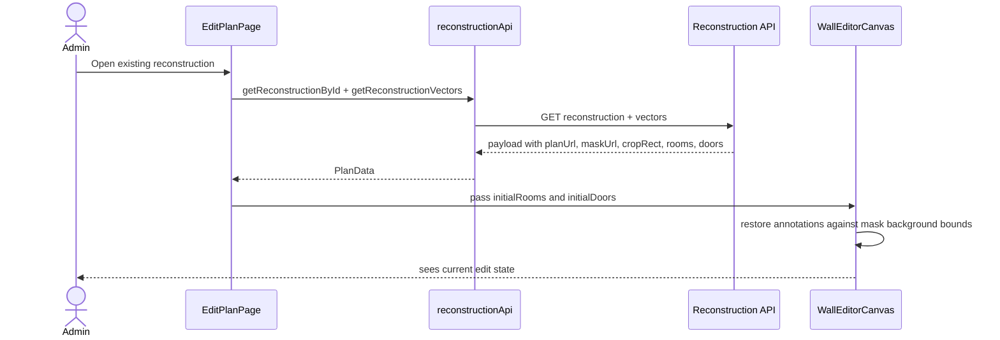

# Behavior: crop→mask→rooms

## Data Flow Diagrams

### DFD: Crop and Preview Generation

### DFD: Annotation Editing and Save

## Sequence Diagrams

### Use Case 1: Generate a cropped/rotated preview mask

**Error cases:**

| Condition | HTTP Status | Response | Behavior |
|-----------|-----------|----------|----------|
| Missing plan file | 404 | `{"detail": "..."}` | Preview cannot be generated |
| Invalid crop/rotation | 400 | validation error | Request rejected before processing |
| Preview generation failure | 500 | safe error message | Log the failure and stop refresh loop |

### Use Case 2: Render editor with shared plan/mask geometry

**Error cases:**

| Condition | HTTP Status | Response | Behavior |
|-----------|-----------|----------|----------|
| Reconstruction not found | 404 | `{"detail": "..."}` | Editor page shows error state |
| Vectorization data missing | 404/nullable fallback | `null` or error detail | Editor loads with empty annotations |
| Mask URL missing | none/empty string | empty string | Editor cannot align layers and stays degraded |

### Use Case 3: Place a room or door and save it

**Error cases:**

| Condition | HTTP Status | Response | Behavior |
|-----------|-----------|----------|----------|
| Invalid room payload | 400 | validation error | Save rejected |
| Reconstruction not found | 404 | `{"detail": "Реконструкция не найдена"}` | Save or update fails |
| Nav graph build failure | 500 | safe error message | Graph step stops; edited vectors remain saved |

### Use Case 4: Re-open an edited plan

## DFD Notes
- The plan crop and rotation originate in `StepPreprocess` and are reused by both the preview-mask request and the plan rendering effect.
- The mask preview is regenerated whenever crop or rotation changes in `StepWallEditor`.
- Rooms and doors are currently normalized using the visible background image dimensions in `WallEditorCanvas`.
- The save flow persists the edited annotations to vectorization data, then triggers nav graph building from the same room/door arrays.

## Edge Cases Specific to This Feature
- The plan preview can be cropped while the mask URL remains from an earlier generation if preview refresh is delayed.
- The plan may render with a different transform than the mask when the loaded reconstruction already has stored crop metadata.
- Door coordinates are stored as a point-like annotation (`x1 == x2`, `y1 == y2`) and are sensitive to any mismatch in the shared basis.
- Restored rooms are converted from polygons to bounding rectangles in `EditPlanPage`, which can lose the original polygon shape when re-rendering annotations.
