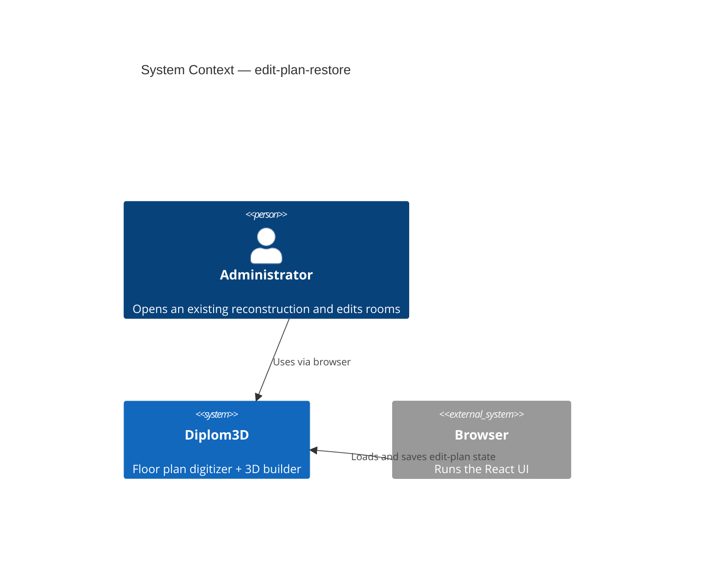
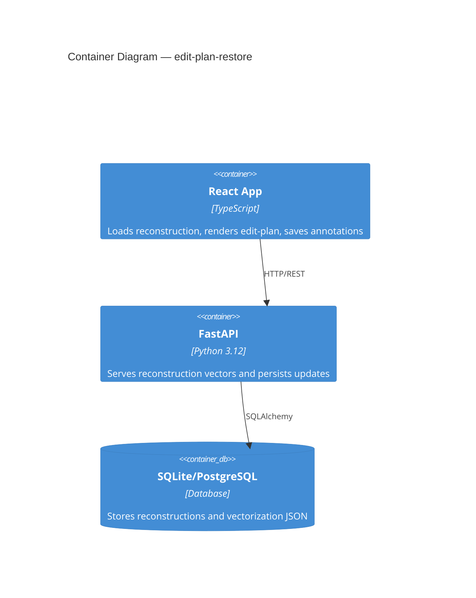
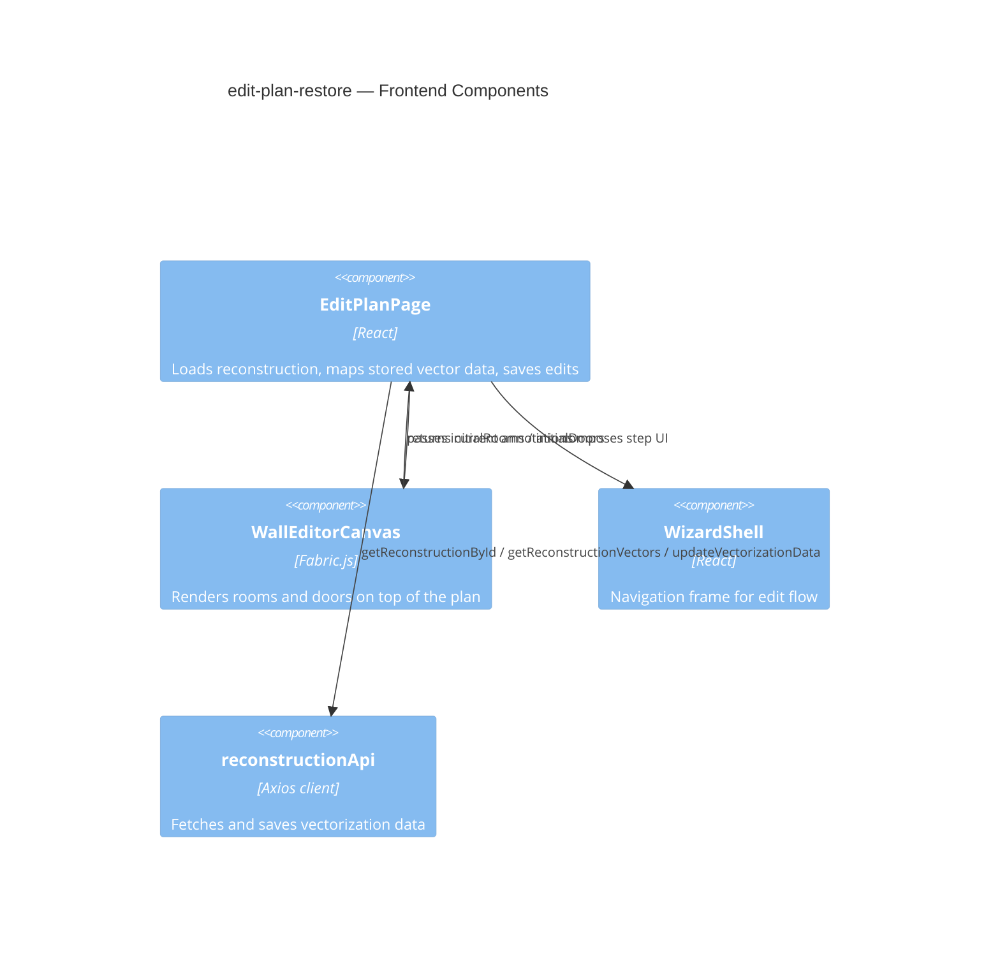
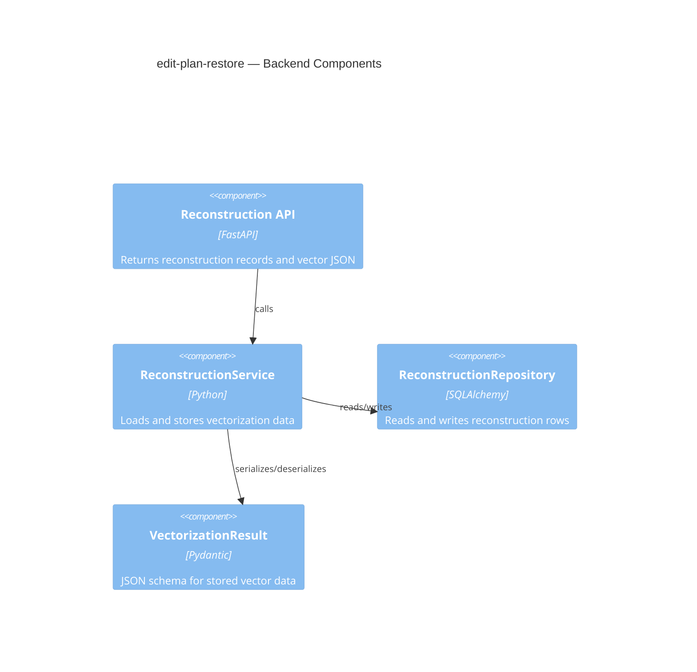
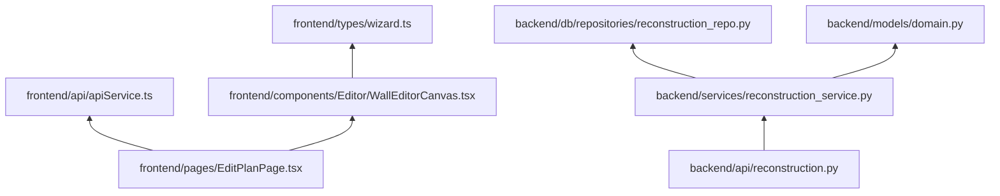

# Architecture: edit-plan-restore

## C4 Level 1 — System Context

## C4 Level 2 — Container

## C4 Level 3 — Component

### 3.1 Frontend Components

### 3.2 Backend Components

## Module Dependency Graph

**Dependency rule:** frontend must preserve room geometry in its local edit flow; backend must store and return the exact vector schema without flattening at the API boundary.
