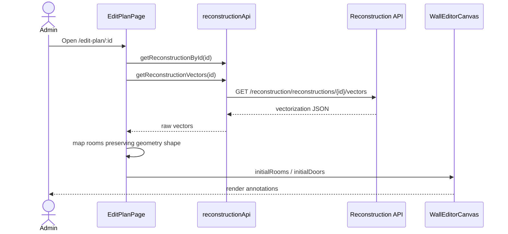
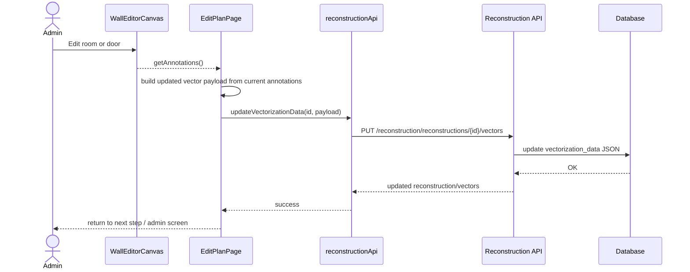

# Behavior: edit-plan-restore

## Data Flow Diagrams

### DFD: Load existing plan for editing

```mermaid
flowchart LR
Admin([Administrator]) -->|Open edit screen| Page[EditPlanPage]
Page -->|GET reconstruction| API1[GET /reconstruction/reconstructions/{id}]
Page -->|GET vectors| API2[GET /reconstruction/reconstructions/{id}/vectors]
API2 -->|JSON vectorization_data| Page
Page -->|Map rooms/doors| Canvas[WallEditorCanvas]
Canvas -->|Render annotations| Admin
```

### DFD: Save edited annotations

```mermaid
flowchart LR
Admin([Administrator]) -->|Move / rename / delete| Canvas[WallEditorCanvas]
Canvas -->|rooms + doors| Page[EditPlanPage]
Page -->|Preserve vector schema| Payload[Updated vectorization JSON]
Payload -->|PUT vectors| API[PUT /reconstruction/reconstructions/{id}/vectors]
API -->|Persist JSON| DB[(reconstructions.vectorization_data)]
DB -->|Stored JSON| API
```

## Sequence Diagrams

### Use Case 1: Open existing reconstruction in edit mode



**Error cases:**

| Condition | HTTP Status | Response | Behavior |
|-----------|-----------|----------|----------|
| Reconstruction not found | 404 | {"detail": "..."} | Show error state and return to admin |
| Vector JSON missing/invalid | 200 + null/empty | empty vector data | Open editor with no restored annotations |
| Room geometry schema unexpected | 200 + partial data | partial list | Skip invalid items, do not crash page |

### Use Case 2: Save annotations after editing



**Error cases:**

| Condition | HTTP Status | Response | Behavior |
|-----------|-----------|----------|----------|
| Invalid vector payload | 400 | Validation error | Show save error, keep current canvas state |
| Reconstruction not found | 404 | {"detail": "..."} | Show save error, do not navigate away |
| Database write failure | 500 | Safe error message | Show error, do not drop local edits |

### Edge cases
- Restored data may contain rooms with polygon geometry and rooms that only have bounding boxes.
- The edit page must not degrade polygon data simply because the canvas renders annotations as rectangles.
- If a room cannot be represented exactly by the current editor, the behavior should be explicitly documented rather than silently flattening it twice.
