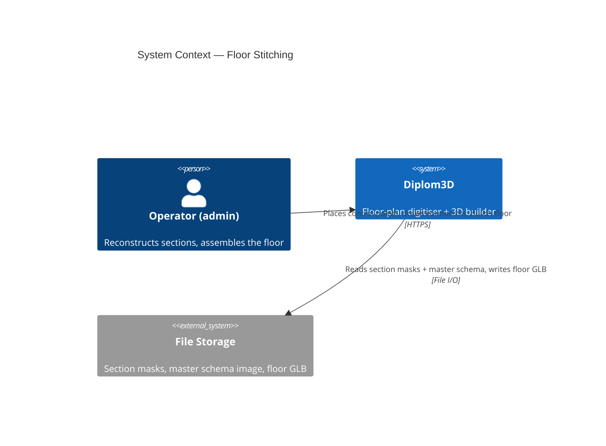
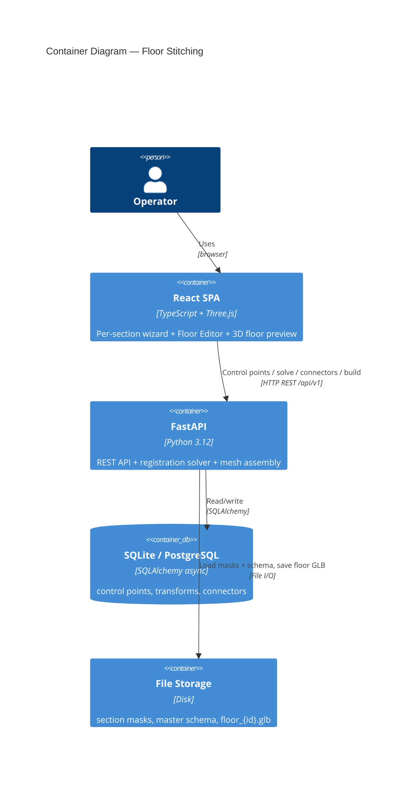
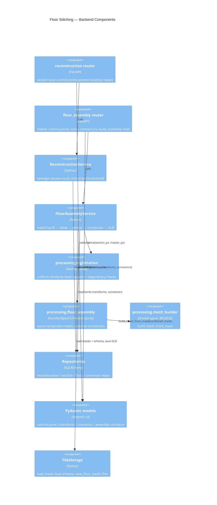
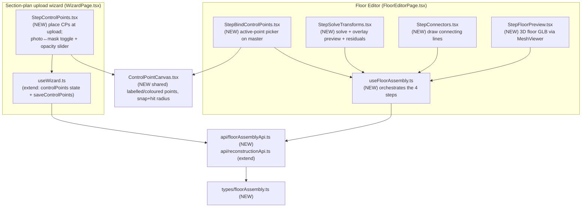
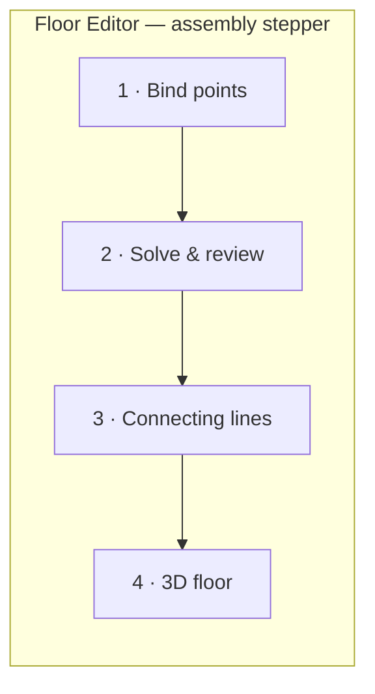
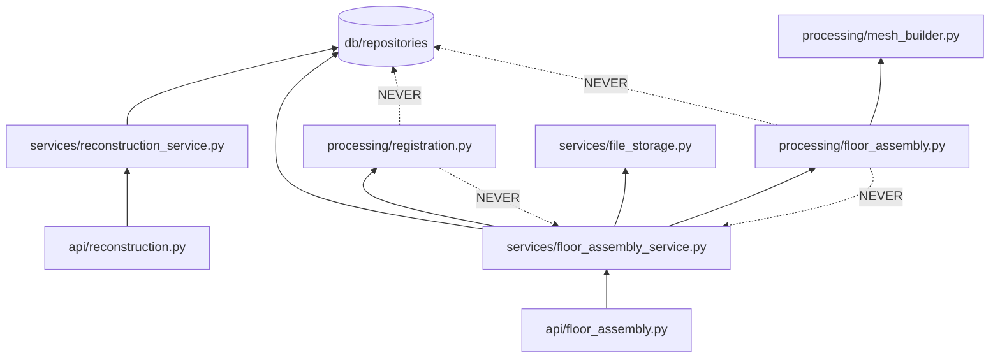
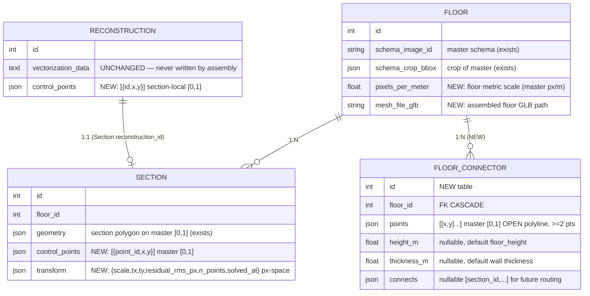

# Architecture: Floor Stitching

> Logical view (C4 L1 → L2 → L3) + module dependency graph.
> Behaviour is in [02-behavior.md](02-behavior.md); the geometry/maths is in
> [06-pipeline-spec.md](06-pipeline-spec.md).

## C4 Level 1 — System Context

The operator already produces per-section reconstructions. This feature adds the
**registration + assembly** loop on top of the existing `Building → Floor →
Section` data the operator has created.

## C4 Level 2 — Container

No new containers. The feature is additive REST endpoints + new columns/table in
the existing DB + a new GLB artifact in the existing file storage.

## C4 Level 3 — Component

### 3.1 Backend Components

**Responsibility split (the line that protects the cabinet-preservation rule):**

- `processing.registration` and `processing.floor_assembly` are **pure** — they
  receive plain arrays / numbers and return arrays / a `trimesh.Trimesh`. They
  never touch the DB and never write `vectorization_data`.
- `FloorAssemblyService` does **all** I/O: loads section masks + the master
  schema from `FileStorage`, reads control points from repos, calls the pure
  solver/assembler, persists transforms + the floor GLB.
- The solver output (`scale, tx, ty`) is **uniform** by construction (the pure
  function only ever returns one isotropic scale), so no layer can introduce an
  anisotropic distortion.

### 3.2 Frontend Components

`ControlPointCanvas` is the single shared canvas widget for placing/selecting
labelled control points; it is reused by both the section side (`StepControlPoints`)
and the master side (`StepBindControlPoints`) so the visual language (colour +
label per ID, snap radius, hit radius) is identical on both screens — the core of
the "points can't be confused" requirement.

`useFloorAssembly.ts` is a **new sibling** of the existing `useFloorEditorWizard.ts`
(which already handles section drawing/binding on `FloorEditorPage`). It does not
replace it — the registration/solve/connector/preview steps are a separate concern
with their own state and their own `floorAssemblyApi`, so they live in a dedicated
hook. The per-section side extends the existing `useWizard.ts` used by
`WizardPage.tsx`.

### 3.3 Frontend UX & quality bar

The registration UI is the part the operator touches most, so it gets a deliberate
UX design (not just functional wiring). All logic stays in hooks; components are
presentational; types are explicit (no `any`); Three.js objects `dispose()` on
unmount (`prompts/frontend_style.md`, `threejs_patterns.md`).

**Dual-panel binding (the anti-confusion screen).** Section thumbnail on the left,
master schema on the right, a shared color/label legend between them. Selecting an
ID highlights it on *both* panels (pulse animation); the same color follows that ID
everywhere. A per-ID checklist shows ✓ placed / ○ pending so the operator always
sees what's left. This is the visual enforcement of AC2.

**Live feedback at every step.**

| Step | What the operator sees |
|------|------------------------|
| Place / bind points | snap ring appears when within `R_SNAP` of a wall vertex; cursor crosshair; magnifier loupe near the cursor for pixel-precise clicks; drag to nudge, click-to-select within `R_HIT` |
| Solve & review | each section gets a status chip — green **ok** / amber **check points** (residual/ppm warning) / red **needs points** / red **degenerate** — with its residual in metres; the warped section outline is overlaid on the master in its ID color so misregistration is *visible*, not just numeric |
| Connecting lines | a polyline draw tool (click to add vertices, double-click/Enter to finish, Esc to cancel); existing lines are editable (drag vertex, insert/remove vertex, delete line); rendered as thick bands so they read as walls |
| 3D floor | `MeshViewer` (reuses `useMeshViewer`) with orbit/zoom, per-section tint toggle, a "rebuild" action (fresh preview), a **"save floor" (confirm)** action that promotes the previewed GLB to the persisted floor, and an excluded-sections notice listing why each was skipped |

**Robust states.** Every screen has explicit loading (skeleton), empty ("no
sections bound yet — go bind a plan"), and error (toast + inline) states, plus an
**undo/redo** stack for point placement and line drawing, and keyboard support
(arrow-nudge selected point, Del to remove, Tab to advance active ID). Canvases are
responsive (devicePixelRatio-aware) so points stay crisp on zoom; the display-px
radii (`R_SNAP`,`R_HIT`) are converted through the current display scale so
behaviour is identical at any zoom level.

`ControlPointCanvas` and the connector draw tool share one canvas-interaction core
(coordinate mapping, snap, hit-test, devicePixelRatio handling) so behaviour and
look are uniform across both wizards.

> The operator mock-ups for the combined **"Редактор точек"** screen (3-pane
> layout, photo/маска/инверт. view toggle + opacity, orange crosshair markers,
> "Опорные точки: 8/10" counter, "Далее" CTA) and their mapping to these
> components are captured in [07-ui-reference.md](07-ui-reference.md). Note that
> the mock-up co-locates the **Опорная точка** and **Переходная точка** tools on
> one screen for operator convenience — they remain separate data/concerns per
> [ADR-14](03-decisions.md); this feature owns only the control-point tool.

## Module Dependency Graph

**Rule (architecture.md §117-119):** dependencies flow inward; `processing/`
imports nothing from `api/`, `services/`, or `db/`. `processing.floor_assembly`
may import `processing.mesh_builder` (same layer) — that is allowed and is how
"raise walls like a normal plan" is reused.

## Data Model (new fields / table)

Rationale for placement (see [03-decisions.md](03-decisions.md) ADR-2):

- **section-local** control points live on `Reconstruction` (they belong to the
  section's own plan, assigned at upload time, independent of any floor).
- **master** control points + the solved **transform** live on `Section` (they
  belong to *this section on this floor*).
- floor metric scale + assembled GLB + connectors live on / under `Floor`.

## Forward compatibility (next features build on this)

This is the **horizontal half** of building assembly. The design leaves clean seams
for the features the user named next — without implementing them (see
[03-decisions.md](03-decisions.md) §Forward compatibility, ADR-14/15):

- **Vertical stitching** reuses the *same* pure `solve_similarity` to register floor
  *N+1* over floor *N* (control points one level up). Floors stack by a parent
  transform using `floors.pixels_per_meter` (persisted here) + a future
  `Floor.base_elevation_m` — **no re-mesh**.
- **Multi-building 3D scene** = each floor/building GLB built at a local origin and
  placed by a parent `Object3D` transform; N buildings = N parented subtrees.
- **Air bridges / vertical transitions** extend the **existing transition layer**
  (`TransitionGroup.type` + `target_hint_building_id/floor_number` already model
  cross-floor/-building links). This feature **does not touch transitions** — control
  points (registration) and transition points (routing) are separate tools (ADR-14).

## Use Cases (→ sequences in 02-behavior.md)

| # | Use case | Primary component |
|---|----------|-------------------|
| UC1 | Place section-local control points (at section-plan upload) | `StepControlPoints` → `ReconstructionService.save_control_points` |
| UC2 | Bind matching control points on the master schema | `StepBindControlPoints` → `FloorAssemblyService.save_section_control_points` |
| UC3 | Solve per-section transforms (match by ID + least squares) | `StepSolveTransforms` → `FloorAssemblyService.solve_transforms` → `processing.registration` |
| UC4 | Draw / replace connecting lines | `StepConnectors` → `FloorAssemblyService.replace_connectors` |
| UC5 | Build (preview) → confirm → persist the stitched floor mesh | `StepFloorPreview` → `FloorAssemblyService.build_floor_mesh` (preview) / `confirm_floor_mesh` (persist) → `processing.floor_assembly` → `build_mesh_from_mask` |
