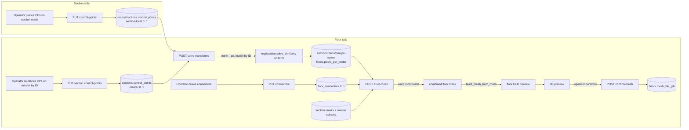
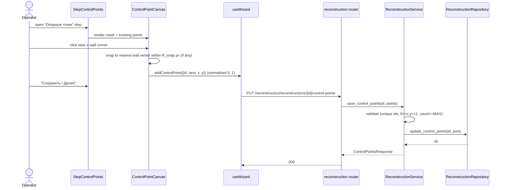
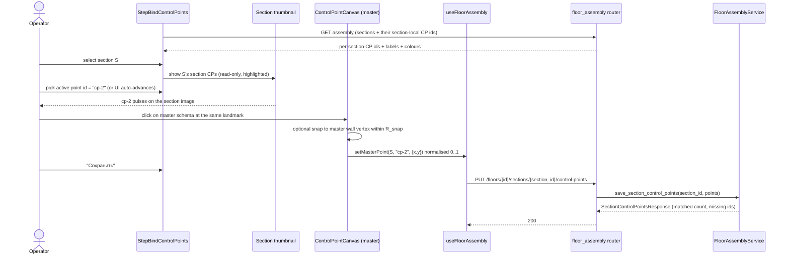
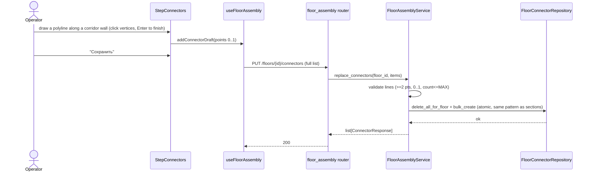
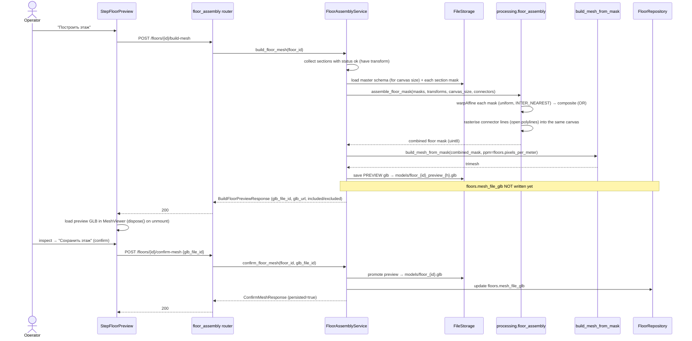

# Behavior: Floor Stitching

> One section per use case (happy path + errors + edge cases grouped).
> Coordinate maths referenced here is specified in
> [06-pipeline-spec.md](06-pipeline-spec.md). JSON shapes are in
> [05-api-contract.md](05-api-contract.md).

## Data Flow Diagram — end to end



The single global frame is the **master-schema pixel canvas**. Section masks are
warped into it by a uniform similarity; the composite is extruded by the existing
`build_mesh_from_mask`. Nothing writes back to `vectorization_data`.

---

## UC1 — Place section-local control points (at section-plan upload)

A step in the **section-plan upload wizard** (`WizardPage`), placed *after*
binarization so the wall mask exists, lets the operator drop labelled control points
on the plan. The editor toggles between the **original photo** and the **binarised
wall mask** with an **opacity slider** (per the friend's mockup), so the operator can
read the photo for context but **snap to the crisp mask corners** for precision. Each
point gets a **stable ID unique within the section** (e.g. `cp-1`, `cp-2`, …,
monotonically increasing — never reused even after a delete, so a master-side
coordinate can never silently re-bind to a different physical point).



**Behaviour rules**
- IDs are generated client-side from a monotonic counter persisted with the point
  list; deleting a point does **not** recycle its ID.
- A new point **snaps** to the nearest wall-polygon vertex within `R_snap`
  (default 12 px at display scale) when one exists; otherwise it stays where
  clicked. Snapping makes the same physical corner reproducible on both screens →
  reliable scale (06-pipeline-spec §Snapping).
- Clicking within `R_hit` (default 10 px) of an existing point selects it for
  drag/delete instead of creating a duplicate.

**Error / edge cases**

| Condition | Status | Behaviour |
|-----------|--------|-----------|
| `reconstruction_id` not found | 404 | `{"detail": "Reconstruction … not found"}` |
| duplicate point id in payload | 422 | reject whole payload |
| x or y outside [0,1] | 422 | Pydantic validation error |
| > `MAX_CONTROL_POINTS` (e.g. 20) | 422 | reject |
| 0/1/2 points saved | 200 | allowed to save, but section is "not solvable yet" (≥3 needed at solve time) |

---

## UC2 — Bind matching control points on the master schema

This is where "points must not be confused" is enforced. Correspondence is
**by ID, established through an active-point picker** — never by spatial guessing.



**Anti-confusion mechanics (the core of the requirement)**
1. The master coordinate is always written to the **currently-selected ID** — the
   click carries the ID with it. There is no nearest-neighbour matching.
2. Each ID is shown with the **same colour + label** on the section thumbnail and
   on the master canvas. The active ID pulses on both simultaneously.
3. Re-clicking with the same active ID **overwrites** that ID's master
   coordinate; it never creates a second point for the same ID.
4. The panel lists every section-local ID with a ✓/✗ "placed on master" badge, so
   the operator sees exactly which correspondences exist before solving.
5. Only IDs that exist on the **section side** can be placed on the master — the
   picker is populated from `reconstruction.control_points`, so a master point can
   never reference a non-existent section point.

**Error / edge cases**

| Condition | Status | Behaviour |
|-----------|--------|-----------|
| section not found | 404 | error |
| master point id ∉ section's control-point ids | 422 | reject (prevents orphan correspondence) |
| x/y outside [0,1] | 422 | validation error |
| operator places only some ids | 200 | saved; unmatched ids reported, section solvable only if ≥3 matched |

---

## UC3 — Solve per-section transforms

```mermaid
sequenceDiagram
actor Op as Operator
participant UI as StepSolveTransforms
participant API as floor_assembly router
participant Svc as FloorAssemblyService
participant SecRepo as SectionRepository
participant RecRepo as ReconstructionRepository
participant Reg as processing.registration

Op->>UI: "Рассчитать преобразования"
UI->>API: POST /floors/{id}/solve-transforms
API->>Svc: solve_transforms(floor_id)
loop each bound section
  Svc->>RecRepo: get reconstruction (control_points + image_size_cropped + ppm)
  Svc->>SecRepo: get section.control_points (master)
  Svc->>Svc: match by ID → pairs; norm→px (06-pipeline §Spaces)
  alt < 3 matched OR degenerate
    Svc->>Svc: mark section unregistered (+reason)
  else >= 3 matched, non-degenerate
    Svc->>Reg: solve_similarity(src_px, dst_px)  uniform scale+shift
    Reg-->>Svc: {scale, tx, ty, residual_rms}
    Svc->>SecRepo: save transform
  end
end
Svc->>Svc: derive floors.pixels_per_meter from anchor section
Svc->>SecRepo/FloorRepo: persist
Svc-->>API: SolveResult (per-section status, residuals, warnings)
API-->>UI: 200
UI->>UI: overlay each section's warped wall outline on master (preview)
```

**Behaviour rules**
- Matching: `pairs = {id : (section_xy, master_xy) for id in section.ids ∩ master.ids}`.
- Coordinates are converted **to pixel space** before solving so the scale is
  aspect-correct and isotropic (06-pipeline §Spaces). The solver returns exactly
  one `scale` (no `sx`/`sy`).
- `floors.pixels_per_meter` is derived from the **anchor section** (most matched
  points; tie-break lowest `number`): `ppm_floor = ppm_anchor × scale_anchor`.
  Per-section implied ppm values are compared; a spread > `PPM_WARN_RATIO` (e.g.
  10 %) raises a non-fatal warning (likely a mis-placed control point).

**Error / edge cases**

| Condition | HTTP | Behaviour |
|-----------|------|-----------|
| floor not found | 404 | error |
| no bound sections | 409 | `{"detail": "No sections bound to plans"}` |
| section has < 3 matched ids | 200 | section `status: "needs_points"`, excluded from build |
| matched points coincident / collinear / baseline < `R_min_baseline` | 200 | section `status: "degenerate"`, excluded, reason returned |
| residual_rms above `RESIDUAL_WARN` | 200 | section `status: "ok"` + `warning` (operator may re-place points) |

---

## UC4 — Draw / replace connecting lines

A connecting line is an **open polyline** tracing one corridor wall. A corridor is
typically two lines (its two sides); the open ends face the section doorways so the
passage is not walled shut.



Atomic replace-all mirrors `PUT /floors/{id}/sections`
(`sections.py:36`, `section_service.py:46`).

**Error / edge cases**

| Condition | HTTP | Behaviour |
|-----------|------|-----------|
| floor not found | 404 | error |
| line < 2 points | 422 | validation error |
| coordinate outside [0,1] | 422 | validation error |
| empty list | 200 | clears all connectors (valid — floor with no corridors) |

---

## UC5 — Build, preview and persist the stitched floor mesh



**Behaviour rules**
- The combined canvas size = the master schema **cropped** pixel dimensions,
  capped at `MAX_FLOOR_CANVAS_PX` (e.g. 4000 on the long side) to bound memory.
- Each section mask is warped with `cv2.warpAffine` using the **uniform** matrix
  derived from its transform and `INTER_NEAREST` (binary mask stays crisp; no
  gray, no shape distortion). Overlaps merge via pixel-wise `OR`; seams/gaps are
  the connectors' job.
- Connector lines are converted master-norm → master-px and drawn as **wall bands**
  with `cv2.polylines(isClosed=False, thickness=derived wall thickness)` so they
  extrude like walls. No fill — the floor mesh is walls-only, so a line *is* a wall.
- `build_mesh_from_mask` is called **unmodified** — this is literally "raise walls
  like a normal plan", now on the stitched map.
- **Preview → confirm.** `build-mesh` writes a *preview* GLB and returns a
  `glb_file_id`; it does **not** overwrite `floors.mesh_file_glb`. Only an explicit
  `confirm-mesh {glb_file_id}` promotes that GLB to the persisted floor model, so an
  unreviewed rebuild can never clobber a good saved floor. Re-running `build-mesh`
  yields a fresh preview (previous unconfirmed previews may be garbage-collected).
- **Low-detail warning (low-res master).** Since the master schema is a phone photo,
  any section whose solved `scale < DETAIL_WARN_SCALE` is downsampled on the canvas;
  the build returns a non-fatal `low_detail` warning naming it (the operator may
  re-shoot the master at higher resolution) and still produces the preview. The
  canvas is **not** upscaled (fixed-canvas, ADR-18).

**Error / edge cases**

| Condition | HTTP | Behaviour |
|-----------|------|-----------|
| floor not found | 404 | error |
| no sections with a transform | 409 | `{"detail": "Run solve-transforms first"}` |
| a section mask file missing | 200 | skip section, list it in `excluded`, continue |
| combined mask has no wall contours | 422 | `{"detail": "Empty floor mask"}` (mirror mesh_builder) |
| trimesh not installed | 500 | logged, safe message |
| confirm with unknown/expired `glb_file_id` | 422 | `{"detail": "No such preview — rebuild first"}` |

---

## Cross-cutting: the cabinet / lift / stair non-displacement guarantee

This is asserted at three points and tested in [04-testing.md](04-testing.md):

1. **No mutation.** No code path in this feature calls
   `reconstruction_repo.update_vectorization_data`. The section's rooms (cabinets),
   doors, stairs and lifts in `vectorization_data` are read-only inputs to the
   floor build. (The only writer remains the per-section editor's
   coord-preserving merge, `reconstruction_service.py:301-311`.)
2. **Uniform transform.** `processing.registration.solve_similarity` returns a
   single isotropic `scale`; warping uses `[[s,0,tx],[0,s,ty]]`. Equal x/y scale,
   zero rotation, zero shear ⇒ no relative displacement or shape change of any
   element inside a section.
3. **Pixel-space solve.** Normalisation ([0,1] = ÷W, ÷H) is undone before solving
   and the warp happens in pixel space, so the differing aspect ratios of the
   section vs master rasters can **not** leak in as an x/y stretch. (06-pipeline
   §Why pixel space.)
