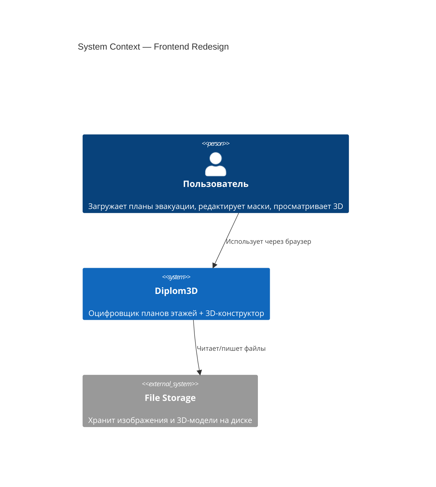
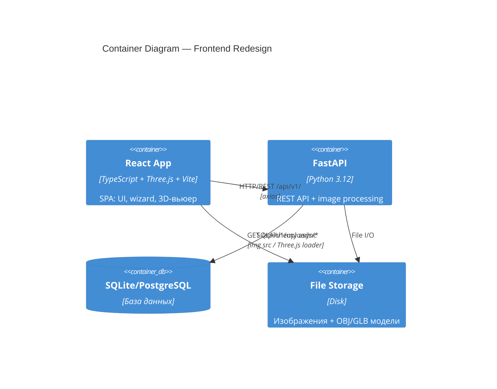
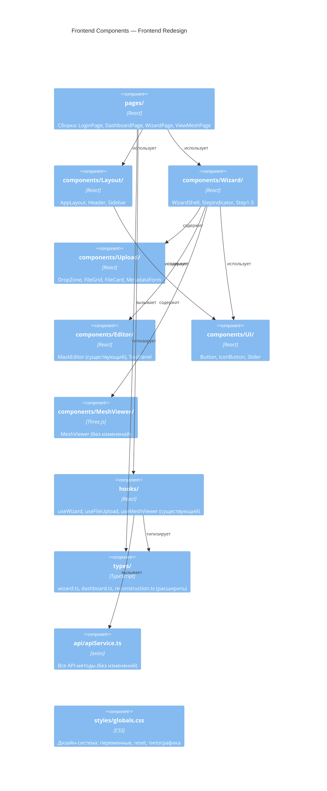
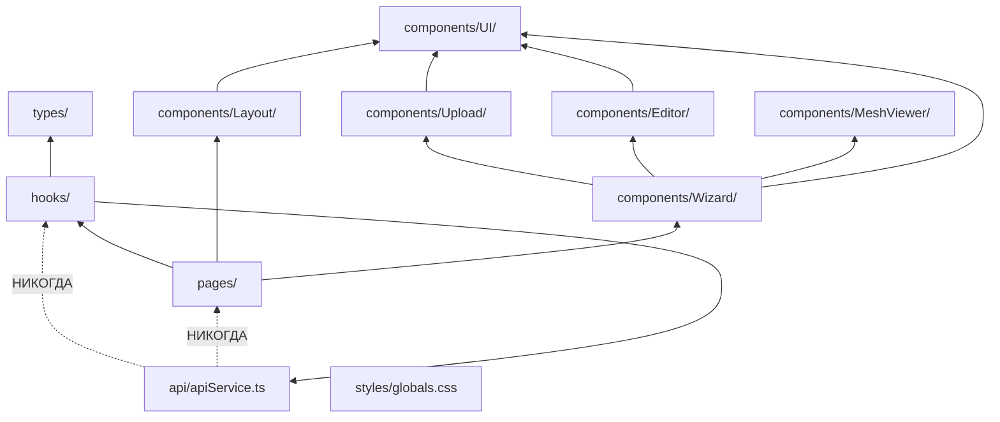

# Architecture: Frontend Redesign

## C4 Level 1 — System Context



## C4 Level 2 — Container



**Важно:** Frontend не меняет backend. Все API-методы уже реализованы в `apiService.ts`.

## C4 Level 3 — Component

### 3.1 Frontend — целевая структура



### 3.2 Маршруты и layout-дерево

```
BrowserRouter
├── /login                    → <LoginPage />          (без layout)
├── /                         → <AppLayout />           (Header + Sidebar + Outlet)
│   ├── index                 → <DashboardPage />
│   └── mesh/:id              → <ViewMeshPage />
├── /upload                   → <WizardPage />          (WizardShell layout)
└── *                         → <Navigate to="/" />
```

### 3.3 Wizard — внутренняя структура

```
WizardPage
└── WizardShell (header + StepIndicator + footer)
    ├── step=1 → StepUpload
    │   ├── DropZone
    │   ├── FileGrid → FileCard[]
    │   └── MetadataForm
    ├── step=2 → StepEditMask
    │   ├── MaskEditor (canvas, Fabric.js)
    │   └── ToolPanel (crop, brush, eraser, slider)
    ├── step=3 → StepBuild
    ├── step=4 → StepView3D → MeshViewer
    └── step=5 → StepSave
```

## Module Dependency Graph



**Правило:** Зависимости направлены внутрь. `api/` не знает о компонентах. Компоненты не вызывают `api/` напрямую — только через хуки.

## Новые файлы vs существующие

### Сохранить без изменений
- `frontend/src/api/apiService.ts` — все API-методы
- `frontend/src/components/MeshViewer.tsx` — Three.js вьюер
- `frontend/src/components/MeshViewer/RoomLabels.tsx`
- `frontend/src/components/MeshViewer/ViewerControls.tsx`
- `frontend/src/hooks/useMeshViewer.ts`
- `frontend/vite.config.ts`, `frontend/tsconfig.json`

### Заменить
- `frontend/src/pages/LoginPage.tsx` — переписать по макету
- `frontend/src/pages/HomePage.tsx` → `DashboardPage.tsx`
- `frontend/src/pages/AddReconstructionPage.tsx` → `WizardPage.tsx`
- `frontend/src/pages/ReconstructionsListPage.tsx` → удалить (функционал в DashboardPage)
- `frontend/src/components/NavBar.tsx` → `Layout/Header.tsx` + `Layout/Sidebar.tsx`
- `frontend/src/styles/index.css` → `styles/globals.css` (новая дизайн-система)
- `frontend/src/App.tsx` — обновить роутинг

### Создать новые
```
components/Layout/AppLayout.tsx
components/Layout/Header.tsx
components/Layout/Sidebar.tsx
components/Wizard/WizardShell.tsx
components/Wizard/StepIndicator.tsx
components/Wizard/StepUpload.tsx
components/Wizard/StepEditMask.tsx
components/Wizard/StepBuild.tsx
components/Wizard/StepView3D.tsx
components/Wizard/StepSave.tsx
components/Upload/DropZone.tsx
components/Upload/FileGrid.tsx
components/Upload/FileCard.tsx
components/Upload/MetadataForm.tsx
components/Editor/ToolPanel.tsx
components/UI/Button.tsx
components/UI/IconButton.tsx
components/UI/Slider.tsx
hooks/useWizard.ts
hooks/useFileUpload.ts
types/wizard.ts
types/dashboard.ts
pages/DashboardPage.tsx
pages/WizardPage.tsx
```
