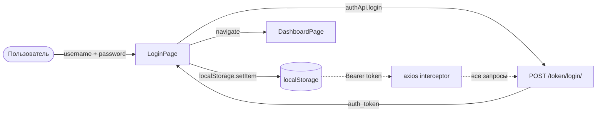
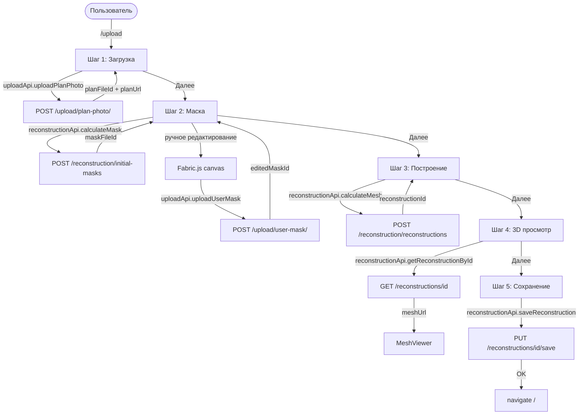
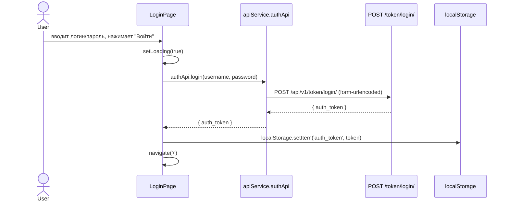
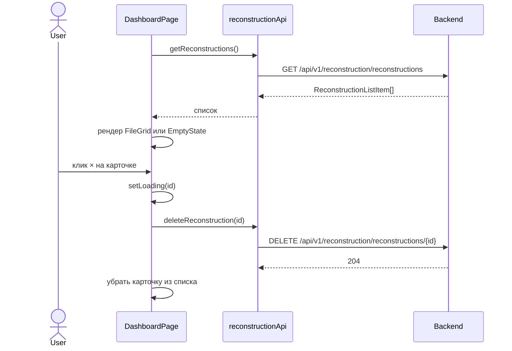
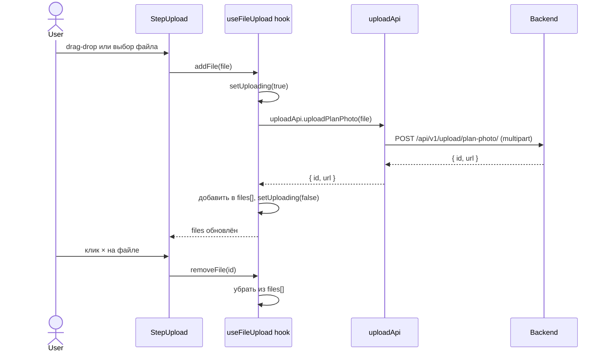
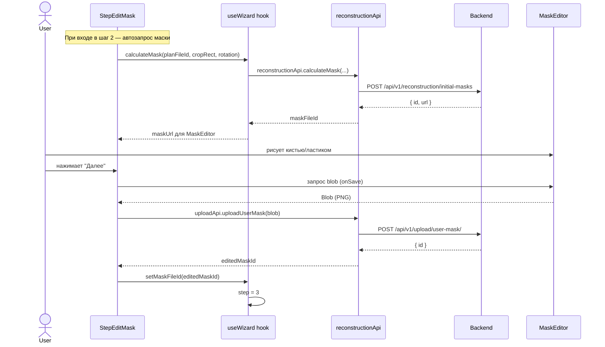
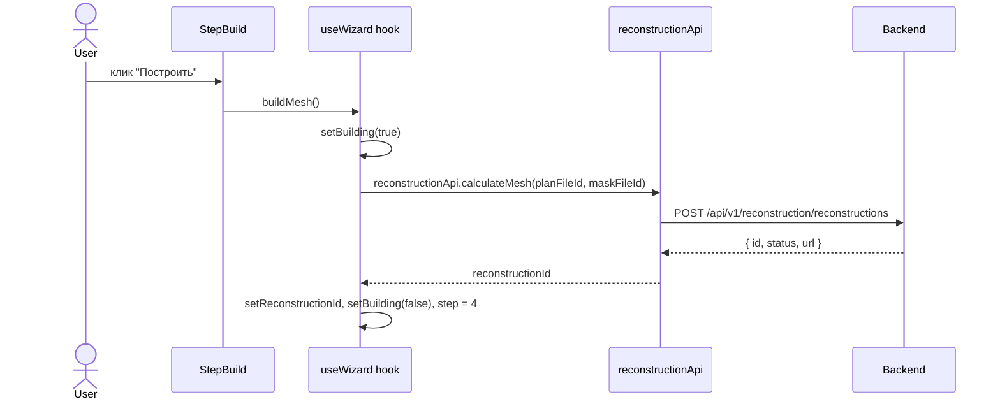
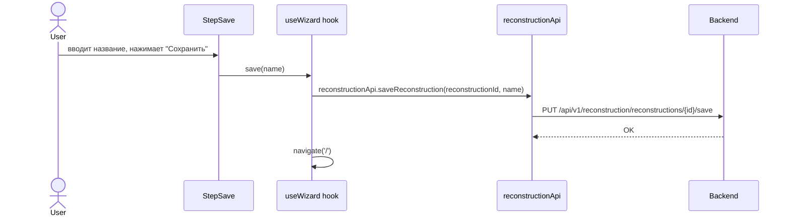
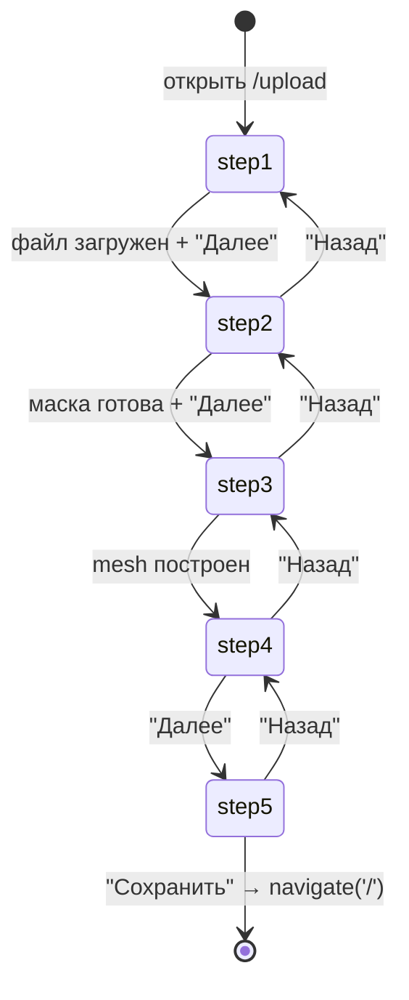

# Behavior: Frontend Redesign

## Data Flow Diagrams

### DFD: Аутентификация



### DFD: Dashboard — загрузка списка

```mermaid
flowchart LR
    User([Пользователь]) -->|открывает /| DashboardPage
    DashboardPage -->|reconstructionApi.getReconstructions| Backend[GET /reconstructions]
    Backend -->|ReconstructionListItem[]| DashboardPage
    DashboardPage -->|пусто| EmptyState[Иконка × + кнопка Начать]
    DashboardPage -->|есть данные| FileGrid[Сетка карточек]
```

### DFD: Wizard — полный flow



---

## Sequence Diagrams

### Use Case 1: Вход в систему



**Ошибки:**

| Условие | Поведение |
|---------|-----------|
| 401 Unauthorized | setError("Неверный логин или пароль"), красная рамка на инпутах |
| Сеть недоступна | setError("Ошибка соединения") |
| Пустые поля | Валидация до запроса, setError("Заполните все поля") |

---

### Use Case 2: Dashboard — просмотр и удаление



**Ошибки:**

| Условие | Поведение |
|---------|-----------|
| Список пуст | EmptyState: иконка ×, "Нет загруженных планов", кнопка "Начать" |
| Ошибка загрузки списка | Показать сообщение об ошибке |
| Ошибка удаления | Показать inline-ошибку, карточка остаётся |

---

### Use Case 3: Wizard — Шаг 1 (загрузка файла)



**Ошибки:**

| Условие | Поведение |
|---------|-----------|
| Неверный формат файла | Валидация до загрузки, показать ошибку в DropZone |
| Ошибка загрузки | setError, файл не добавляется в список |
| Кнопка "Далее" без файлов | Заблокирована (disabled) |

---

### Use Case 4: Wizard — Шаг 2 (маска)



---

### Use Case 5: Wizard — Шаг 3 (построение 3D)



**Ошибки:**

| Условие | Поведение |
|---------|-----------|
| status = 4 (ERROR) | Показать error_message, кнопка "Попробовать снова" |
| Сеть недоступна | setError, кнопка "Построить" снова активна |

---

### Use Case 6: Wizard — Шаг 5 (сохранение)



---

## State Machine: Wizard



## WizardState — структура данных

```typescript
interface WizardState {
  step: 1 | 2 | 3 | 4 | 5;
  planFileId: string | null;       // из uploadApi.uploadPlanPhoto()
  planUrl: string | null;          // URL превью плана
  maskFileId: string | null;       // из reconstructionApi.calculateMask() или uploadApi.uploadUserMask()
  reconstructionId: number | null; // из reconstructionApi.calculateMesh()
  meshUrl: string | null;          // из getReconstructionById().url
  cropRect: CropRect | null;       // { x, y, width, height } в [0,1]
  rotation: 0 | 90 | 180 | 270;
  isLoading: boolean;
  error: string | null;
}
```
