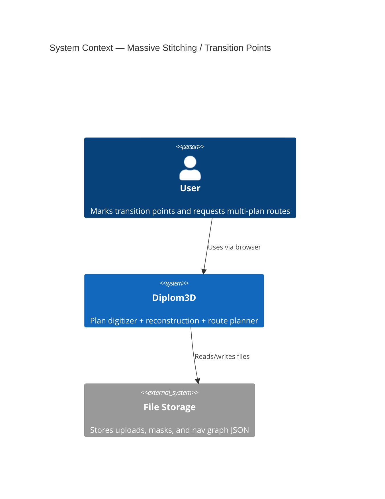
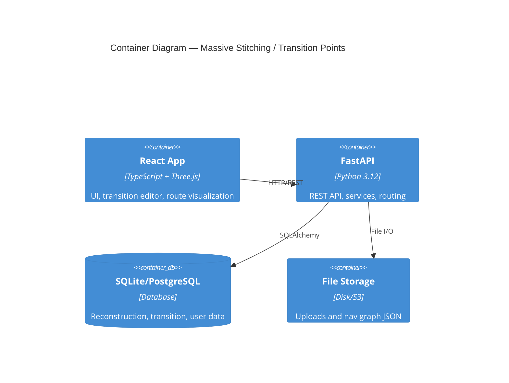
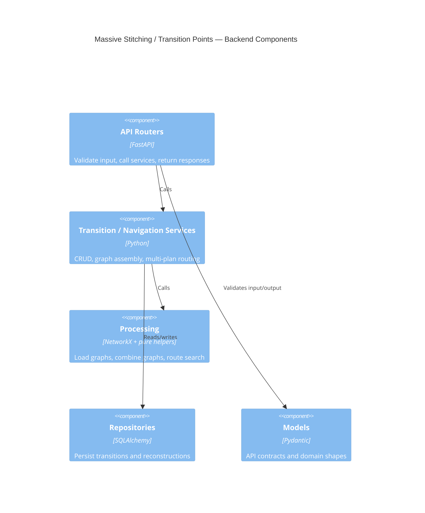
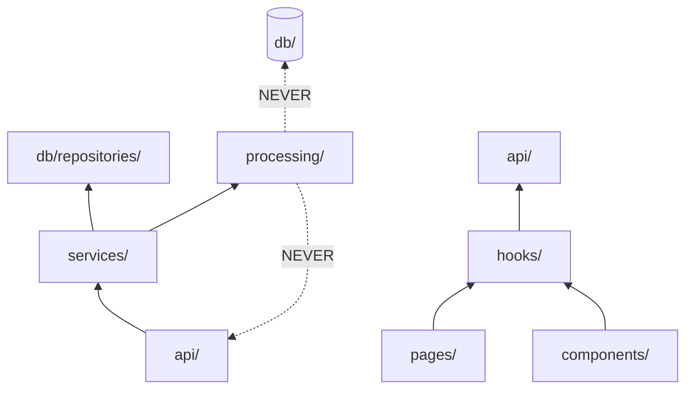

# Architecture: Massive Stitching / Transition Points

## C4 Level 1 — System Context



## C4 Level 2 — Container



## C4 Level 3 — Component

### 3.1 Backend Components



### 3.2 Frontend Components

```mermaid
C4Component
title Massive Stitching / Transition Points — Frontend Components
Component(page, "TransitionsPage", "React", "Page shell for floor tree, canvas, and details panel")
Component(hook, "useTransitions", "React hook", "State + API orchestration")
Component(canvas, "TransitionCanvas", "Canvas/SVG", "Render plans and transition markers")
Component(panel, "GroupPanel", "React", "Edit selected point/group")
Component(routePanel, "MultiPlanRoutePanel", "React", "Show route segments and total distance")
Rel(page, hook, "Uses")
Rel(page, canvas, "Renders")
Rel(page, panel, "Renders")
Rel(page, routePanel, "Renders")
Rel(hook, backend, "HTTP API")
```

## Module Dependency Graph



**Rule:** Dependencies flow inward. `processing/` stays free of FastAPI and database imports.

## Current Reality vs Project Standards
- Current backend reality already keeps route composition in `api/` and persistence in repositories for reconstruction and stitching flows (`backend/app/api/reconstruction.py:41-260`, `backend/app/db/repositories/reconstruction_repo.py:18-191`).
- Current navigation routing is split between API stubs and processing helpers (`backend/app/api/navigation.py:12-76`, `backend/app/processing/nav_graph.py:392-519`).
- Current frontend reality uses page-level orchestration and hook-based state management for stitching and mesh viewing (`frontend/src/pages/StitchingPage.tsx:10-148`, `frontend/src/hooks/useStitching.ts:21-219`, `frontend/src/hooks/useMeshViewer.ts:11-47`).
- The new transition feature should follow those existing patterns rather than introducing a different architecture.
