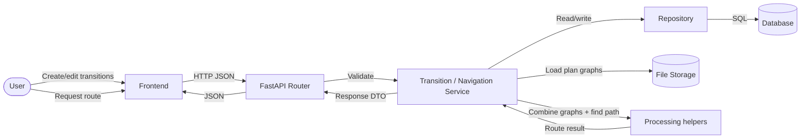
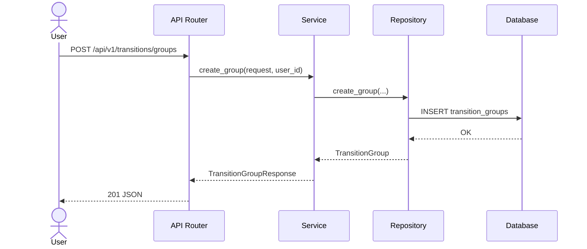
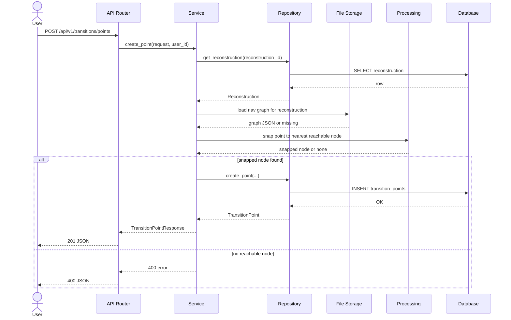
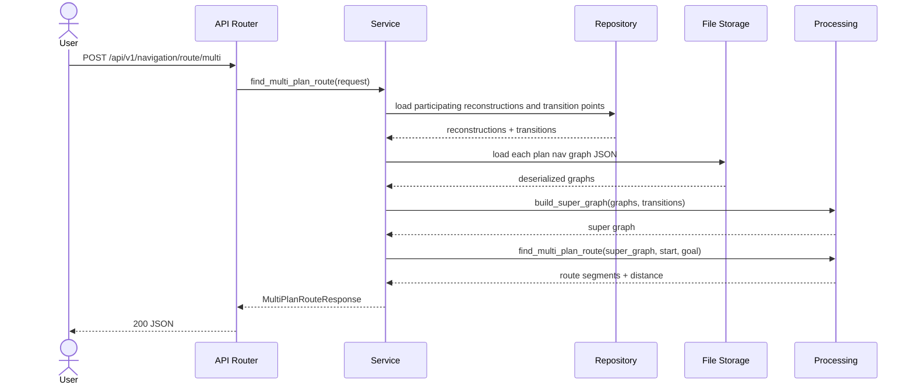
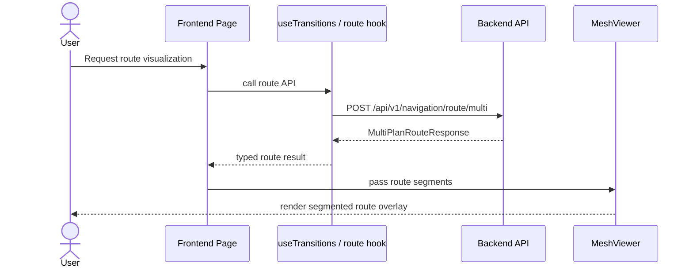

# Behavior: Massive Stitching / Transition Points

## Data Flow Diagrams

### DFD: Transition CRUD and Multi-Plan Routing

## Sequence Diagrams

### Use Case 1: Create a transition group

**Error cases:**

| Condition | HTTP Status | Response | Behavior |
|-----------|-----------|----------|----------|
| Invalid body | 400 | ValidationError | Return Pydantic validation error details |
| Authentication missing | 401 | Unauthorized | Reject request before service call |
| Storage or DB failure | 500 | Safe error | Log and return generic error |

### Use Case 2: Create a transition point

**Error cases:**

| Condition | HTTP Status | Response | Behavior |
|-----------|-----------|----------|----------|
| Reconstruction not found | 404 | {"detail": "..."} | Reject point creation |
| Point outside reachable area | 400 | {"detail": "point out of reachable area"} | Do not persist point |
| Invalid coordinates | 400 | ValidationError | Reject before service call |

### Use Case 3: Build a multi-plan route

**Error cases:**

| Condition | HTTP Status | Response | Behavior |
|-----------|-----------|----------|----------|
| Target reconstruction unreachable | 404 or 200 no_path | {"status":"no_path"} | Return safe no-path result |
| Missing nav graph file | 400 | {"detail": "..."} | Report missing prerequisite |
| No path between groups | 200 | {"status":"no_path"} | Return structured no-path response |

**Edge cases (Diplom3D-specific):**
- Multiple transition points may belong to the same group; the route must treat the group as the logical connector, not the individual point.
- Transition point coordinates are normalized `[0,1]`; denormalization happens only when combining with a specific reconstruction’s graph.
- Current nav graph nodes are file-based per mask, so multi-plan routing must load several graph JSON files and prefix node IDs to avoid collisions.
- The frontend must still support single-plan navigation while multi-plan routing is added.

### Use Case 4: Visualize multi-plan route segments in the viewer

**Error cases:**

| Condition | HTTP Status | Response | Behavior |
|-----------|-----------|----------|----------|
| No route result | 200 | {"status":"no_path"} | Show empty-state message |
| Invalid route input | 400 | ValidationError | Show field-level error |

## Use Case Coverage Summary
- Transition group CRUD
- Transition point CRUD with reachability validation
- Multi-plan route assembly and search
- Frontend route-segment visualization
