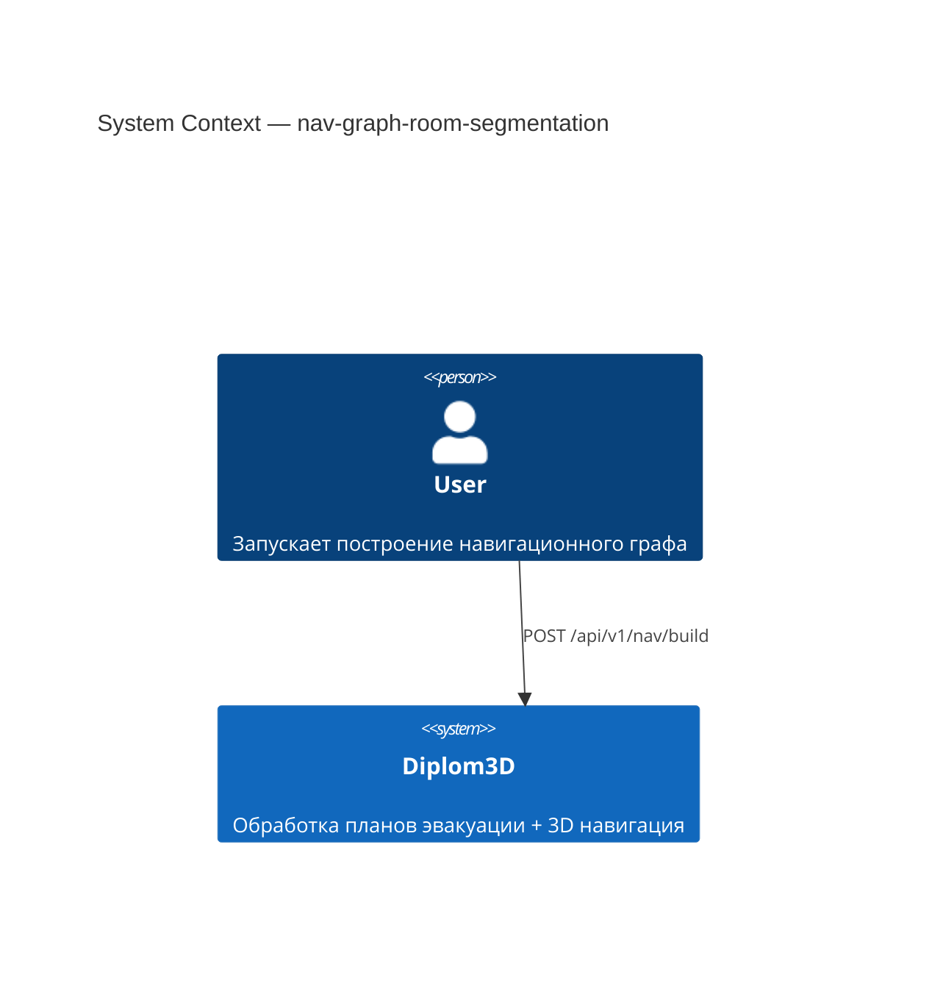
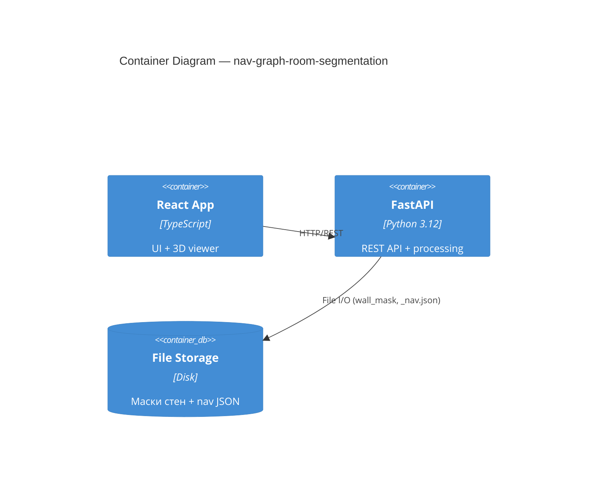
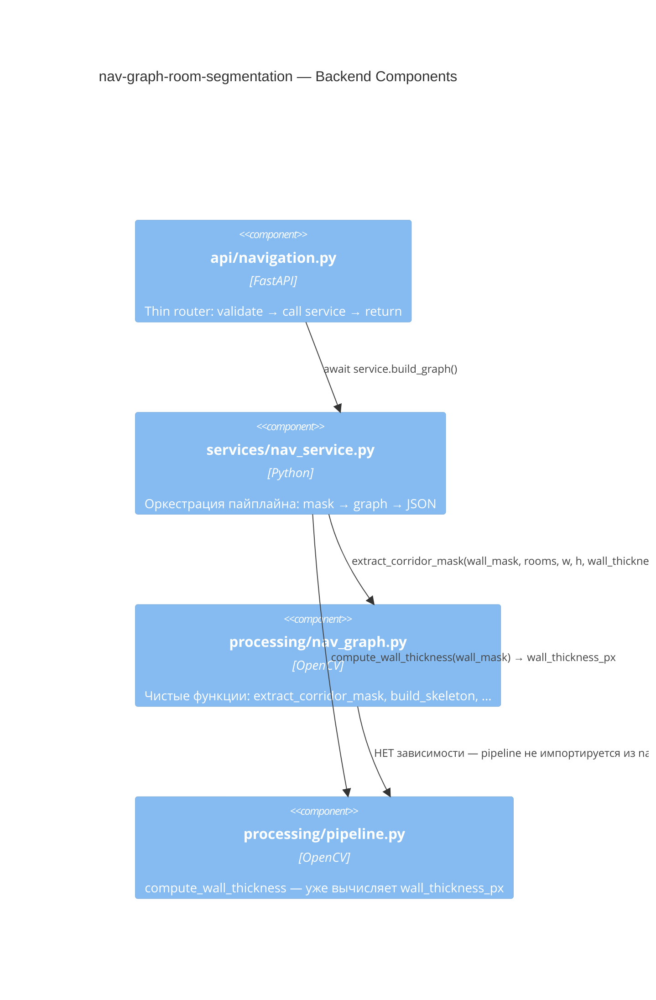
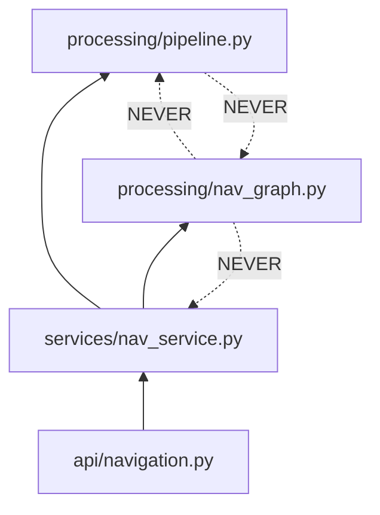

# Architecture: nav-graph-room-segmentation

## C4 Level 1 — System Context

## C4 Level 2 — Container

## C4 Level 3 — Component

### 3.1 Backend Components

### 3.2 Затронутые файлы

| Файл | Роль | Изменение |
|------|------|-----------|
| `processing/nav_graph.py:15-141` | Алгоритм сегментации | Заменить тело `extract_corridor_mask` |
| `services/nav_service.py:59` | Вызов функции | Передать `wall_thickness_px` в `extract_corridor_mask` |

## Module Dependency Graph

**Правило:** `processing/nav_graph.py` не импортирует из `pipeline.py`.
`wall_thickness_px` передаётся как параметр через `nav_service.py`.
