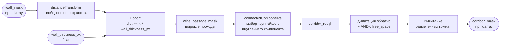
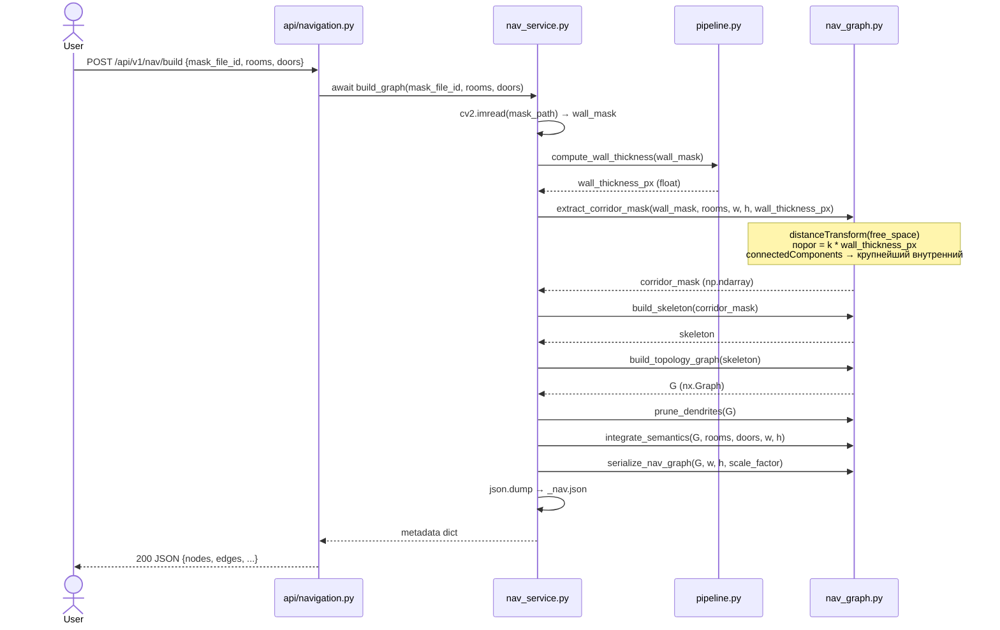
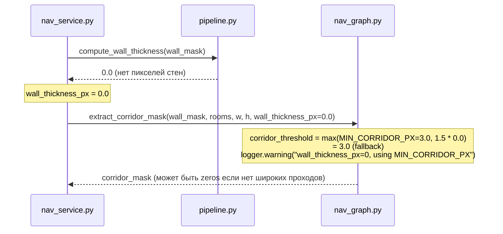

# Behavior: nav-graph-room-segmentation

## Data Flow Diagram

## Sequence Diagrams

### Use Case 1: Построение навигационного графа (happy path)

**Error cases:**

| Условие | HTTP Status | Поведение |
|---------|-------------|-----------|
| Маска не найдена | 404 | FileNotFoundError → service возвращает ошибку |
| Маска не читается | 500 | ValueError → логируется, возвращается 500 |
| `wall_thickness_px == 0` | — | Используется fallback порог (константа), логируется warning |
| Свободное пространство пустое | — | Возвращается `np.zeros_like(wall_mask)`, логируется warning |
| Все компоненты касаются границ | — | Fallback: крупнейший не-экстерьерный компонент (поведение сохраняется) |

**Edge cases:**

| Ситуация | Поведение |
|----------|-----------|
| Очень тонкие стены (`wall_thickness_px < 3`) | `corridor_threshold` зажат снизу минимальным значением (3 px) |
| Очень толстые стены (> 30 px) | Порог растёт пропорционально — коридор должен быть шире стены |
| Нет комнат (`rooms = []`) | Шаг вычитания комнат пропускается без ошибки |

### Use Case 1b: Обработка `wall_thickness_px == 0` (fallback)

Это **warning**, не исключение — пайплайн продолжается с минимальным порогом.

---

### Use Case 2: Поиск маршрута (не затрагивается)

`find_route` / `NavService.find_route` не изменяются — они работают с уже
построенным графом. Данный тикет затрагивает только шаг генерации `corridor_mask`.
