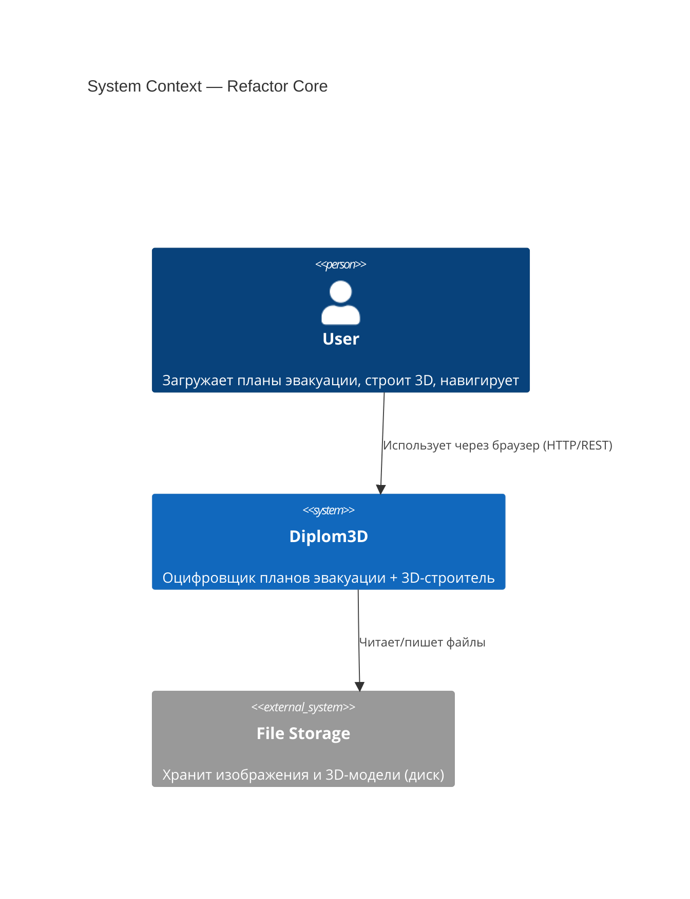
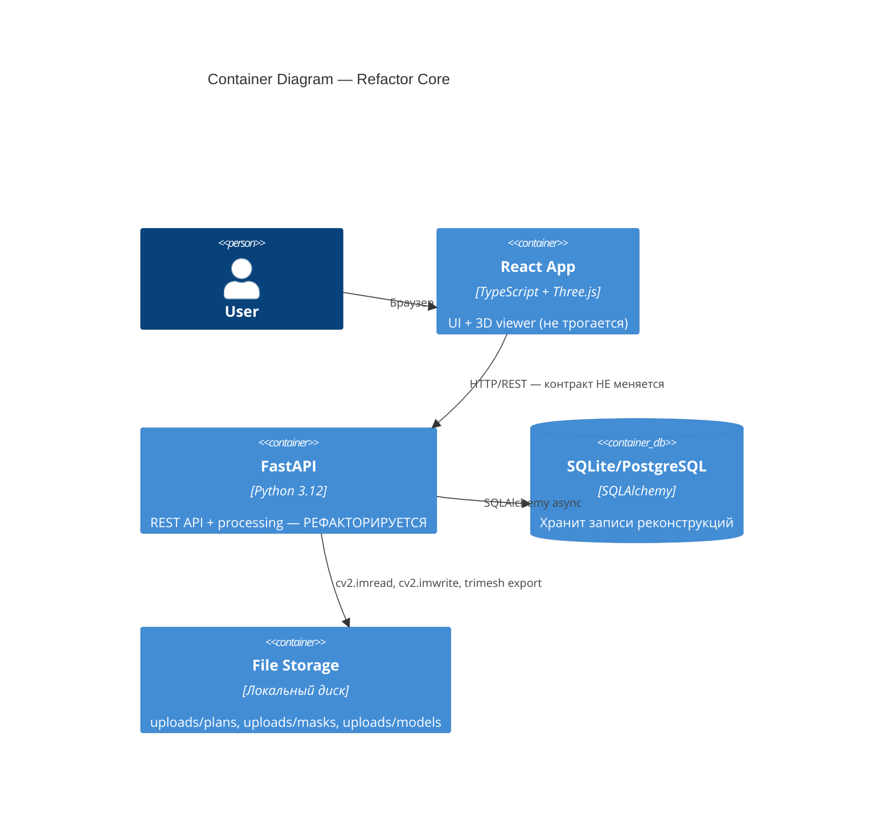
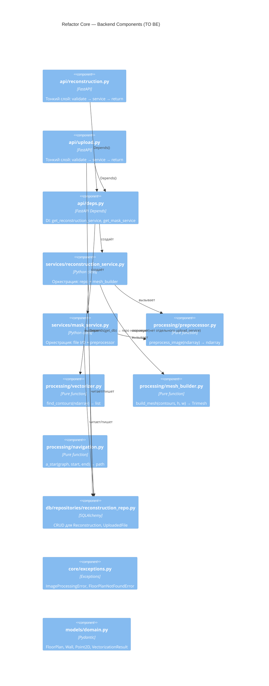
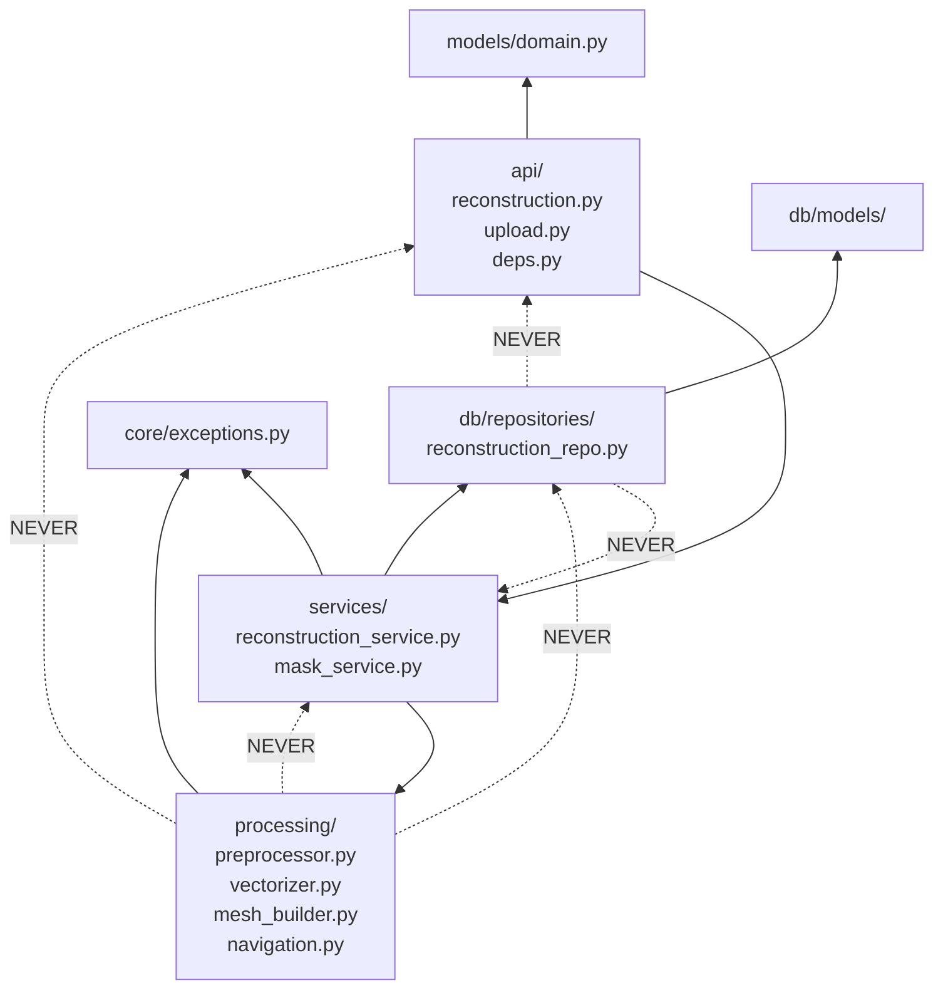

# Architecture: Refactor Core

## C4 Level 1 — System Context

Система не меняется с точки зрения пользователя. Рефакторинг — это внутренняя реструктуризация.



---

## C4 Level 2 — Container

Фронтенд не трогается. Рефакторинг касается только backend-контейнера.



---

## C4 Level 3 — Component

### AS IS (текущее состояние — нарушения)

```mermaid
flowchart TB
    subgraph api["api/ (толстый слой)"]
        R[reconstruction.py<br/>329 строк]
        U[upload.py]
    end
    subgraph processing["processing/ (нарушения архитектуры)"]
        RS[reconstruction_service.py<br/>❌ creates DB sessions<br/>❌ Singleton<br/>❌ print()]
        MS[mask_service.py<br/>❌ settings.UPLOAD_DIR<br/>❌ file I/O + CV2]
        MG[mesh_generator.py<br/>❌ os.makedirs<br/>❌ file export<br/>❌ print()]
        BS[binarization.py<br/>disconnected]
        CS[contours.py<br/>disconnected]
        NAV[navigation.py<br/>NavigationGraphService]
    end
    subgraph db["db/"]
        ORM[models/reconstruction.py<br/>UploadedFile, Reconstruction, Room]
    end

    R -->|import inside function| RS
    R -->|import inside function| MS
    U -->|async_session_maker| db
    RS -->|async_session_maker| db
    RS -->|instantiates| MG
    MS -->|settings.UPLOAD_DIR| config
    config["core/config.py"]
```

**Нарушения:**
- `processing/reconstruction_service.py:20` — `from app.core.database import async_session_maker`
- `processing/mask_service.py:6` — `from app.core.config import settings` в `__init__`
- `api/reconstruction.py:43` — `from app.processing.mask_service import MaskService` внутри функции
- `api/reconstruction.py:116` — `from app.processing.reconstruction_service import reconstruction_service`
- `api/upload.py:50` — `from app.core.database import async_session_maker` в роутере
- Дублирование `status_map` в 3 местах: `api/reconstruction.py:136, 214, 255`
- Singleton `reconstruction_service = ReconstructionService()` в `processing/reconstruction_service.py:201`

---

### TO BE (целевое состояние)



---

## Module Dependency Graph (TO BE)



**Правило:** Зависимости направлены строго внутрь. `processing/` не импортирует ничего из
`api/`, `db/`, `core/config.py`. Каждый слой зависит только от слоёв ниже.

---

## Маппинг AS IS → TO BE (что переезжает куда)

| Откуда (AS IS) | Что | Куда (TO BE) |
|----------------|-----|--------------|
| `processing/reconstruction_service.py` | DB-операции (session, CRUD) | `db/repositories/reconstruction_repo.py` |
| `processing/reconstruction_service.py` | Оркестрация (pipeline) | `services/reconstruction_service.py` |
| `processing/reconstruction_service.py` | Singleton | Удалить → `api/deps.py` |
| `processing/mask_service.py` | OpenCV-обработка (граф.→граф.) | `processing/preprocessor.py` |
| `processing/mask_service.py` | File I/O + оркестрация | `services/mask_service.py` |
| `processing/mesh_generator.py` | Чистая mesh-генерация (без save) | `processing/mesh_builder.py` |
| `processing/mesh_generator.py` | File export (glb, obj) | `services/reconstruction_service.py` |
| `api/upload.py` | `save_file_to_db()` — DB-операция | `db/repositories/reconstruction_repo.py` (вызывается напрямую из роутера через Depends) |
| `api/reconstruction.py` | `status_map` (дубликат) | `services/reconstruction_service.py` |
| — (новый) | — | `core/exceptions.py` |
| — (новый) | — | `models/domain.py` |
| — (новый) | — | `api/deps.py` |

## Что НЕ меняется

- `db/models/` — ORM модели (`Reconstruction`, `UploadedFile`, `Room`) остаются без изменений
- `models/reconstruction.py` — Pydantic request/response модели (API-контракт не меняется)
- `processing/binarization.py` — не подключается к pipeline, остаётся как есть
- `processing/contours.py` — не подключается к pipeline, остаётся как есть
- `core/config.py`, `core/security.py`, `core/database.py` — не трогаются
- `api/auth.py`, `api/navigation.py` — не трогаются
