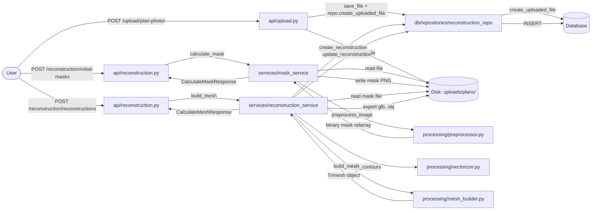
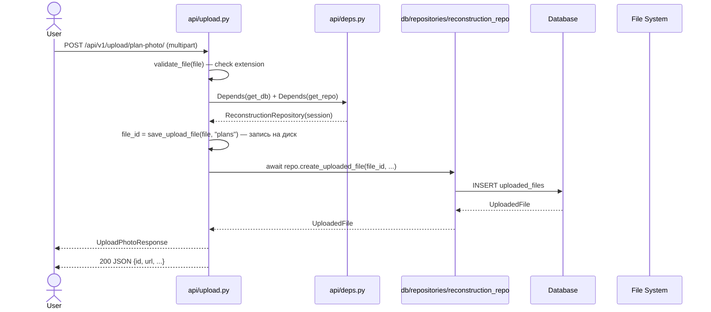
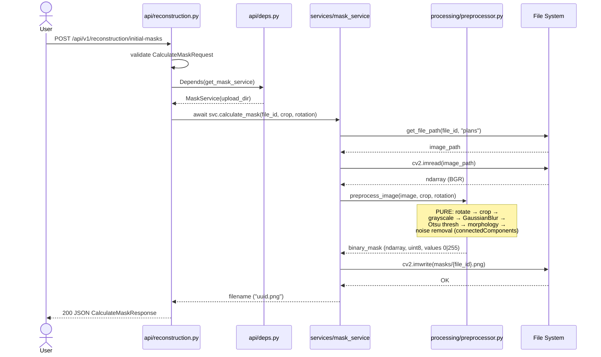
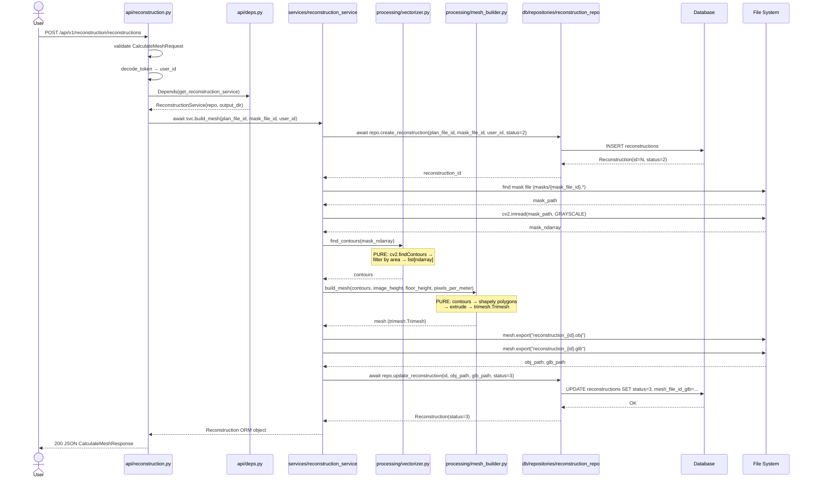
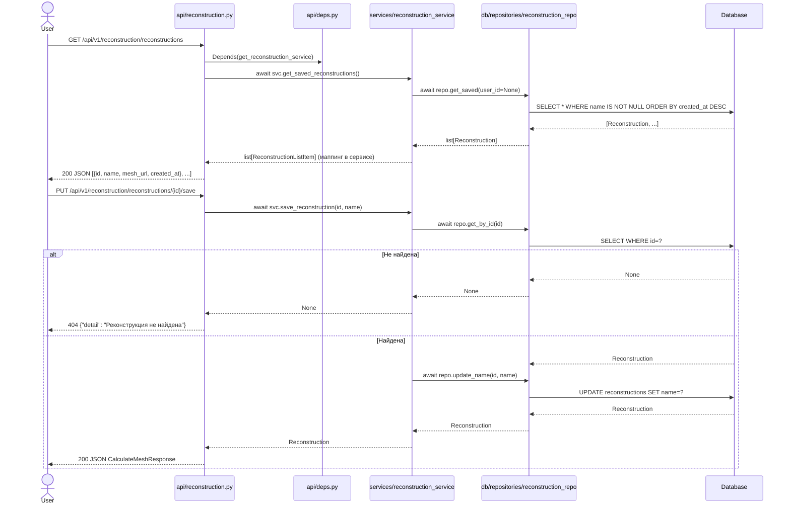

# Behavior: Refactor Core

Данный файл описывает поведение системы в целевом состоянии (TO BE).
API-контракт не меняется — меняются только внутренние вызовы между слоями.

---

## DFD: Полный pipeline обработки плана

---

## Sequence Diagrams

### Use Case 1: Upload Plan Photo

**Error cases:**

| Condition | HTTP Status | Response | Behaviour |
|-----------|------------|----------|-----------|
| Недопустимый формат файла | 400 | `{"detail": "Недопустимый формат..."}` | Отклонить до записи на диск |
| Недействительный токен | 401 | `{"detail": "Недействительный токен"}` | Отклонить на уровне deps |
| Диск недоступен | 500 | `{"detail": "Ошибка сохранения файла"}` | Логировать через `logging`, вернуть 500 |

---

### Use Case 2: Calculate Mask (Binarization Pipeline)

**Error cases:**

| Condition | HTTP Status | Response | Behaviour |
|-----------|------------|----------|-----------|
| file_id не найден на диске | 500 | `{"detail": "Ошибка обработки изображения: ..."}` | FileNotFoundError → logging.error → 500 |
| cv2.imread вернул None | 500 | `{"detail": "Ошибка обработки..."}` | ValueError → logging.error → 500 |
| Пустое изображение (0px) | 400 | `{"detail": "..."}` | ImageProcessingError → 400 |

**Edge cases:**
- `rotation=0` — пропустить rotate
- `crop=None` — пропустить crop
- Маска уже существует — перезаписать (idempotent)

---

### Use Case 3: Build 3D Mesh

**Error cases:**

| Condition | HTTP Status | Response | Behaviour |
|-----------|------------|----------|-----------|
| Маска не найдена на диске | 500 | `{"detail": "Ошибка построения 3D модели: ..."}` | Записать status=4 в DB, вернуть 500 |
| Trimesh/Shapely не установлен | 500 | `{"detail": "..."}` | RuntimeError → status=4, 500 |
| Маска пустая (нет контуров) | 500 | `{"detail": "..."}` | Empty mesh → status=4, error_message |
| Недействительный токен | 401 | `{"detail": "..."}` | Отклонить до запуска pipeline |

**Edge cases:**
- Маска с очень маленькими контурами (< MIN_AREA) — отфильтровать в vectorizer
- Маска 0×0 или None → `ImageProcessingError`

---

### Use Case 4: Get / List / Save Reconstruction (тонкий роутер → репозиторий)

**Error cases:**

| Endpoint | Condition | Status | Response |
|----------|-----------|--------|----------|
| GET /reconstructions | БД недоступна | 500 | `{"detail": "..."}` |
| PUT /{id}/save | id не существует | 404 | `{"detail": "Реконструкция не найдена"}` |
| GET /{id} | id не существует | 404 | `{"detail": "Реконструкция не найдена"}` |
