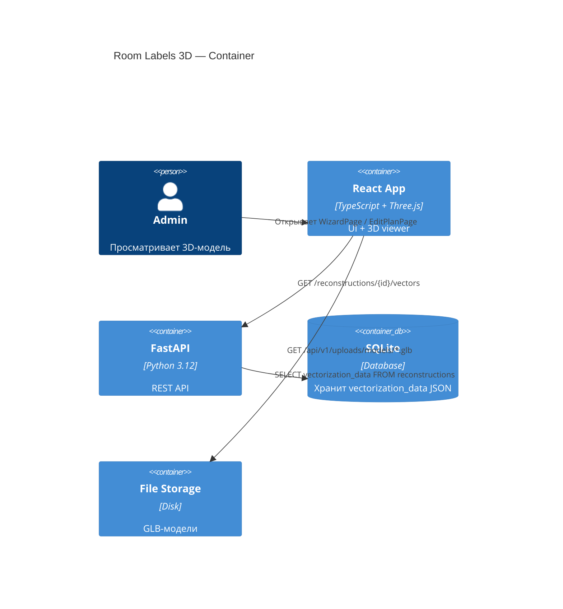
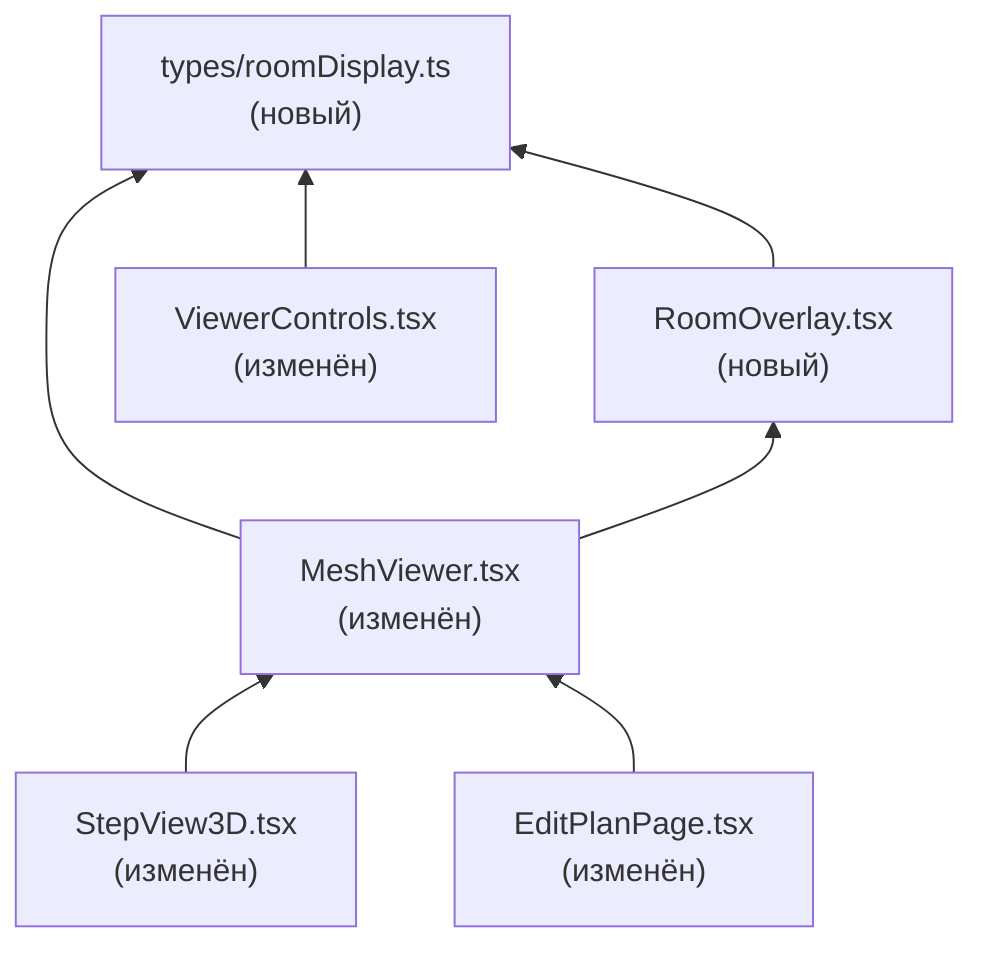

# Architecture: Room Labels 3D

## C4 Level 2 — Container



## C4 Level 3 — Backend Components (затронутые)

Фича **не добавляет** новых backend-компонентов.
Используется существующий endpoint:
- `backend/app/api/reconstruction.py:399` — `GET /reconstructions/{id}/vectors`
  → возвращает `VectorizationResult` с полем `rooms: List[VectorRoom]`
- `backend/app/services/reconstruction_service.py:387` — `get_room_labels()`
  уже существует, но нигде не вызывается из API. Оставляем как есть.

## C4 Level 3 — Frontend Components

### Новые компоненты

```
frontend/src/components/MeshViewer/
├── RoomOverlay.tsx          ← НОВЫЙ: Html-метки + Box в 3D-пространстве
└── RoomOverlay.module.css   ← НОВЫЙ: стили для Html-метки
```

### Новые типы

```
frontend/src/types/
└── roomDisplay.ts           ← НОВЫЙ: унифицированный RoomDisplay + утилиты
```

### Модифицированные компоненты

```
frontend/src/components/MeshViewer/
└── MeshViewer.tsx           ← ИЗМЕНЁН: props rooms?, showRooms propagation

frontend/src/components/MeshViewer/
└── ViewerControls.tsx       ← ИЗМЕНЁН: кнопка-тоггл «Кабинеты»

frontend/src/components/Wizard/
└── StepView3D.tsx           ← ИЗМЕНЁН: передаёт rooms в MeshViewer

frontend/src/api/
└── apiService.ts            ← ИЗМЕНЁН: добавляет вызов /vectors endpoint
```

### Модифицированные хуки

```
frontend/src/hooks/
└── useWizard.ts             ← не изменяется (rooms уже в state)

frontend/src/pages/
└── EditPlanPage.tsx         ← ИЗМЕНЁН: fetches /vectors, передаёт rooms
```

## Зависимости компонентов



**Правило:** `RoomOverlay` рендерится ВНУТРИ `GlbModel`/`ObjModel` — у него есть
доступ к `modelRef` (Three.js объект загруженной модели).

## Типы данных

### Новый тип `RoomDisplay` (общий для всех источников)

```typescript
// types/roomDisplay.ts

export interface RoomDisplay {
  id: string;
  name: string;
  room_type: string;      // "classroom" | "corridor" | "staircase" | "toilet" | "other"
  center_x: number;       // normalized [0, 1]
  center_y: number;       // normalized [0, 1]
  width_norm: number;     // normalized [0, 1] bounding box width
  height_norm: number;    // normalized [0, 1] bounding box height
  color: string;          // hex color по room_type
}

export const ROOM_COLORS: Record<string, string> = {
  classroom: '#f5c542',
  corridor:  '#4287f5',
  staircase: '#f54242',
  elevator:  '#a742f5',  // ← соответствует RoomAnnotation.room_type
  toilet:    '#42f5c8',
  other:     '#c8c8c8',
  room:      '#c8c8c8',
};

// Fallback-цвет — всегда использовать через ROOM_COLORS[type] ?? ROOM_COLORS.other
// Гарантирует что новые типы не дают undefined.

/** RoomAnnotation (wizard) → RoomDisplay.
 *  Использует r.center (если задан), иначе вычисляет из bbox:
 *    center_x = r.x + r.width / 2
 *    center_y = r.y + r.height / 2
 *  width_norm = r.width, height_norm = r.height.
 *  color = ROOM_COLORS[r.room_type] ?? ROOM_COLORS.other
 */
export function fromRoomAnnotation(r: RoomAnnotation): RoomDisplay;

/** VectorRoom (from /vectors API) → RoomDisplay.
 *  center берётся из r.center.x / r.center.y.
 *  width_norm / height_norm вычисляются из bounding box r.polygon:
 *    width_norm = max(p.x) - min(p.x)
 *    height_norm = max(p.y) - min(p.y)
 *  Если polygon пустой → width_norm=height_norm=0.
 *  color = ROOM_COLORS[r.room_type] ?? ROOM_COLORS.other
 */
export function fromVectorRoom(r: VectorRoom): RoomDisplay;

/** Нормализованные координаты [0,1] → мировые Three.js позиции.
 *  Используется внутри RoomOverlay.
 */
export function normalizedToWorld(
  cx: number,
  cy: number,
  box: THREE.Box3,
  wallHeight: number,
): [number, number, number];
```

### Координатная трансформация

Нормализованные координаты `[0, 1]` → мировые Three.js координаты:

```
3d_x = box.min.x + cx * (box.max.x - box.min.x)
3d_y = box.min.y + wallHeight * 0.5    ← середина высоты стены
3d_z = box.min.z + cy * (box.max.z - box.min.z)
```

Логика Y-flip **уже встроена в GLB** (mesh_builder делает flip при экспорте),
поэтому маппинг прямой (cy=0 → box.min.z, cy=1 → box.max.z).

Размер Box в 3D:
```
size_x = width_norm * (box.max.x - box.min.x)
size_y = wallHeight * 0.8              ← чуть ниже высоты стены
size_z = height_norm * (box.max.z - box.min.z)
```

## Доступ к modelRef из RoomOverlay

`RoomOverlay` монтируется **внутри** `GlbModel`/`ObjModel` — рядом с `FloorPlane`
(см. `MeshViewer.tsx:120` и `MeshViewer.tsx:186`).
`modelRef` передаётся как prop, как это уже делается для `FloorPlane` и `CameraSetup`.

```tsx
// Текущий паттерн (FloorPlane — MeshViewer.tsx:186):
function GlbModel({ url }: { url: string }) {
  const ref = useRef<THREE.Object3D>(null);
  return (
    <>
      <primitive ref={ref} object={processedScene} />
      <FloorPlane modelRef={ref} />
    </>
  );
}

// Расширенный паттерн (Room Labels):
// GlbModelProps — новый локальный интерфейс (добавляется рядом с компонентом):
// interface GlbModelProps { url: string; rooms: RoomDisplay[]; showRooms: boolean; }
function GlbModel({ url, rooms, showRooms }: GlbModelProps) {
  const ref = useRef<THREE.Object3D>(null);
  return (
    <>
      <primitive ref={ref} object={processedScene} />
      <FloorPlane modelRef={ref} />
      <RoomOverlay modelRef={ref} rooms={rooms} visible={showRooms} />
    </>
  );
}

// ObjModel расширяется АНАЛОГИЧНО с теми же props.
// Формат OBJ используется в ViewMeshPage (без room labels — AC#6 ограничивает scope
// до StepView3D и EditPlanPage, оба используют GLB).
// Тем не менее ObjModel тоже получает rooms/showRooms чтобы MeshViewer
// не имел условной логики по формату — если передано, рендерим.
// interface ObjModelProps { url: string; rooms: RoomDisplay[]; showRooms: boolean; }
```

## Пропсы MeshViewer (расширение)

Текущий интерфейс `MeshViewerProps` (`MeshViewer.tsx:237`):
```typescript
interface MeshViewerProps {
  url: string;
  format?: 'obj' | 'glb';
  children?: React.ReactNode;
}
```

Расширение:
```typescript
interface MeshViewerProps {
  url: string;
  format?: 'obj' | 'glb';
  children?: React.ReactNode;
  rooms?: RoomDisplay[];     // ← НОВОЕ: данные комнат для оверлея
  showRooms?: boolean;       // ← НОВОЕ: состояние тоггла (управляется снаружи)
}
```

Состояние тоггла управляется родительским компонентом
(`StepView3D`, `EditPlanPage`), а не внутри `MeshViewer`.
Это позволяет кнопке-тогглу жить в `ViewerControls`, который рендерится снаружи
`Canvas`.
