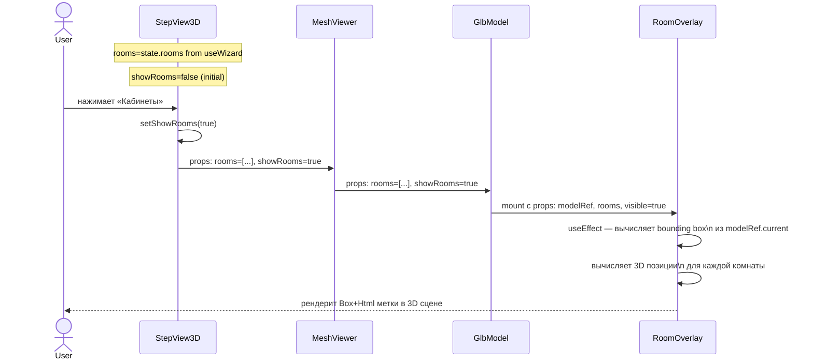
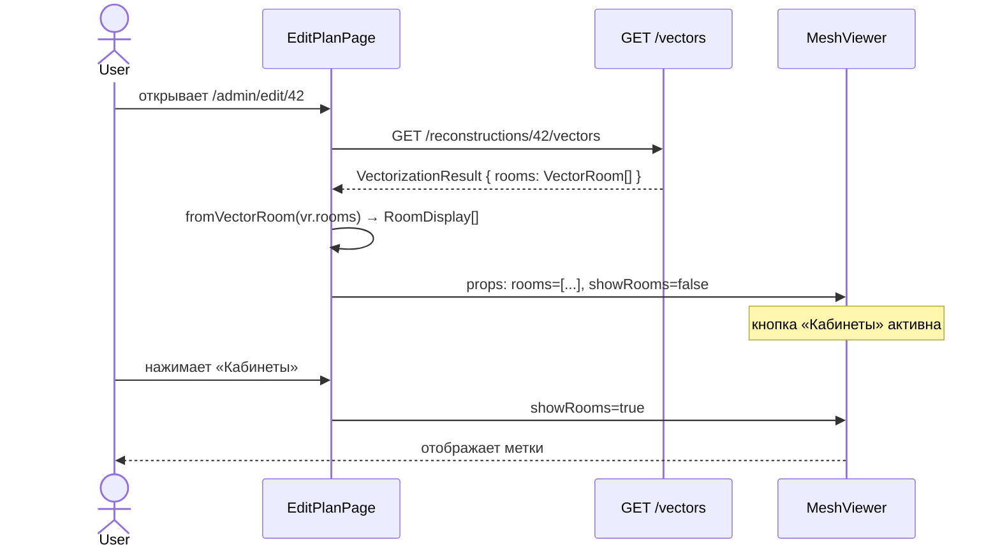
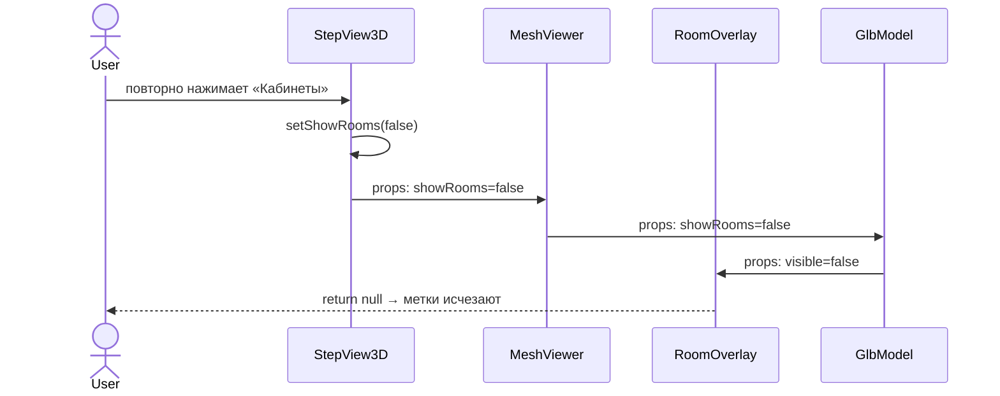
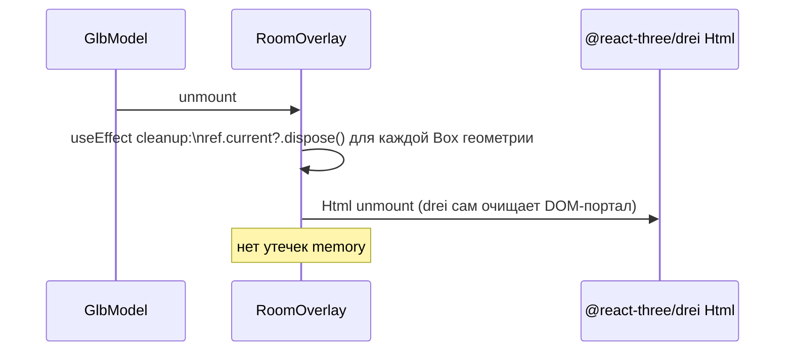

# Behavior: Room Labels 3D

## Data Flow Diagrams

### DFD: Wizard Flow (StepView3D)

```mermaid
flowchart LR
  WallEditor([WallEditorCanvas\nШаг 3]) -->|rooms: RoomAnnotation\[\]| State[useWizard state]
  State -->|rooms| StepView3D
  StepView3D -->|rooms + showRooms| MeshViewer
  MeshViewer -->|rooms + modelRef| RoomOverlay
  RoomOverlay -->|3D positions| R3FScene[R3F Scene\nHtml + Box]
```

### DFD: EditPlanPage Flow

```mermaid
flowchart LR
  User([User]) -->|открывает EditPlanPage| Page[EditPlanPage]
  Page -->|GET /reconstructions/{id}/vectors| API[FastAPI]
  API -->|VectorizationResult| Page
  Page -->|fromVectorRoom\(\)| Rooms[RoomDisplay\[\]]
  Rooms -->|rooms + showRooms| MeshViewer
  MeshViewer -->|rooms + modelRef| RoomOverlay
  RoomOverlay -->|3D positions| R3FScene[R3F Scene]
```

---

## Sequence Diagrams

### Use Case 1: Пользователь включает отображение кабинетов в wizard



**Error cases:**

| Условие | Поведение |
|---------|-----------|
| `modelRef.current` не готов | skip — position = [0,0,0], Box не рендерится |
| `rooms` = [] | `visible=true`, но ничего не рендерится |
| room без имени | отображается `room_type` вместо имени |

---

### Use Case 2: Загрузка комнат для сохранённой реконструкции (EditPlanPage)



**Error cases:**

| Условие | HTTP | Поведение |
|---------|------|-----------|
| Vectors не сохранены | 404 | `rooms=[]`, кнопка неактивна/скрыта |
| Сетевая ошибка | — | `rooms=[]`, silent fail, кнопка скрыта |

---

### Use Case 3: Пользователь выключает отображение



---

### Use Case 4: Размонтирование компонента



---

## Визуальный стиль (как в route building)

### В route building (`FloorRouteView.tsx:55-86`)
```
Box: color="#FF4500", opacity=0.4, depthWrite=false, side=DoubleSide
Html: цвет текста white, fontWeight=500, textShadow
```

### Room Labels (все комнаты — менее насыщенный вариант)
```
Box: color=ROOM_COLORS[room_type], opacity=0.15, depthWrite=false, side=DoubleSide
Html: цвет текста white, fontWeight=500, textShadow, fontSize=13px
```

Меньшая opacity (0.15 vs 0.4) — потому что комнат много и стены за ними должны быть видны.
Цвет по типу комнаты — потому что так легче ориентироваться.
