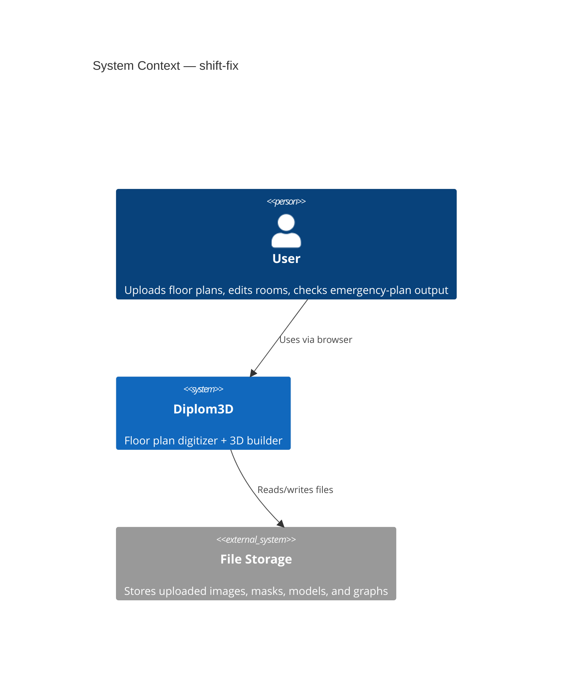
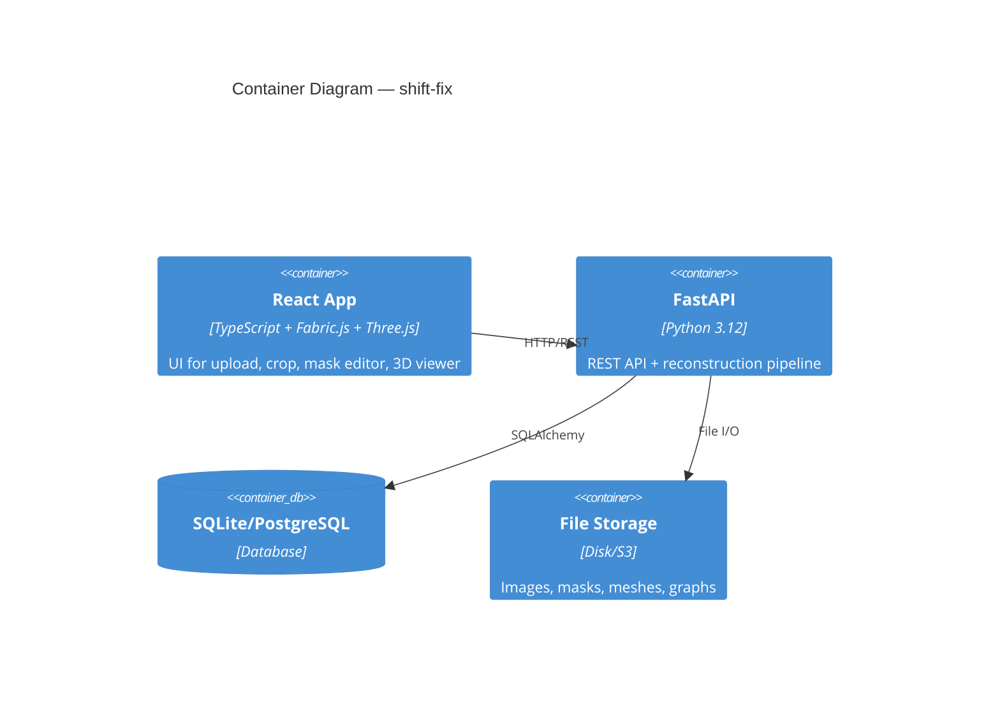
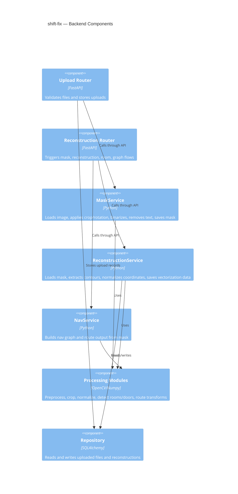
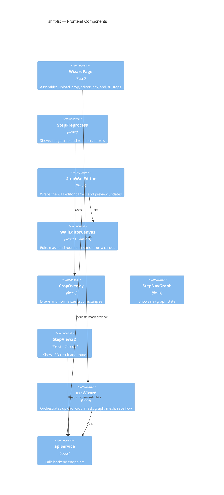
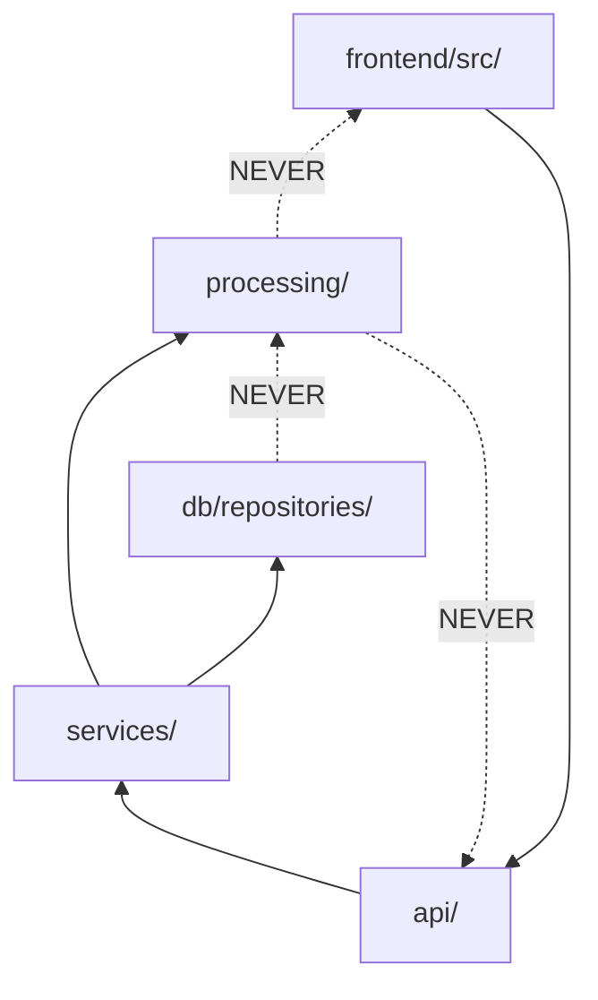

# Architecture: shift-fix

## C4 Level 1 — System Context
The user uploads a plan image, adjusts crop/rotation, edits the vector mask and room positions, and then builds the reconstruction and navigation outputs. The bug affects how the same plan geometry is positioned across these steps.

## C4 Level 2 — Container
The frontend captures crop/rotation and editor actions; the backend processes the image, stores intermediate artifacts, and returns reconstruction/nav data.

## C4 Level 3 — Component

### 3.1 Backend Components

### 3.2 Frontend Components

## Module Dependency Graph

**Rule:** dependencies flow from UI/API toward service and processing layers. Coordinate transforms must be consistent between the browser canvas, crop parameters, and backend vectorization data.
