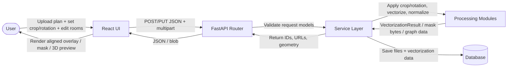
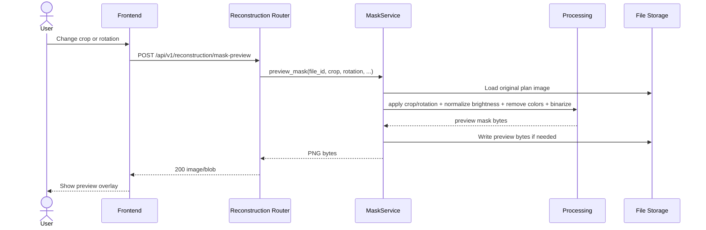
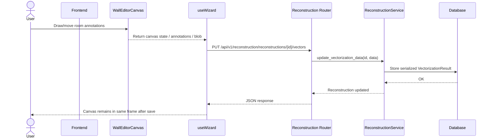
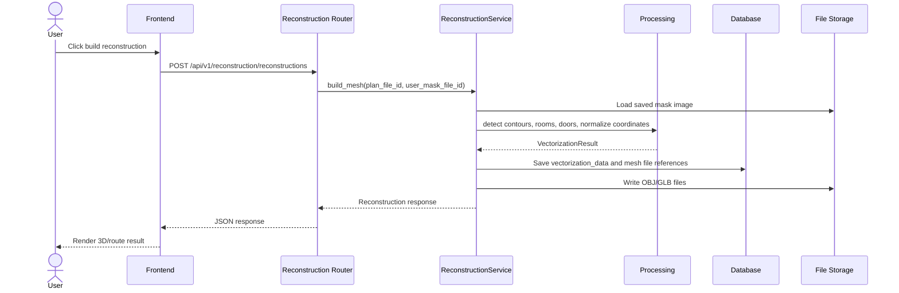

# Behavior: shift-fix

## Data Flow Diagrams

### DFD: Plan alignment flow

## Sequence Diagrams

### Use Case 1: Crop and preview mask stay aligned
User adjusts crop and rotation in the preprocess step and requests a mask preview.

**Error cases:**

| Condition | HTTP Status | Response | Behavior |
|-----------|-----------|----------|----------|
| Invalid crop schema | 422 | ValidationError | Reject request before processing |
| Missing source file | 404 | {"detail": "..."} | Do not build preview |
| Empty or unreadable image | 400 | {"detail": "..."} | Return safe error message |
| Processing failure | 500 | {"detail": "..."} | Log error and stop |

**Edge cases (Diplom3D-specific):**
- Crop rectangle reaches image boundary — preview must use the same clamp logic as the editor.
- Rotation changes image orientation — preview must reuse the same rotation value that will be used for saved mask generation.
- The preview must not introduce a different origin than the one used by reconstruction.

### Use Case 2: Manual room edits keep the same coordinate frame
User edits rooms/cabinets on the vector mask canvas and saves those changes for later reconstruction.

**Error cases:**

| Condition | HTTP Status | Response | Behavior |
|-----------|-----------|----------|----------|
| Invalid vectorization payload | 422 | ValidationError | Reject before save |
| Reconstruction not found | 404 | {"detail": "..."} | Do not write data |
| Save failure | 500 | {"detail": "..."} | Keep local editor state intact |

**Edge cases (Diplom3D-specific):**
- The canvas state must preserve the same crop-origin reference as the generated preview.
- Reopening saved annotations must not shift room labels relative to the underlying plan image.
- If vectorization data already contains crop metadata, the editor must render against that metadata instead of assuming full-image coordinates.

### Use Case 3: Reconstruction and emergency-plan output use the same geometry
User runs reconstruction and then views the 3D / navigation result.

**Error cases:**

| Condition | HTTP Status | Response | Behavior |
|-----------|-----------|----------|----------|
| Mask missing | 404 | {"detail": "..."} | Stop build |
| No contours detected | 200 or 4xx depending on service policy | Empty geometry or validation error | Must be defined consistently in decisions |
| Coordinate normalization failure | 500 | {"detail": "..."} | Do not save broken geometry |

**Edge cases (Diplom3D-specific):**
- The saved mask image and the original plan image must share the same reference transform used for room positions.
- Emergency-plan route rendering must use the same normalized coordinates as reconstruction and nav graph serialization.
- Any crop metadata stored in `VectorizationResult` must be read back before mesh/nav rendering.
