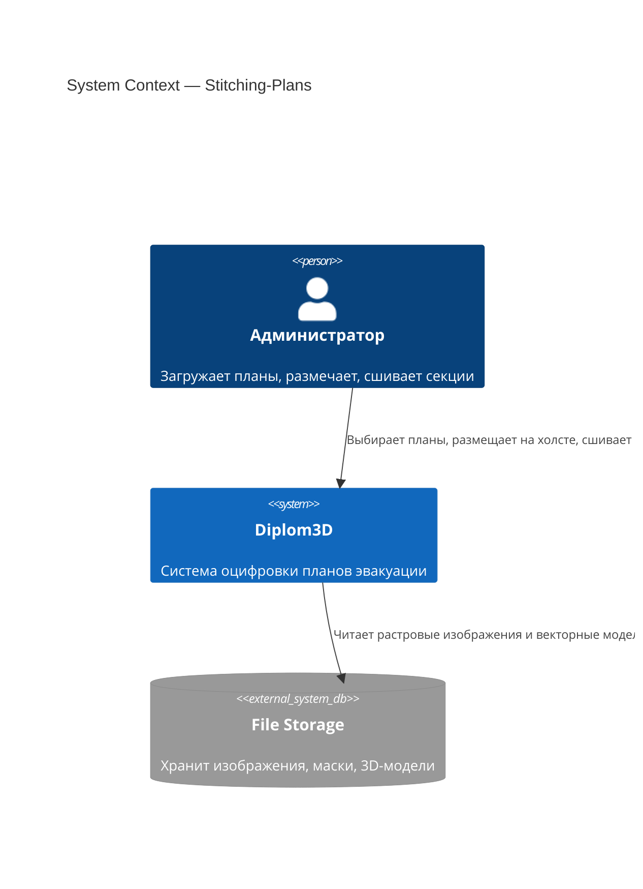
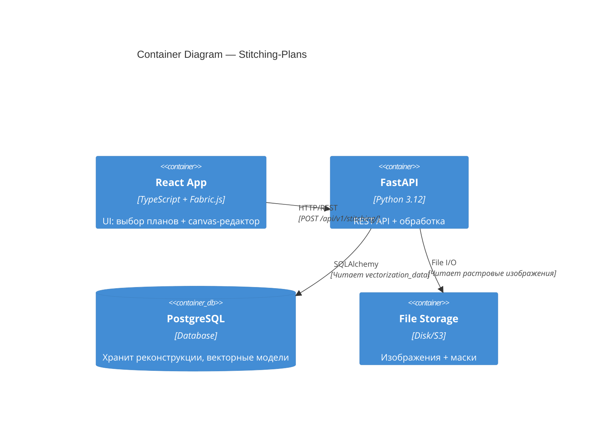
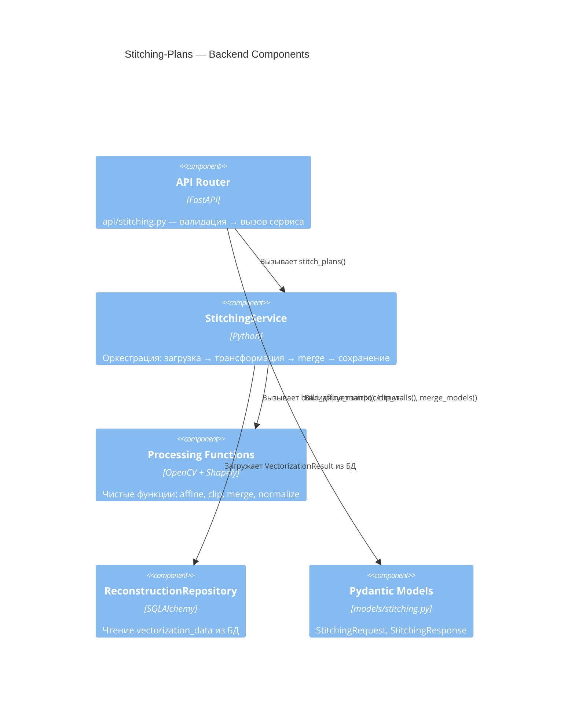
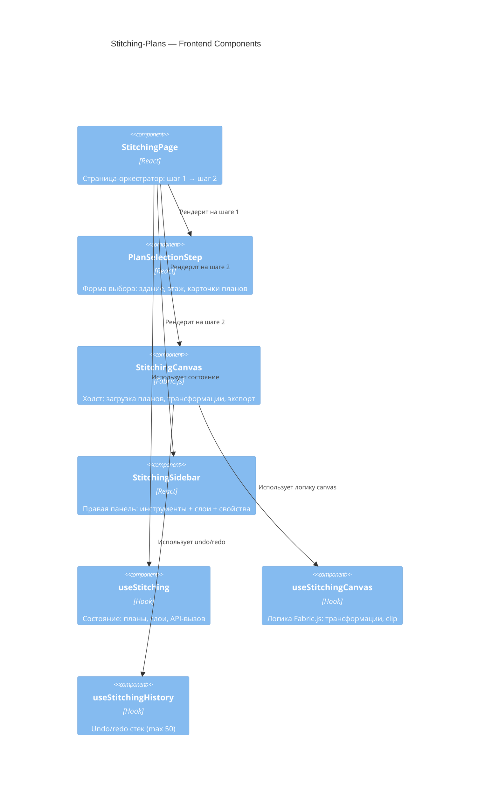
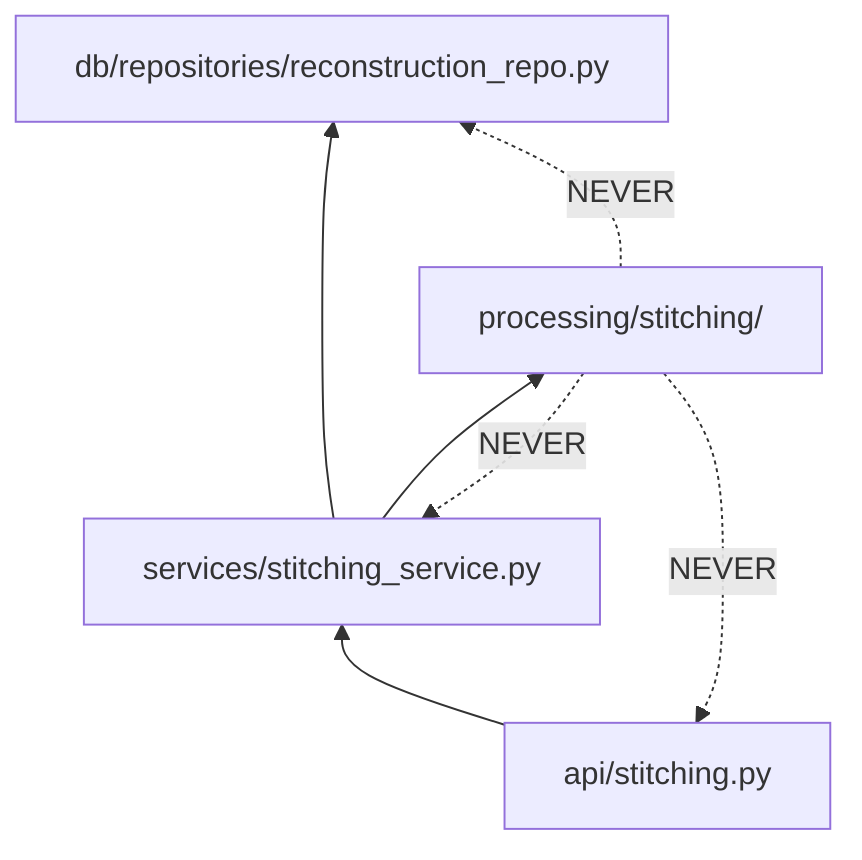
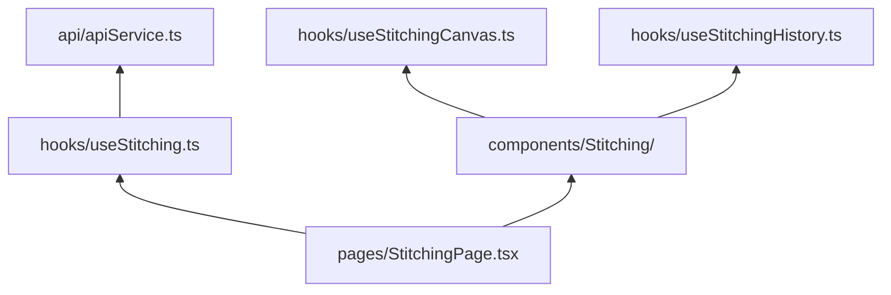

# Architecture: Stitching-Plans

## C4 Level 1 — System Context

WHO interacts with the system and WHAT external systems are involved.



## C4 Level 2 — Container

WHAT services/containers and HOW they communicate.



## C4 Level 3 — Component

WHAT internal modules handle the feature logic.

### 3.1 Backend Components



**Processing modules:**
- `processing/stitching/transform.py` — аффинные трансформации (scale → rotate → translate)
- `processing/stitching/clip.py` — обрезка стен/комнат/дверей (Shapely difference)
- `processing/stitching/merge.py` — объединение моделей + нормализация к [0,1]
- `processing/stitching/image_stitch.py` — сшивание растровых изображений (OpenCV warpAffine)

### 3.2 Frontend Components



## Module Dependency Graph

### Backend



**Rule:** Dependencies flow inward. `processing/` has ZERO external imports (no DB, no HTTP, no FastAPI).

### Frontend



**Rule:** Logic in hooks, components only render. No business logic in components.

## Key Architectural Decisions

### 1. Coordinate System Strategy

**Problem:** Plans have different sizes, rotations, positions on canvas. How to merge?

**Solution:** Three coordinate spaces:
1. **Canvas space (pixels)** — where user positions plans on Fabric.js canvas
2. **Image space (pixels)** — original image dimensions of each plan
3. **Normalized space [0,1]** — stored in DB, used for 3D generation

**Transformation pipeline:**
```
DB [0,1] → denormalize → Image pixels → affine transform → Canvas pixels
                                                          ↓
                                      clip polygons (canvas space)
                                                          ↓
                                      merge all plans → bounding box
                                                          ↓
                                      normalize → DB [0,1]
```

### 2. Pure Processing Functions

**Pattern from existing code:** `processing/pipeline.py` contains pure functions (no DB, no HTTP).

**Applied to stitching:**
- `processing/stitching/transform.py` — pure numpy/math operations
- `processing/stitching/clip.py` — pure Shapely operations
- `processing/stitching/merge.py` — pure list concatenation + normalization

**Service layer** (`services/stitching_service.py`) orchestrates: load from DB → call processing → save to DB.

### 3. Fabric.js Canvas for Positioning

**Why Fabric.js:** Already used in `WallEditorCanvas.tsx` for wall editing. Provides:
- Object transformations (move, rotate, scale)
- clipPath for polygon clipping
- Event handling for tools
- Export to JSON

**Reuse pattern:** Similar structure to `WallEditorCanvas.tsx`:
- Canvas in component, logic in hook (`useStitchingCanvas.ts`)
- Refs for Fabric.js objects (avoid React state for Three.js/Fabric objects)
- Cleanup on unmount (`canvas.dispose()`)

### 4. Two-Step Workflow

**Pattern from existing code:** `WizardPage.tsx` uses multi-step wizard with `WizardShell`.

**Applied to stitching:**
- **Step 1:** Plan selection form (separate page, no canvas yet)
  - Validates ≥2 plans selected
  - Stores selection in state
- **Step 2:** Canvas editor (full-screen)
  - Loads selected plans
  - User positions/crops
  - Exports transformations

**Why separate steps:** Canvas is heavy (Fabric.js + images). Don't load until plans selected.

### 5. Undo/Redo Strategy

**Snapshot-based:** Store full state after each action (not delta-based).

**Why:** Transformations are complex (affine matrix + clip polygons). Easier to snapshot than compute inverse operations.

**Limit:** 50 snapshots (FIFO). Prevents memory issues with large plans.

### 6. Clip Polygon Semantics

**User expectation:** "Remove overlap zones" = subtract (delete inside polygon).

**Fabric.js clipPath:** Shows what's INSIDE (opposite of user expectation).

**Solution:** Use `inverted: true` (Fabric.js 5+) or create outer rect with hole.

### 7. Database Model Extension

**Existing:** `Reconstruction.vectorization_data` (JSON TEXT) stores `VectorizationResult`.

**Extension for stitching:**
- Add `source_reconstruction_ids` (JSON array) — tracks which plans were merged
- Add `is_stitched` (boolean) — flag for filtering

**Why not new table:** Stitched reconstruction IS a reconstruction. Same structure, same 3D pipeline.

### 8. Error Handling for Duplicate Rooms

**Problem:** User didn't fully crop overlap → two rooms with same name (e.g., "A304") close together.

**Solution:** Detect in `check_duplicate_rooms()` (distance threshold 30px). Return warnings, don't block.

**Why warnings not errors:** User might intentionally have two "A304" (different buildings, same floor number). Let them decide.
