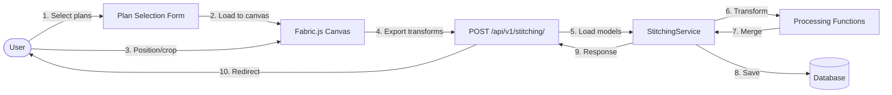
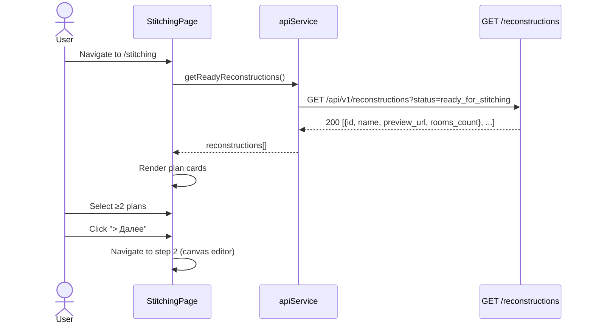
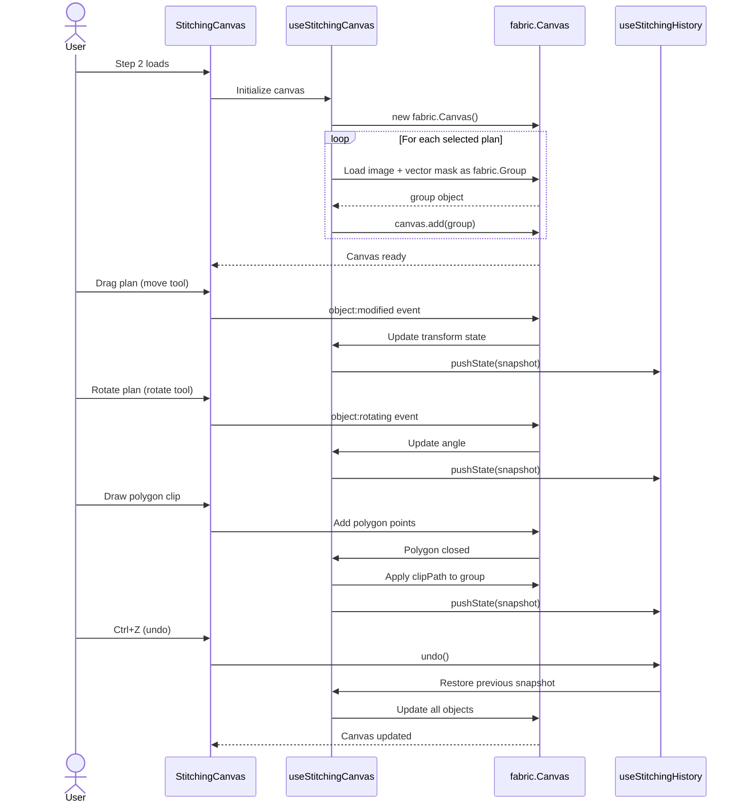
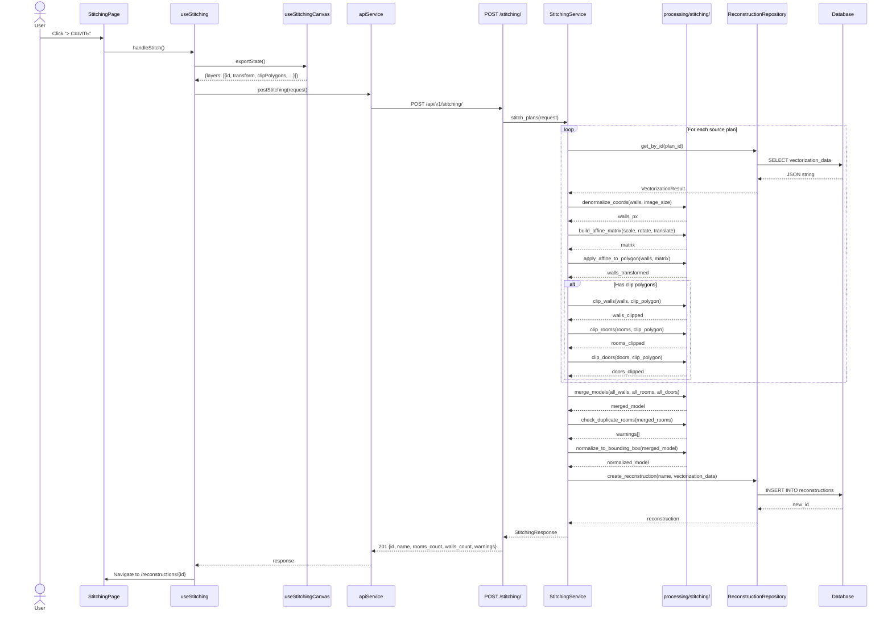
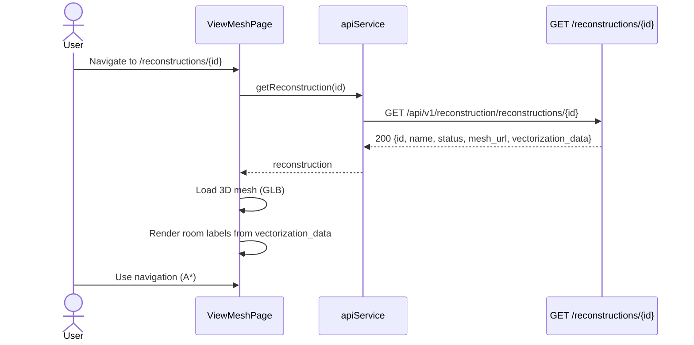
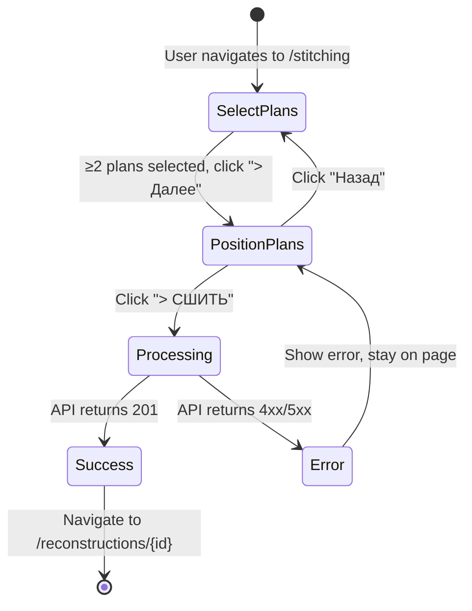
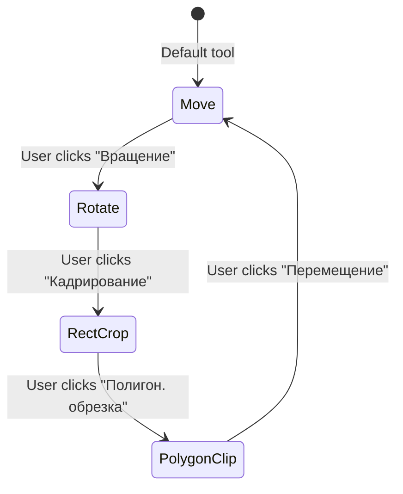

# Behavior: Stitching-Plans

## Data Flow Diagrams

### DFD: Main Stitching Flow



## Sequence Diagrams

### Use Case 1: Load Plans for Selection



**Error cases:**

| Condition | HTTP Status | Response | Behavior |
|-----------|-----------|----------|----------|
| No reconstructions found | 200 | `[]` | Show message "Нет готовых планов. Загрузите план." + button → /wizard |
| User selects <2 plans | — | — | Disable "> Далее" button |
| Network error | 500 | `{"detail": "..."}` | Show error toast, retry button |

**Edge cases:**
- Zero reconstructions in DB → show empty state with "Загрузить план" button
- Only 1 reconstruction ready → show message "Для сшивания нужно минимум 2 плана"
- User selects same plan twice → prevent in UI (checkbox, not multi-select)

### Use Case 2: Position Plans on Canvas



**Error cases:**

| Condition | Behavior |
|-----------|----------|
| Image fails to load | Show placeholder + error icon on layer card |
| Canvas initialization fails | Show error message "Не удалось инициализировать редактор" |
| Out of memory (too many snapshots) | Limit to 50, FIFO removal |

**Edge cases:**
- User rotates plan 360° → normalize to 0°
- User scales plan to 0 → prevent (min scale 0.1)
- User moves plan outside canvas → allow (canvas is infinite, bounding box computed later)
- Polygon clip with <3 points → ignore, show tooltip "Минимум 3 точки"

### Use Case 3: Submit Stitching Request



**Error cases:**

| Condition | HTTP Status | Response | Behavior |
|-----------|-----------|----------|----------|
| Less than 2 plans | 400 | `{"detail": "At least 2 source plans required"}` | Show error toast |
| Invalid transform data | 400 | `{"detail": "Invalid transform: scale must be > 0"}` | Show validation errors |
| No walls after merge | 400 | `{"detail": "No walls after merge"}` | Show error toast |
| Source plan not found | 404 | `{"detail": "Reconstruction {id} not found"}` | Show error toast |
| Building not found | 404 | `{"detail": "Building {id} not found"}` | Show error toast |
| Pydantic validation | 422 | `{"detail": [{"loc": [...], "msg": "..."}]}` | Show validation errors |
| Processing error | 500 | `{"detail": "Stitching failed: ..."}` | Show error + log details |
| DB save error | 500 | `{"detail": "Failed to save"}` | Show error, don't navigate |

**Edge cases:**
- All rooms clipped away → create reconstruction with 0 rooms (valid, user can re-edit)
- Bounding box is empty (no walls) → return 400 "No walls after merge"
- Duplicate room warnings → include in response, show to user as info toast
- Very large merged model (>10k walls) → process normally, may be slow (add timeout warning)

### Use Case 4: View Stitched Reconstruction



**No special behavior** — stitched reconstruction is identical to single-plan reconstruction from this point forward.

## State Transitions

### Stitching Workflow State Machine



### Canvas Tool State



**Tool behaviors:**
- **Move:** Drag plan = translate, drag corner = scale, drag near corner = rotate
- **Rotate:** Drag anywhere on plan = rotate around center, Shift = snap to 15°
- **RectCrop:** Drag rectangle on plan, Enter = apply crop (delete outside)
- **PolygonClip:** Click to add points, click first point = close, apply = delete inside

## Data Structures

### StitchingRequest (frontend → backend)

```typescript
interface StitchingRequest {
  name: string;
  building_id: string;
  floor_number: number;
  source_plans: SourcePlanInput[];
}

interface SourcePlanInput {
  reconstruction_id: string;
  transform: {
    translate_x: number;  // Canvas pixels
    translate_y: number;
    scale_x: number;
    scale_y: number;
    rotation_deg: number;
  };
  clip_polygons: ClipPolygon[];
  rect_crop: RectCrop | null;
  image_width_px: number;   // Original image size
  image_height_px: number;
  z_index: number;
}

interface ClipPolygon {
  type: "subtract";
  points: [number, number][];  // Canvas pixels
}

interface RectCrop {
  x: number;      // Image pixels
  y: number;
  width: number;
  height: number;
}
```

### StitchingResponse (backend → frontend)

```typescript
interface StitchingResponse {
  id: number;
  name: string;
  status: number;  // 3 = completed
  source_reconstruction_ids: number[];
  building_id: string;
  floor_number: number;
  rooms_count: number;
  walls_count: number;
  warnings?: string[];  // e.g., ["Duplicate room 'A304' detected"]
}
```

### Canvas Snapshot (undo/redo)

```typescript
interface StitchingSnapshot {
  layers: LayerSnapshot[];
}

interface LayerSnapshot {
  reconstructionId: string;
  transform: {
    x: number;
    y: number;
    scaleX: number;
    scaleY: number;
    angle: number;
  };
  clipPaths: SerializedClipPath[];
  rectCrop: RectCrop | null;
  zIndex: number;
}
```
