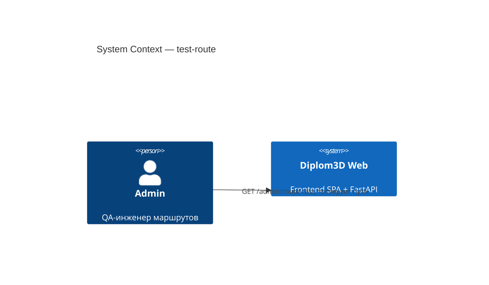
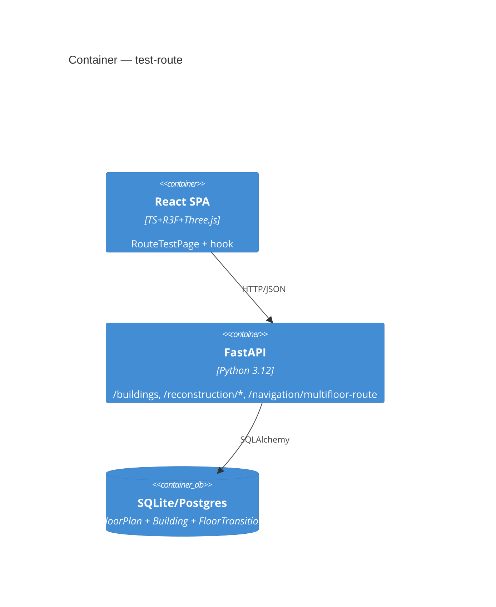
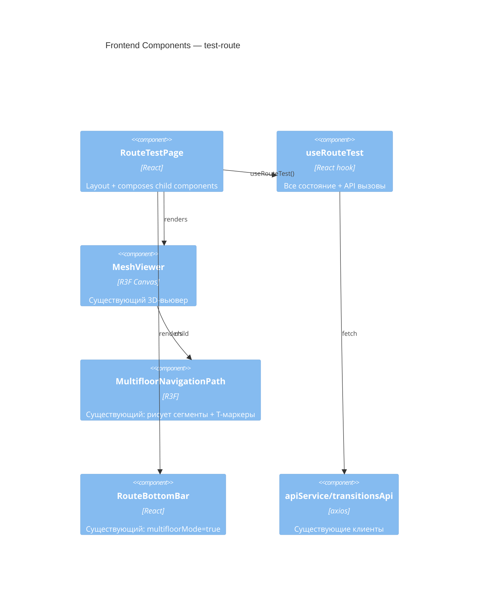
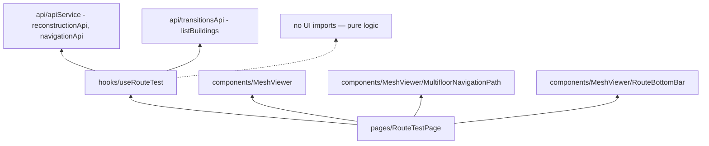

# Architecture: test-route

## C4 L1 — System Context

## C4 L2 — Container

## C4 L3 — Components (frontend)

## Module Dependency Graph

**Rule:** `useRouteTest` не импортирует Three.js / React-компоненты.
Только axios-клиенты + типы. Вся UI-логика — в page и существующих компонентах.

## File Inventory

### New files

| Path | Purpose |
|------|---------|
| `frontend/src/hooks/useRouteTest.ts` | состояние + API оркестрация |
| `frontend/src/pages/RouteTestPage.tsx` | layout (заменяет stub) |
| `frontend/src/pages/RouteTestPage.module.css` | layout styles |

### Modified files

| Path | Change |
|------|--------|
| `frontend/src/App.tsx` | + `<Route path="/admin/route-test" element={<RouteTestPage/>}/>` |

### Reused (no changes)

- `components/MeshViewer.tsx`
- `components/MeshViewer/MultifloorNavigationPath.tsx`
- `components/MeshViewer/RouteBottomBar.tsx`
- `api/apiService.ts` (reconstructionApi, navigationApi)
- `api/transitionsApi.ts` (listBuildings)
- `types/transitions.ts`
- `types/reconstructionVectors.ts` (для rooms)
