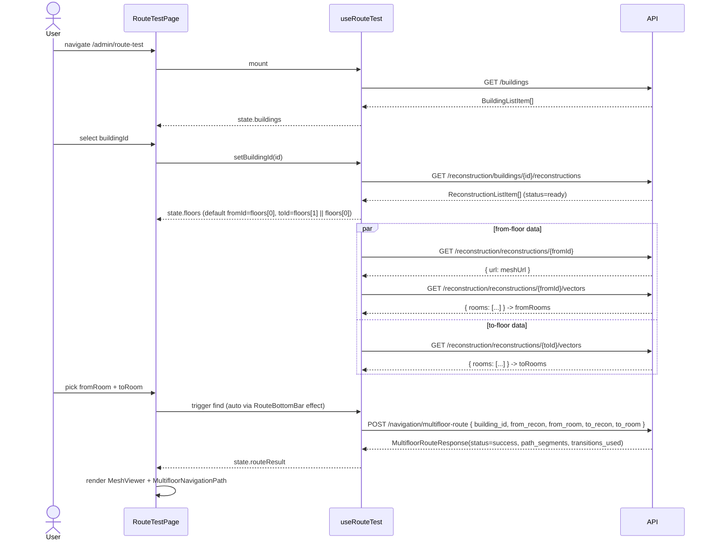
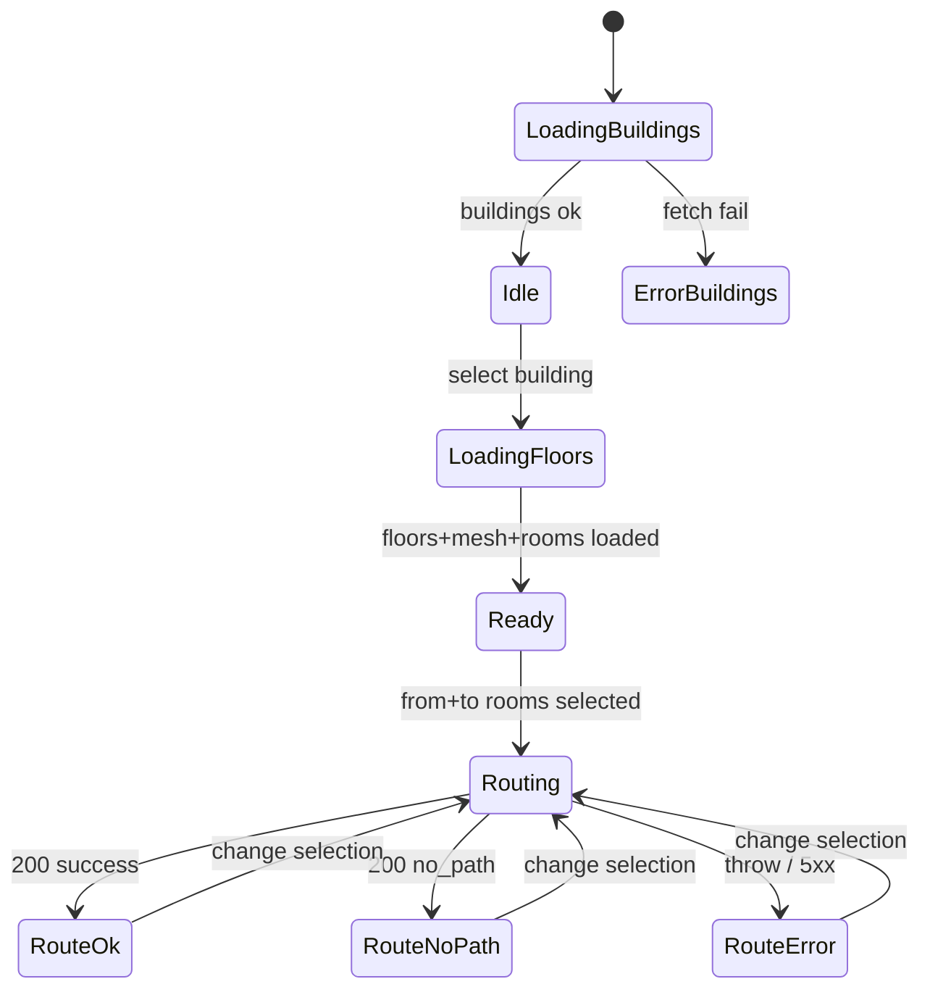

# Behavior: test-route

## DFD — Test Route Flow

```mermaid
flowchart LR
  user([Admin]) -->|select building| page[RouteTestPage]
  page --> hook[useRouteTest]
  hook -->|GET /buildings| api[(API)]
  api -->|building list| hook
  hook -->|GET /buildings/:id/reconstructions| api
  api -->|floors| hook
  hook -->|GET /reconstructions/:id| api
  api -->|mesh url| hook
  hook -->|GET /reconstructions/:id/vectors| api
  api -->|rooms[]| hook
  user -->|select rooms| page
  hook -->|POST /navigation/multifloor-route| api
  api -->|MultifloorRouteResponse| hook
  hook -->|state| page
  page -->|render| viewer[MeshViewer + MultifloorNavigationPath]
```

## Sequence: Happy Path



## Error / Edge Cases

| Condition | UI Behavior |
|-----------|-------------|
| `GET /buildings` fails | HUD: "Ошибка загрузки зданий" |
| Здание без этажей | селекторы пусты, кнопка disabled |
| Только 1 этаж | то же значение в обоих селекторах допускается; multifloor backend вернёт `no_path` или single-floor route — обрабатываем status |
| `meshUrl == null` (не построено) | placeholder "3D-модель не готова" |
| Rooms list пуст | селекторы комнат пусты, кнопка не сработает |
| `multifloorRoute` returns `status=no_path` | HUD: "Маршрут не найден" |
| `multifloorRoute` throws | HUD: "Ошибка запроса маршрута" |
| Смена этажа "От" во время загрузки | сбрасываем routeResult, начинаем новый fetch |
| Размонтирование во время fetch | stale-fetch guard через ref `mountedRef` |

## State Machine (high-level)


