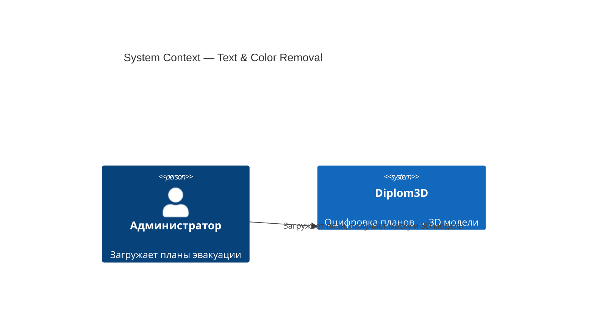
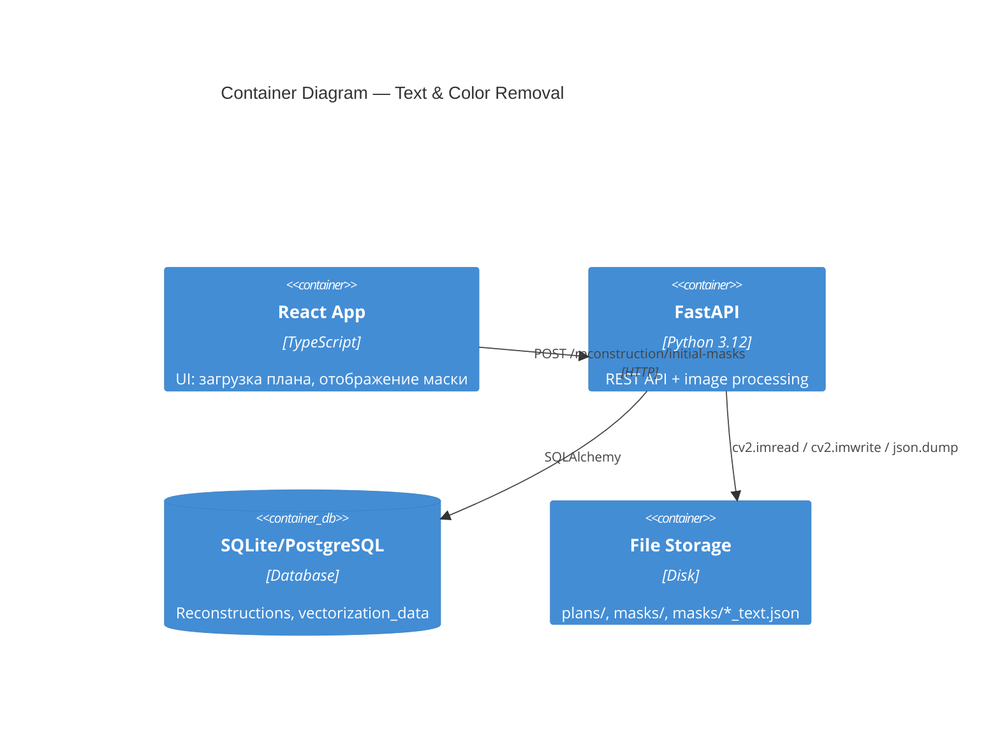
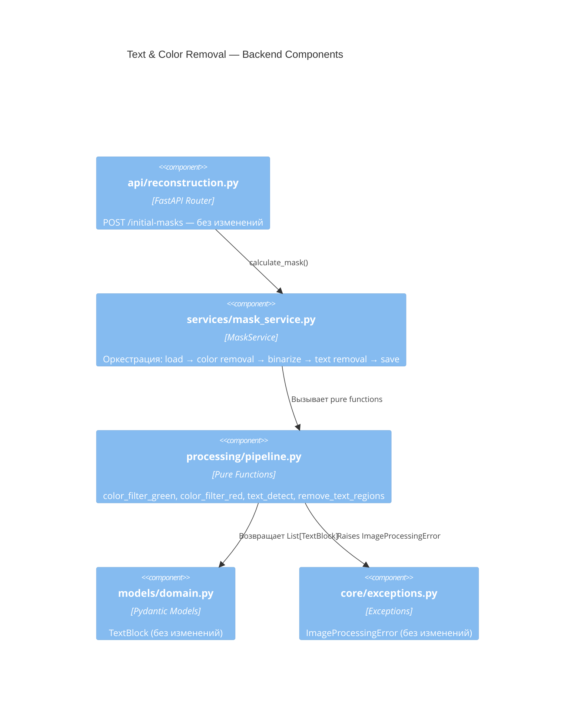
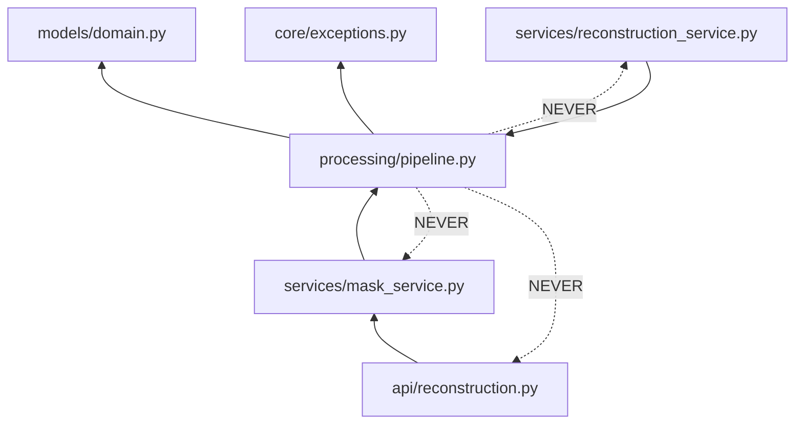

# Architecture: Text & Color Removal

## C4 Level 1 — System Context

Фича не добавляет новых внешних систем. Единственная внешняя зависимость — Tesseract OCR binary (уже установлен, pytesseract — обёртка).

## C4 Level 2 — Container

Изменения только в backend — frontend не затрагивается (шаги включены по умолчанию, параметры не передаются с фронта).

## C4 Level 3 — Backend Components

### 3.1 Затронутые модули

### 3.2 Новые и изменяемые компоненты

| Компонент | Файл | Изменение |
|-----------|------|-----------|
| `remove_green_elements()` | `processing/pipeline.py` | **NEW** — HSV фильтрация зелёного + inpaint |
| `remove_red_elements()` | `processing/pipeline.py` | **NEW** — HSV фильтрация красного + морфологическое восстановление стен |
| `remove_colored_elements()` | `processing/pipeline.py` | **NEW** — оркестратор: green → red → wall repair |
| `text_detect()` | `processing/pipeline.py` | Без изменений (уже реализована) |
| `remove_text_regions()` | `processing/pipeline.py` | Без изменений (уже реализована) |
| `MaskService.calculate_mask()` | `services/mask_service.py` | **MODIFY** — добавить шаги color removal + text removal |

### 3.3 Что НЕ меняется

- `api/reconstruction.py` — роутер остаётся тонким, параметры не добавляются
- `models/domain.py` — `TextBlock` уже содержит все нужные поля
- `core/exceptions.py` — `ImageProcessingError` уже подходит
- `services/reconstruction_service.py` — уже загружает `_text.json`, логика не меняется
- Frontend — никаких изменений

## Module Dependency Graph

**Rule:** `processing/pipeline.py` — чистые функции. Нет импортов из `api/`, `services/`, `db/`. Нет файлового I/O, нет HTTP, нет side effects.

Файловый I/O (сохранение `_text.json`) — ответственность `MaskService`, не `pipeline.py`.
