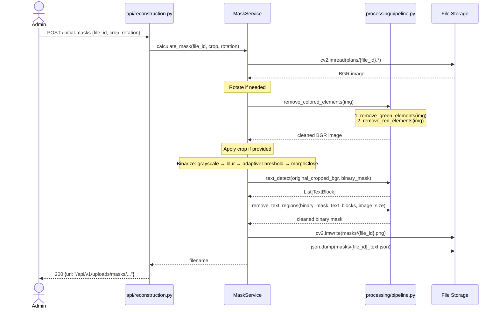

# Behavior: Text & Color Removal

## Data Flow Diagrams

### DFD: Mask Pipeline (updated)

```mermaid
flowchart LR
    User([Admin]) -->|"POST /initial-masks"| Router[API Router]
    Router -->|"file_id, crop, rotation"| MaskSvc[MaskService]
    MaskSvc -->|"BGR image"| ColorRm["remove_colored_elements()"]
    ColorRm -->|"Cleaned BGR"| Binarize["adaptiveThreshold()"]
    Binarize -->|"Binary mask"| TextDet["text_detect()"]
    TextDet -->|"List[TextBlock]"| TextRm["remove_text_regions()"]
    TextRm -->|"Cleaned mask"| Save["Save mask + text.json"]
    Save -->|"filename"| Router
    Router -->|"JSON response"| User
```



### DFD: Порядок шагов в пайплайне (до и после)

**Текущий пайплайн:**
```
load → rotate → [normalize OFF] → [color_filter OFF] → crop → binarize → morphClose → save
```

**Новый пайплайн:**
```
load → rotate → [normalize OFF] → color_removal → crop → binarize → morphClose → text_detect → text_removal → save mask + save text.json
```

Ключевые изменения:
1. `color_removal` включён по умолчанию (вместо отключённого `color_filter`)
2. `text_detect` + `text_removal` добавлены после бинаризации
3. Текстовые блоки сохраняются в `{file_id}_text.json`

## Sequence Diagrams

### Use Case 1: Расчёт маски с удалением цвета и текста (happy path)



**Error cases:**

| Condition | HTTP Status | Response | Behavior |
|-----------|-----------|----------|----------|
| Plan file not found | 500 | "Ошибка обработки изображения" | FileStorageError → caught in router |
| cv2.imread returns None | 500 | "Ошибка обработки изображения" | ImageProcessingError → caught in router |
| Tesseract not installed | 200 | Normal response | text_detect returns [], text removal skipped |
| OCR fails at runtime | 200 | Normal response | text_detect catches exception, returns [] |
| Empty image after crop | 500 | "Ошибка обработки изображения" | ImageProcessingError from processing functions |

**Edge cases:**

| Case | Behavior |
|------|----------|
| План без цветных элементов | color_removal возвращает изображение без изменений (маска пустая → inpaint = noop) |
| План без текста | text_detect возвращает [], remove_text_regions возвращает маску без изменений |
| Красный элемент на стене | remove_red_elements восстанавливает стену через morphClose после inpaint |
| Очень большое изображение (>5000px) | Работает, но text_detect может быть медленным (>5s). Логируем время |
| Pytesseract не установлен | Graceful fallback: text_detect возвращает [], маска без удаления текста |

### Use Case 2: Построение 3D модели с текстовыми блоками (без изменений)

Существующий flow в `ReconstructionService.build_mesh()` уже загружает `{mask_file_id}_text.json` (строки 124-137 в `reconstruction_service.py`). Текстовые блоки используются для `assign_room_numbers()`. Этот flow не меняется — он просто начнёт получать реальные данные вместо пустого файла.
