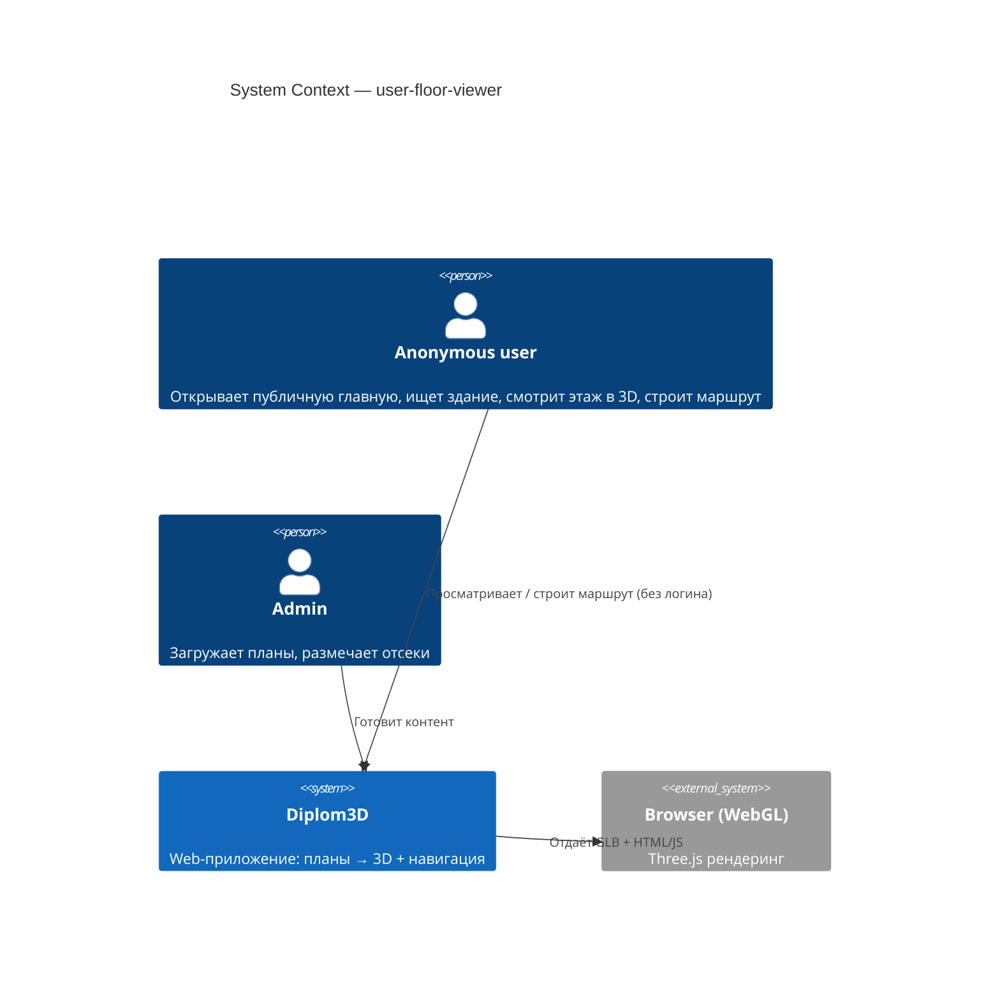
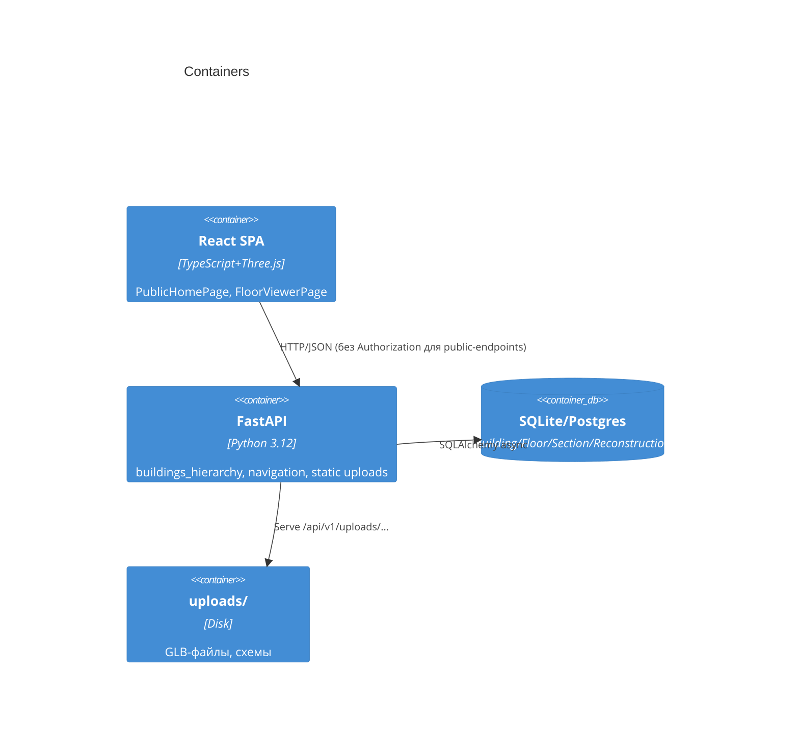
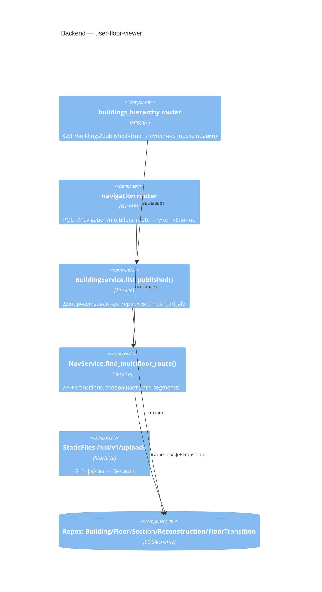
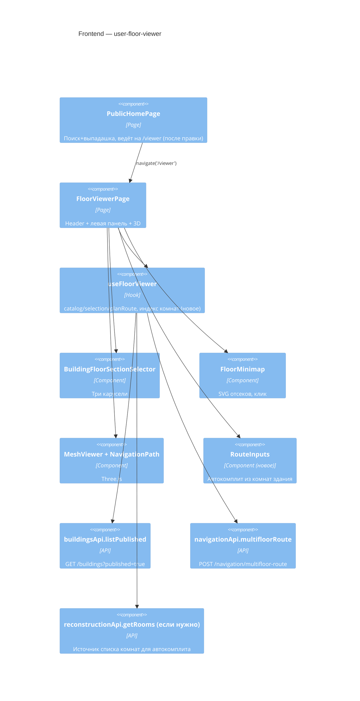
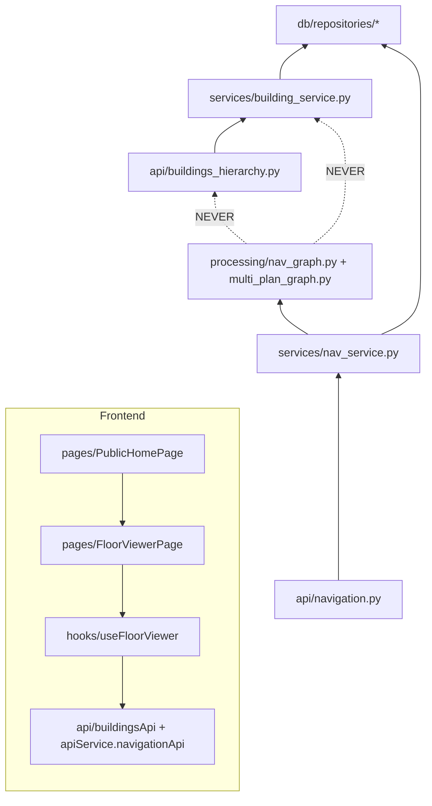

# Architecture: user-floor-viewer

## C4 Level 1 — System Context

## C4 Level 2 — Container

Изменений на уровне контейнеров нет. Фича целиком в существующих:

## C4 Level 3 — Component

### 3.1 Backend (затрагиваемые компоненты)

**Точка правки:** [buildings_hierarchy.py:42-55](backend/app/api/buildings_hierarchy.py:42) — разделить ручку на «public-режим без auth» и «admin-режим с auth». Варианты в [03-decisions.md](03-decisions.md) ADR-1.

### 3.2 Frontend (затрагиваемые компоненты)

**Точки правки:**
- [PublicHomePage.tsx:117](frontend/src/pages/PublicHomePage.tsx:117) — `navigate('/map')` → `navigate('/viewer')`.
- [apiService.ts:20-30](frontend/src/api/apiService.ts:20) — `Authorization`-заголовок должен **не добавляться**, если токена нет (interceptor уже это делает — `if (token) ...`). Никаких правок не требуется, но 401-редирект ([:36-40](frontend/src/api/apiService.ts:36)) не должен срабатывать для публичных страниц — см. ADR-2.
- [useFloorViewer.ts](frontend/src/hooks/useFloorViewer.ts) — добавить загрузку реестра комнат текущего здания + новый `RouteInputs` с автокомплитом (ADR-3).

## Module Dependency Graph

Правило: правки не меняют направления зависимостей, не добавляют импортов между слоями.
