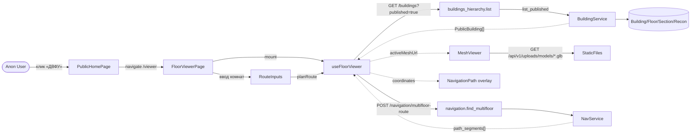
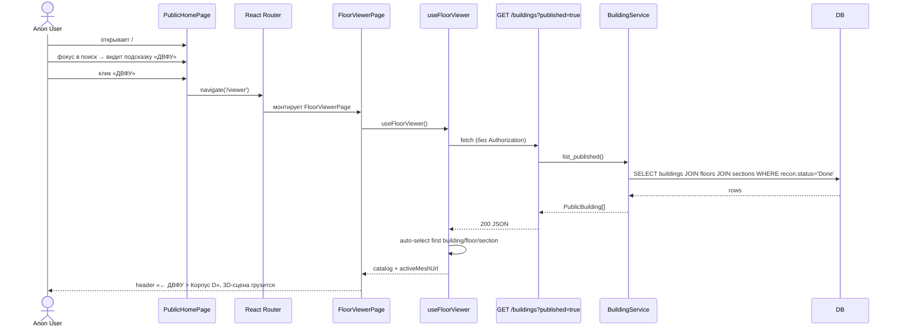
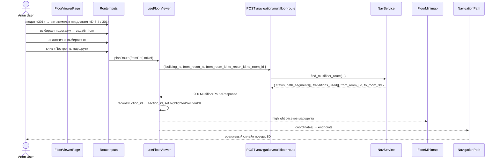
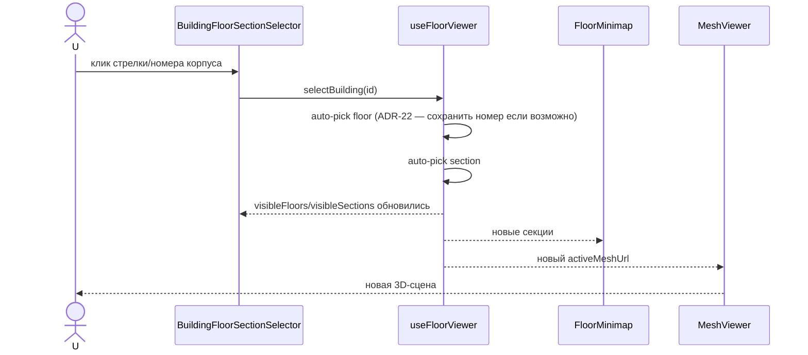

# Behavior: user-floor-viewer

## DFD — главный поток

---

## Use Case 1 — «Открыть ДВФУ из главной»

**Error / Edge cases:**

| Условие | Поведение |
|---|---|
| Каталог пуст (нет опубликованных зданий) | Страница рисует пустое состояние с подсказкой «Нет доступных зданий» (новый UI-элемент) |
| Сервер вернул 500 | Toast «Не удалось загрузить каталог зданий» + кнопка «Повторить» |
| Сервер вернул 401 (регресс auth-правки) | НЕ редиректить на /login с публичной страницы — см. ADR-2 |
| Здание ДВФУ есть, но ни у одного отсека нет mesh_url_glb | Страница показывает селекторы, но `MeshViewer` без url → placeholder «Модель ещё не готова» |
| Очень большой GLB (>50 МБ) | Spinner на время загрузки `useGLTF` (уже реализован Suspense) |

---

## Use Case 2 — «Построить маршрут между комнатами»

**Error / Edge cases:**

| Условие | HTTP | Поведение фронта |
|---|---|---|
| Комнаты в разных зданиях | — | Локально в `planRoute` валидируем → toast «Маршрут только в пределах одного здания» |
| `status='no_path'` | 200 | Toast «Маршрут не найден между этими помещениями» |
| Комната не найдена (id невалиден) | 404 | Toast «Не удалось найти комнату» |
| Сервер 500 | 500 | Toast «Ошибка построения маршрута» |
| Пользователь меняет селектор корпус/этаж/отсек после построения | — | Сбрасываем `highlightedSectionIds` и `routeSegments` (текущее поведение [useFloorViewer.ts](frontend/src/hooks/useFloorViewer.ts)) |
| Поля пустые | — | Кнопка disabled |
| Маршрут через лестницу/лифт между этажами | 200 | Отрисовываем все `path_segments`, на каждом этаже своя минимапа подсветка |

---

## Use Case 3 — «Переключение корпус / этаж / отсек»

Edge: переключение во время незавершённого `planRoute()` — отмена не нужна, ответ просто будет проигнорирован, т.к. `highlightedSectionIds` уже очистится. Уже работает в текущем хуке.

---

## Use Case 4 — «Авторизованный admin открывает /viewer»

После снятия auth с публичной ручки admin должен иметь идентичный опыт:
- `apiService.ts` всё равно подставит `Bearer` (если токен есть) — бэкенд должен его проигнорировать, а не валидировать.
- Решение: оставляем `Depends(security)` только в ветке `published=false`. См. [03-decisions.md](03-decisions.md) ADR-1.
