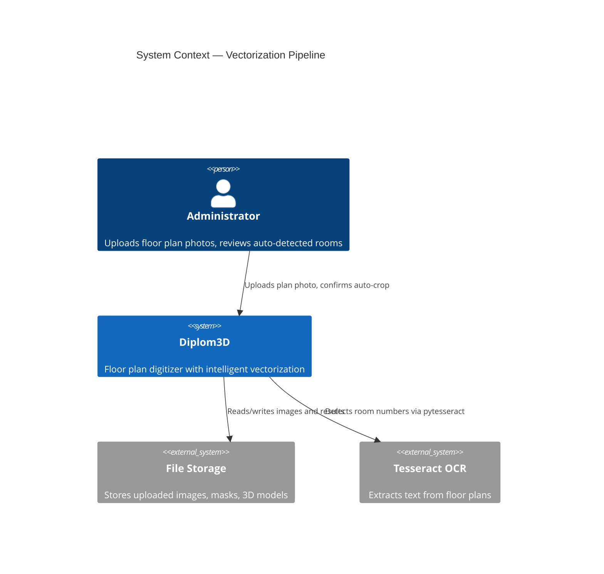
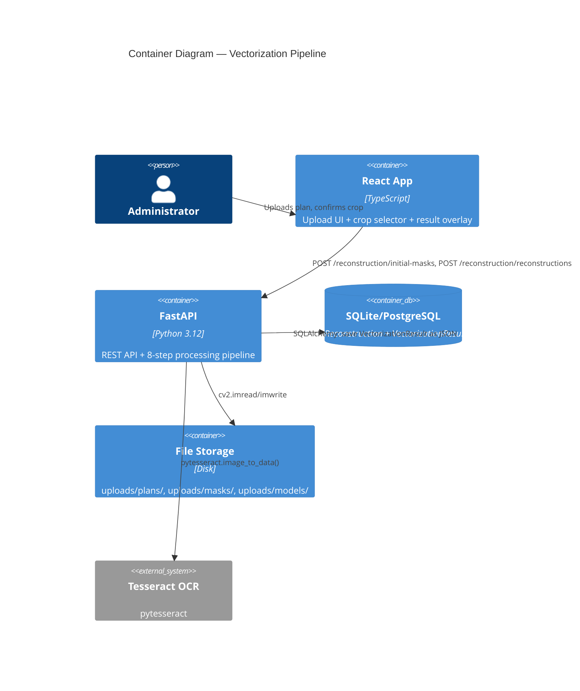
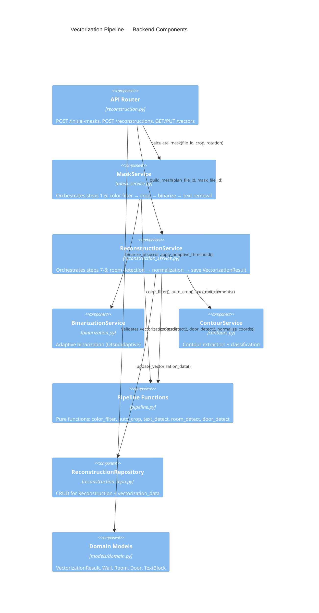
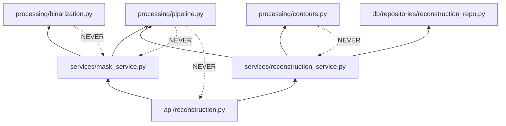

# Architecture: Vectorization Pipeline

## C4 Level 1 — System Context

WHO interacts with the system and WHAT external systems are involved.

**Context:** Administrator uploads evacuation plan photo → system processes through 8-step pipeline → produces structured VectorizationResult with walls, rooms, doors, text → saves to DB → enables downstream features (floor-editor, 3d-builder, pathfinding).

---

## C4 Level 2 — Container

WHAT services/containers and HOW they communicate.

**Key flows:**
1. Upload: Frontend → Backend → Storage (saves plan to uploads/plans/)
2. Vectorization: Backend reads plan → 8-step pipeline → saves VectorizationResult JSON to DB
3. Retrieval: Frontend → Backend → DB (GET /reconstructions/{id}/vectors)

---

## C4 Level 3 — Component

WHAT internal modules handle the feature logic.

### 3.1 Backend Components

### 3.2 Module Dependency Graph

**Dependency Rules:**
- `processing/` modules are PURE — no imports from `api/`, `services/`, or `db/`
- `services/` orchestrate processing functions and call repositories
- `api/` routers are thin — validate input → call service → return response
- `repositories/` handle all database operations

### 3.3 New Files Created

**Processing Layer (pure functions):**
- `backend/app/processing/pipeline.py` — NEW: color_filter, auto_crop, text_detect, room_detect, door_detect, normalize_coords

**Domain Models:**
- `backend/app/models/domain.py` — MODIFIED: extend VectorizationResult, add Room, Door, TextBlock

**Database:**
- `backend/app/db/models/reconstruction.py` — MODIFIED: add vectorization_data column (Text/JSON)
- `backend/alembic/versions/{timestamp}_add_vectorization_data.py` — NEW: migration

**API:**
- `backend/app/api/reconstruction.py` — MODIFIED: add GET/PUT /reconstructions/{id}/vectors endpoints

**Services:**
- `backend/app/services/mask_service.py` — MODIFIED: integrate BinarizationService + pipeline functions
- `backend/app/services/reconstruction_service.py` — MODIFIED: integrate ContourService + pipeline functions, save VectorizationResult

### 3.4 Modified Files

**Existing services refactored to use new pipeline:**
- `backend/app/services/mask_service.py:28-62` — replace `preprocess_image()` call with BinarizationService + pipeline steps 1-6
- `backend/app/services/reconstruction_service.py:36-107` — replace `find_contours()` call with ContourService + pipeline steps 7-8

**Existing processing classes integrated:**
- `backend/app/processing/binarization.py` — NO CHANGES (already implements Otsu + adaptive)
- `backend/app/processing/contours.py` — NO CHANGES (already implements classification)

---

## Architecture Principles

1. **Pure Processing Layer:** All functions in `processing/pipeline.py` are pure — take np.ndarray, return np.ndarray or domain models. No side effects, no DB, no HTTP.

2. **Service Orchestration:** `MaskService` and `ReconstructionService` orchestrate pipeline steps, handle file I/O, call repositories.

3. **Domain-Driven Design:** `VectorizationResult` is the core domain model — all downstream features depend on its structure.

4. **Backward Compatibility:** Existing API endpoints unchanged. New endpoints added for vector data access.

5. **Testability:** Pure functions tested with synthetic images. Services tested with mocked dependencies. API tested with TestClient.

6. **Separation of Concerns:**
   - `processing/` — image algorithms (OpenCV, numpy)
   - `services/` — business logic (orchestration, validation)
   - `api/` — HTTP layer (request/response)
   - `db/` — persistence (SQLAlchemy)
