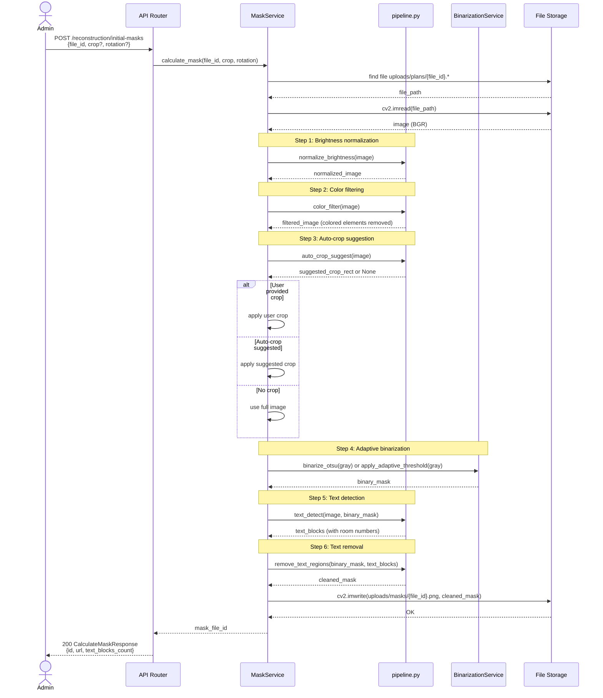
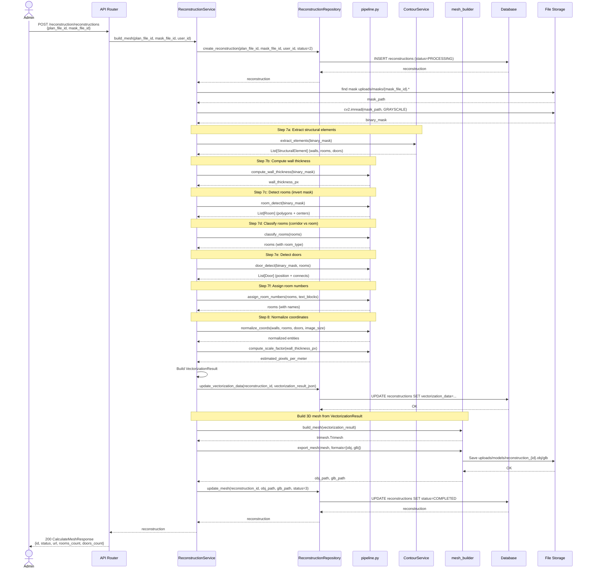
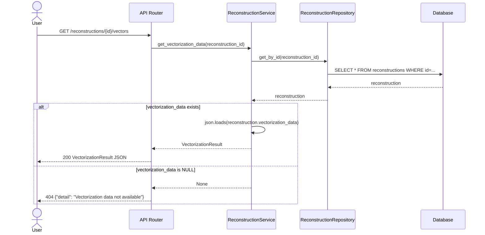
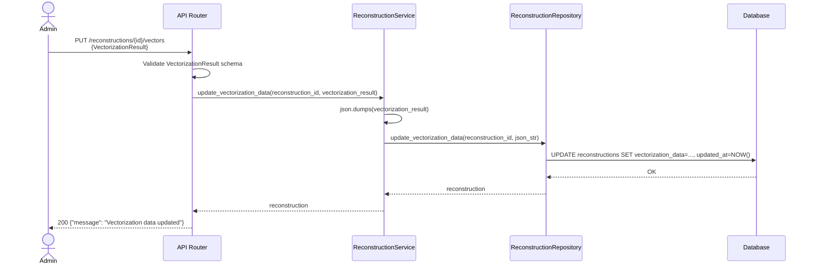

# Behavior: Vectorization Pipeline

## Data Flow Diagrams

### DFD: Full Vectorization Pipeline

```mermaid
flowchart TB
User([Administrator]) -->|1. Upload plan photo| Upload[POST /upload/plan-photo/]
Upload -->|file_id| User
User -->|2. Request mask with crop/rotation| CalcMask[POST /reconstruction/initial-masks]
CalcMask -->|Orchestrate| MaskService[MaskService]
MaskService -->|Step 1-2| ColorFilter[color_filter + auto_crop]
ColorFilter -->|cleaned image| MaskService
MaskService -->|Step 3-4| Binarization[BinarizationService]
Binarization -->|binary mask| MaskService
MaskService -->|Step 5-6| TextRemoval[text_detect + inpaint]
TextRemoval -->|mask + text_blocks| MaskService
MaskService -->|Save mask| Storage[(uploads/masks/)]
MaskService -->|mask_file_id| User

User -->|3. Request mesh| CalcMesh[POST /reconstruction/reconstructions]
CalcMesh -->|Orchestrate| ReconService[ReconstructionService]
ReconService -->|Load mask| Storage
ReconService -->|Step 7| RoomDetect[room_detect + ContourService]
RoomDetect -->|walls, rooms, doors| ReconService
ReconService -->|Step 8| Normalize[normalize_coords + compute scale]
Normalize -->|VectorizationResult| ReconService
ReconService -->|Save JSON| DB[(reconstructions.vectorization_data)]
ReconService -->|Build 3D mesh| MeshBuilder[mesh_builder]
MeshBuilder -->|OBJ/GLB| Storage
ReconService -->|reconstruction_id| User

User -->|4. Retrieve vectors| GetVectors[GET /reconstructions/{id}/vectors]
GetVectors -->|Load JSON| DB
DB -->|VectorizationResult| User
```

---

## Sequence Diagrams

### Use Case 1: Calculate Mask with Auto-Crop



**Error cases:**

| Condition | HTTP Status | Response | Behavior |
|-----------|-----------|----------|----------|
| file_id not found | 404 | {"detail": "Plan file not found"} | FileStorageError raised |
| Invalid image format | 400 | {"detail": "Failed to decode image"} | cv2.imread returns None |
| Processing failed | 500 | {"detail": "Image processing error: {step}"} | ImageProcessingError caught, logged |
| Empty image after crop | 400 | {"detail": "Crop area is empty"} | Validate crop before processing |

**Edge cases:**
- Large file (>10MB): Already validated in upload endpoint, rejected before reaching this step
- Plan with no text: text_detect returns empty list, system continues normally
- Plan with no detectable building boundary: auto_crop returns None, uses full image
- Extreme rotation (not 0/90/180/270): Reject in validation, only allow 90° increments

---

### Use Case 2: Build Mesh with Room Detection



**Error cases:**

| Condition | HTTP Status | Response | Behavior |
|-----------|-----------|----------|----------|
| mask_file_id not found | 404 | {"detail": "Mask file not found"} | FileStorageError raised |
| No contours detected | 200 | {status: COMPLETED, walls: [], rooms: []} | Valid result, empty building |
| Room detection failed | 500 | {status: ERROR, error_message: "..."} | Update DB status=4, return error |
| Mesh generation failed | 500 | {status: ERROR, error_message: "..."} | Update DB status=4, VectorizationResult still saved |

**Edge cases:**
- Plan with no rooms (only corridors): rooms list empty, corridors_count > 0
- Plan with no doors detected: doors list empty, system continues
- Plan with overlapping rooms: Keep all, floor-editor allows manual merge
- Wall thickness cannot be computed: Use default 0.2m, log warning

---

### Use Case 3: Retrieve Vectorization Data



**Error cases:**

| Condition | HTTP Status | Response | Behavior |
|-----------|-----------|----------|----------|
| reconstruction_id not found | 404 | {"detail": "Reconstruction not found"} | Repository returns None |
| vectorization_data is NULL | 404 | {"detail": "Vectorization data not available"} | Old reconstructions before this feature |
| Invalid JSON in vectorization_data | 500 | {"detail": "Corrupted vectorization data"} | Log error, return 500 |

---

### Use Case 4: Update Vectorization Data (from floor-editor)



**Error cases:**

| Condition | HTTP Status | Response | Behavior |
|-----------|-----------|----------|----------|
| reconstruction_id not found | 404 | {"detail": "Reconstruction not found"} | Repository returns None |
| Invalid VectorizationResult schema | 400 | {"detail": "Validation error: ..."} | Pydantic validation fails |
| Coordinates out of [0,1] range | 400 | {"detail": "Invalid coordinates"} | Pydantic Field validation fails |

---

## Diplom3D-Specific Edge Cases

1. **Plans without room numbers (plans 2, 3):**
   - text_detect returns empty list or text_blocks without room number pattern
   - room.name remains empty string
   - System continues normally
   - Admin fills room names later in floor-editor

2. **Vertical/rotated plans:**
   - User manually rotates via button (90° increments)
   - Rotation applied before pipeline starts
   - No automatic rotation detection

3. **Plans with thick walls (plan 3) vs thin walls (plan 1):**
   - Adaptive binarization handles both
   - Wall thickness computed per-plan via distance transform
   - No hardcoded thickness values

4. **Phone photos with uneven lighting:**
   - Step 1 (brightness normalization) uses CLAHE
   - Step 4 (binarization) uses adaptive threshold instead of Otsu
   - Histogram analysis chooses method automatically

5. **Scans with uniform contrast:**
   - Step 1 (brightness normalization) skipped if histogram is already uniform
   - Step 4 (binarization) uses Otsu (faster, more accurate for bimodal histograms)

6. **Colored evacuation arrows and symbols:**
   - Step 2 (color filtering) removes high-saturation pixels before binarization
   - HSV mask: saturation > threshold → inpaint
   - Prevents green arrows and red symbols from becoming "walls"

7. **Mini-plans in corner:**
   - Step 3 (auto-crop) filters contours by area (> 20% of image)
   - Mini-plan is significantly smaller → excluded
   - Only main building boundary suggested for crop

8. **Concurrent edits to same reconstruction:**
   - Last-write-wins (no optimistic locking)
   - updated_at timestamp tracks last modification
   - Future: Add version field if conflicts become issue
