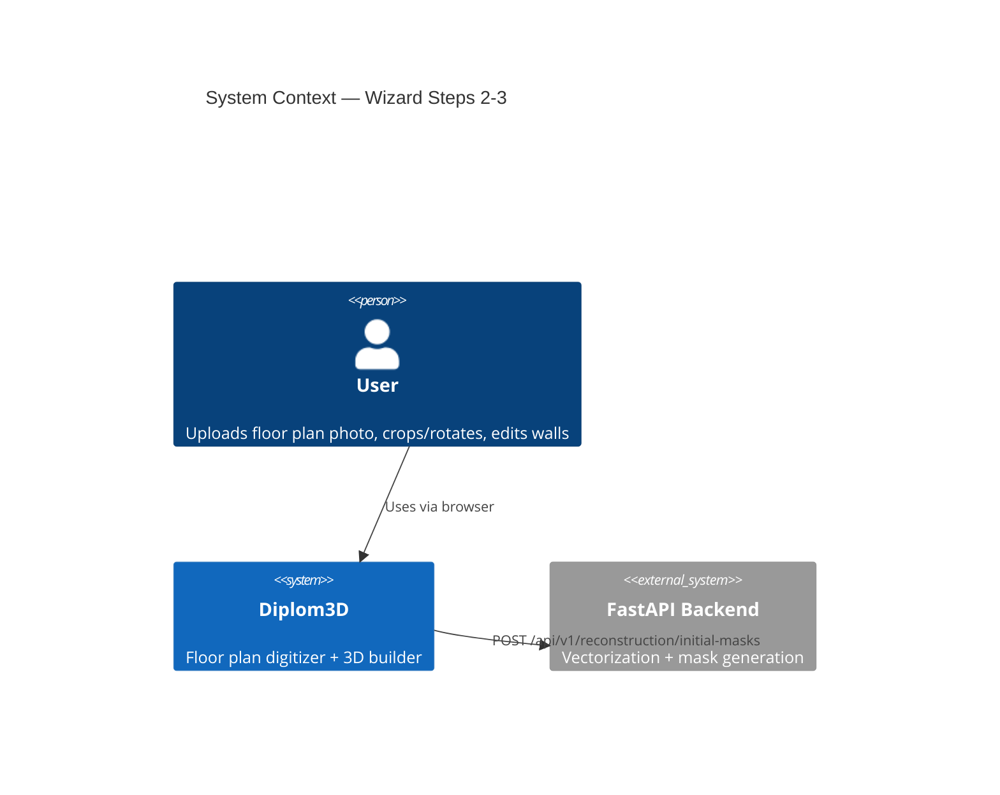
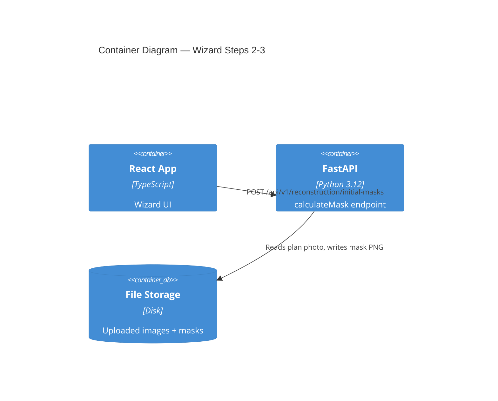
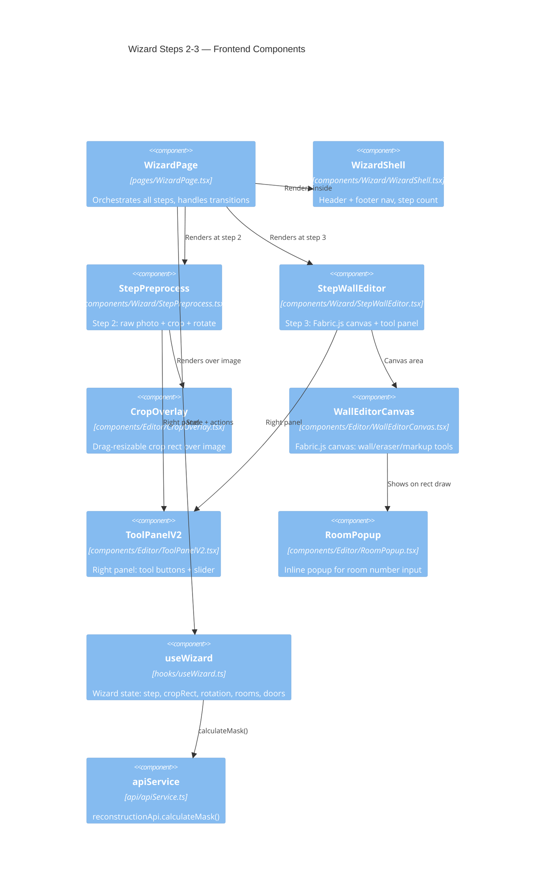
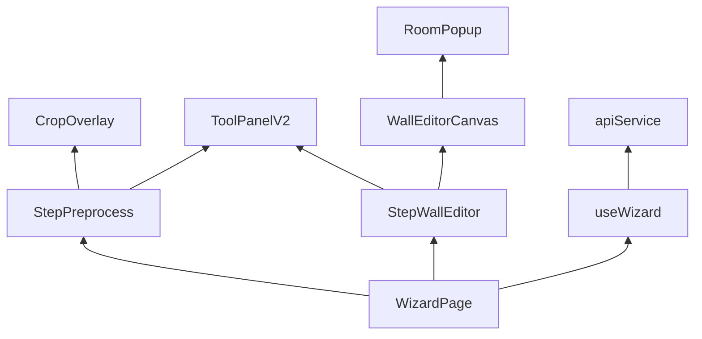

# Architecture: Wizard Steps 2-3

## C4 Level 1 — System Context



## C4 Level 2 — Container



## C4 Level 3 — Component

### 3.1 Frontend Components



### 3.2 State Shape (useWizard)

```typescript
// types/wizard.ts additions
export type WizardStep = 1 | 2 | 3 | 4 | 5 | 6;

export interface RoomAnnotation {
  id: string;
  name: string;           // room number or empty
  room_type: 'room' | 'staircase' | 'elevator' | 'corridor';
  x: number;              // normalized [0,1]
  y: number;
  width: number;
  height: number;
}

export interface DoorAnnotation {
  id: string;
  x1: number; y1: number;  // normalized [0,1]
  x2: number; y2: number;
}

// WizardState additions:
// rooms: RoomAnnotation[]
// doors: DoorAnnotation[]
// editedMaskFileId: string | null
```

## Module Dependency Graph



**Rule:** Components are pure render. All API calls go through `useWizard`. `WallEditorCanvas` manages Fabric.js lifecycle internally and exposes `getBlob()` + `getAnnotations()` via ref.
