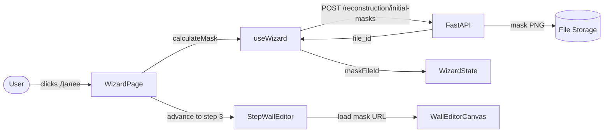
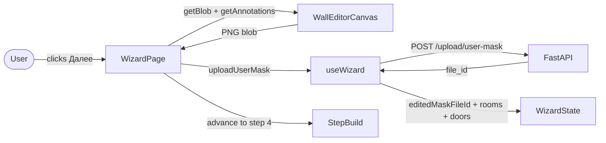
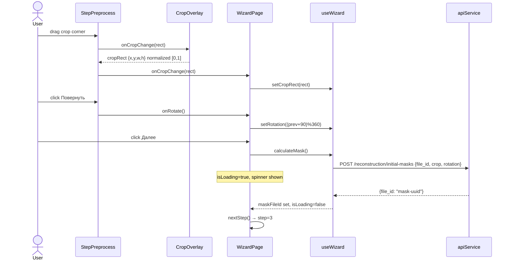
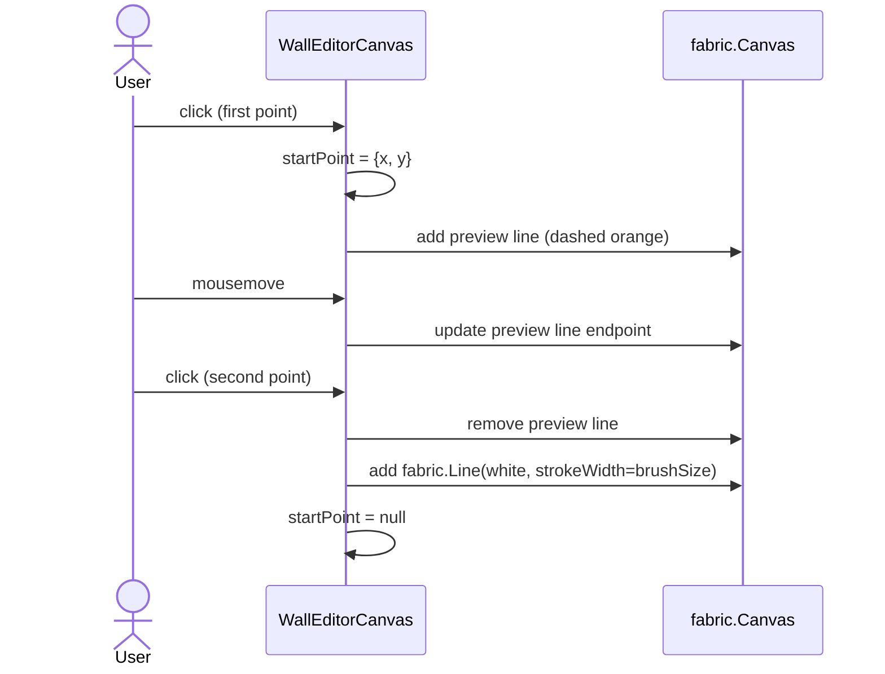
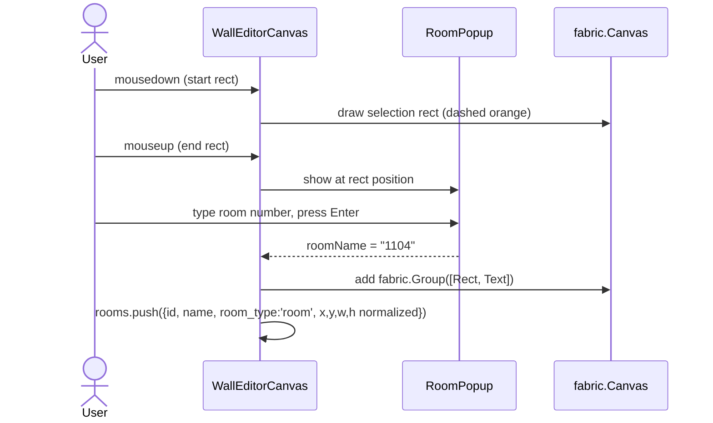
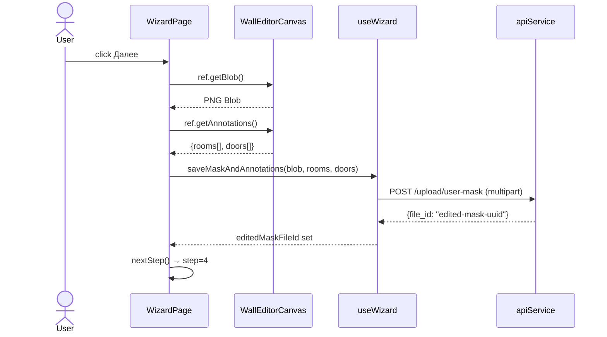

# Behavior: Wizard Steps 2-3

## Data Flow Diagrams

### DFD: Step 2 → Step 3 Transition

### DFD: Step 3 → Step 4 Transition

## Sequence Diagrams

### Use Case 1: Step 2 — Crop + Rotate + Advance

**Error cases:**

| Condition | Behavior |
|-----------|----------|
| calculateMask fails (500) | `state.error` set, spinner hidden, user stays on step 2 |
| No file uploaded | "Далее" button disabled (step 1 guard) |
| planFileId null | calculateMask returns early, no API call |

**Edge cases:**
- Auto-rotate: if `naturalHeight > naturalWidth` on image load → `setRotation(90)` + toast "Изображение автоматически повёрнуто"
- No crop set: `cropRect` stays null, backend receives `crop: null` (full image)

---

### Use Case 2: Step 3 — Draw Wall

**Edge cases:**
- Shift held on second click → snap endpoint to nearest 0°/90° axis from startPoint
- Tool changed mid-draw → discard preview line, reset startPoint

---

### Use Case 3: Step 3 — Label Room (Кабинет)

**Edge cases:**
- User presses Escape in popup → discard rect, no room added
- Empty room name → still add rect with empty label (valid for corridor/staircase types)
- Delete key on selected group → remove from canvas + rooms array

---

### Use Case 4: Step 3 → Step 4 Transition

**Error cases:**

| Condition | Behavior |
|-----------|----------|
| uploadUserMask fails | `state.error` set, user stays on step 3 |
| Canvas has no changes | Still export + upload (mask unchanged is valid) |
